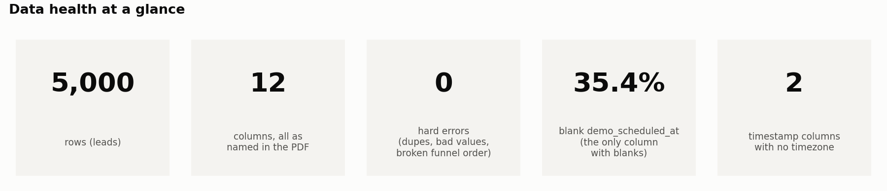
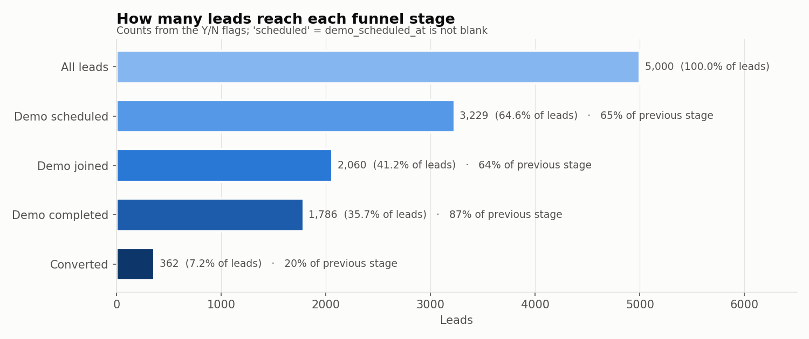
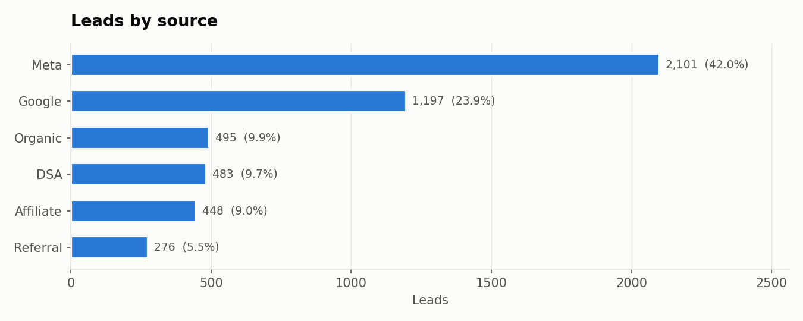
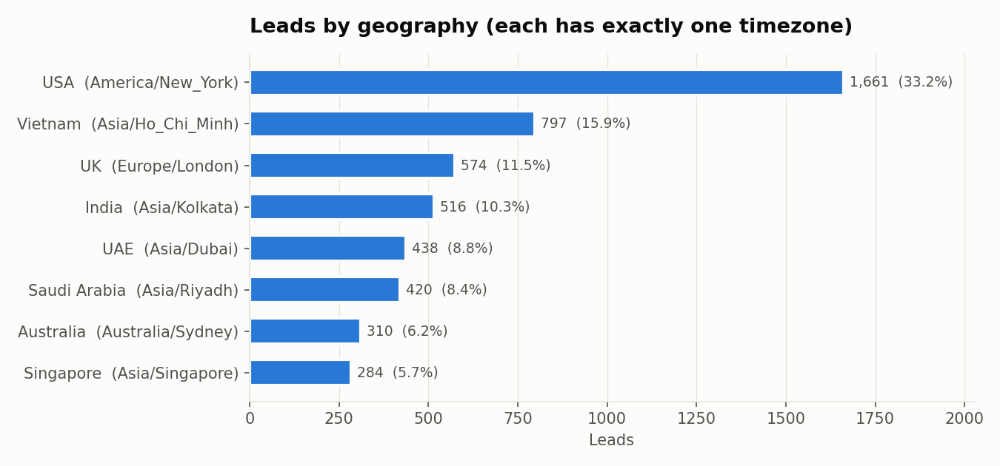
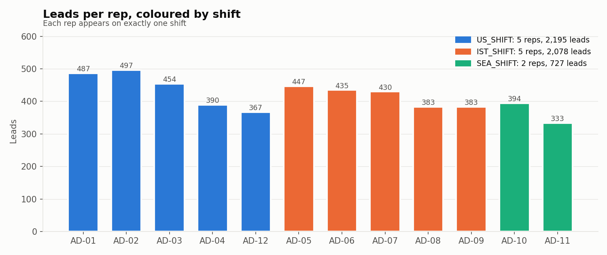
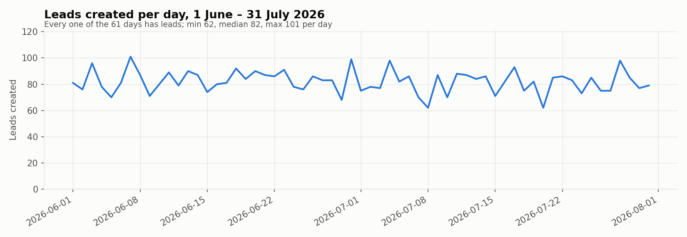
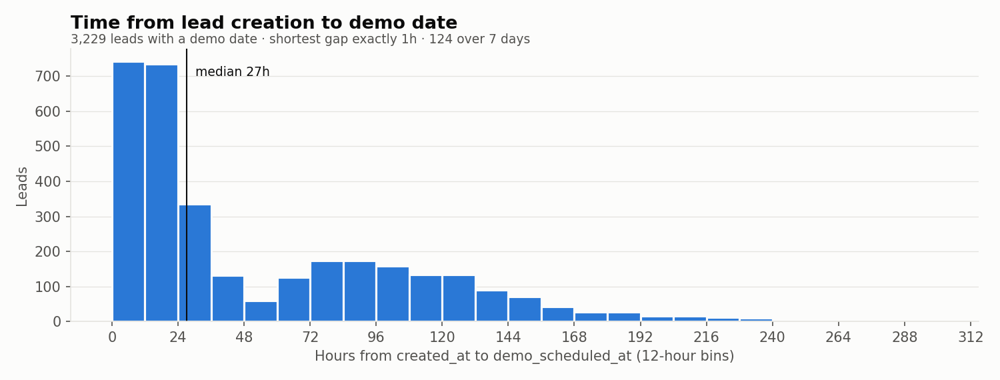
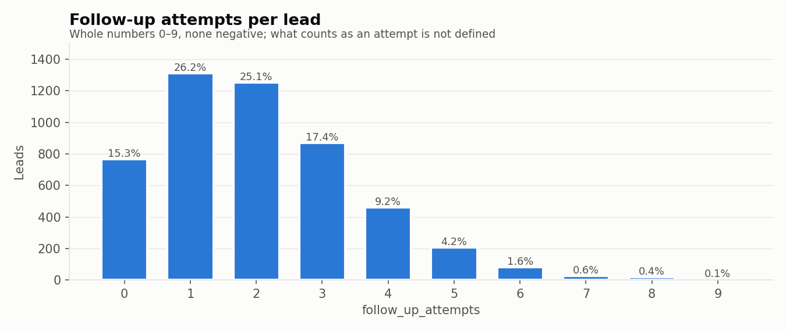
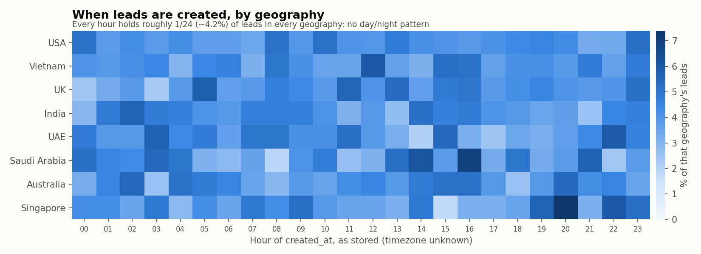

# Phase 1 — Data Audit, in charts

Generated by `analysis/phase_01_audit_charts.py`. Full tables and exact numbers: [phase_01_data_audit.md](phase_01_data_audit.md). These charts describe the data only; no business conclusions yet.

## 1. Is the data clean?

**What it shows:** The file is structurally clean. The open issues are about meaning (blank demo dates, missing timezone), not broken values.

## 2. How far do leads get?

**What it shows:** Of 5,000 leads, 3,229 have a demo date, 2,060 joined, 1,786 completed and 362 converted. No lead skips a stage.

## 3. Where do leads come from?

**What it shows:** Meta and Google bring 66% of leads. 'DSA' is not defined in the assignment.

## 4. Which countries?

**What it shows:** A third of leads are from the USA. Every geography maps to a single parent_timezone.

## 5. Reps and shifts

**What it shows:** 12 reps: 5 on US_SHIFT, 5 on IST_SHIFT, 2 on SEA_SHIFT. Shift working hours are not given.

## 6. Leads over time

**What it shows:** Lead volume is steady across both months (2,504 in June, 2,496 in July), with no gaps in the date range.

## 7. How soon is the demo?

**What it shows:** Half of demos are within about 27 hours of lead creation. None are earlier than 1 hour and none are negative.

## 8. Follow-up attempts

**What it shows:** Most leads get 1–2 follow-ups; 15.3% get none. Values above 6 are rare (1% of leads) but not invalid.

## 9. The timezone question

**What it shows:** Leads are spread almost evenly across all 24 hours in every geography, with no day/night pattern. So the hour of day cannot tell us which clock the timestamps use; that has to be a written assumption.

## Still unknown (not answerable from the data or the PDF)

- Which clock the timestamps use (UTC, IST, or the parent's local time)
- Whether `demo_scheduled_at` is the demo time or the booking time, and what a blank means
- The date the data was extracted, so recent leads may not have finished their journey
- What counts as a follow-up attempt
- Shift working hours, and what 'DSA' stands for
