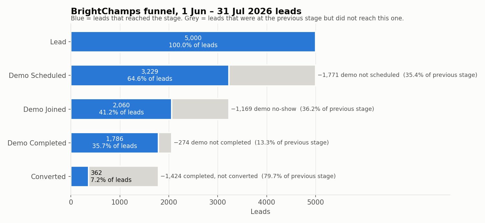

# Phase 2 — Funnel Analysis

Source file: `BrightChamps_FDA_Case_Dataset.csv`  
Generated by: `analysis/phase_02_funnel_analysis.py` (re-run to reproduce).  
Scope: exact counts and rates from the dataset. No interventions, no revenue-loss estimates.

## 1. Stage definitions

| stage          | rule used                        | previous stage |
| -------------- | -------------------------------- | -------------- |
| Lead           | every row in the file            | —              |
| Demo Scheduled | `demo_scheduled_at` is not blank | Lead           |
| Demo Joined    | `demo_joined` = Y                | Demo Scheduled |
| Demo Completed | `demo_completed` = Y             | Demo Joined    |
| Converted      | `converted` = Y                  | Demo Completed |

The stages are strictly nested: no lead reaches a stage without the one before it (checked by the script; see section 6). Treating a blank `demo_scheduled_at` as "not scheduled" is an assumption carried from Phase 1 (open question 2).

## 2. Requested metrics, with formulas

Letters used in the formulas:

| symbol | meaning        | how it is counted                    |
| ------ | -------------- | ------------------------------------ |
| L      | total leads    | count(rows)                          |
| S      | demo scheduled | count(`demo_scheduled_at` not blank) |
| J      | demo joined    | count(`demo_joined` = Y)             |
| C      | demo completed | count(`demo_completed` = Y)          |
| V      | converted      | count(`converted` = Y)               |

|   # | metric                           | count formula | count | rate formula |   rate |
| --: | -------------------------------- | ------------- | ----: | ------------ | -----: |
|   1 | Total leads                      | L             | 5,000 | —            |      — |
|   2 | Demo scheduled                   | S             | 3,229 | S / L        | 64.58% |
|   3 | Demo not scheduled               | L − S         | 1,771 | (L − S) / L  | 35.42% |
|   4 | Demo joined (join rate)          | J             | 2,060 | J / S        | 63.80% |
|   5 | Demo no-show                     | S − J         | 1,169 | (S − J) / S  | 36.20% |
|   6 | Demo completed (completion rate) | C             | 1,786 | C / J        | 86.70% |
|   7 | Demo not completed               | J − C         |   274 | (J − C) / J  | 13.30% |
|   8 | Converted (post-demo rate)       | V             |   362 | V / C        | 20.27% |
|   9 | Overall conversion rate          | V             |   362 | V / L        |  7.24% |

Worked rate calculations:

|   # | formula     | numbers       | result |
| --: | ----------- | ------------- | -----: |
|   2 | S / L       | 3,229 / 5,000 | 64.58% |
|   3 | (L − S) / L | 1,771 / 5,000 | 35.42% |
|   4 | J / S       | 2,060 / 3,229 | 63.80% |
|   5 | (S − J) / S | 1,169 / 3,229 | 36.20% |
|   6 | C / J       | 1,786 / 2,060 | 86.70% |
|   7 | (J − C) / J |   274 / 2,060 | 13.30% |
|   8 | V / C       |   362 / 1,786 | 20.27% |
|   9 | V / L       |   362 / 5,000 |  7.24% |

No-show is defined as *scheduled but not joined*. The dataset has no field that separates a no-show from a cancellation or a reschedule, so all three are inside this number.

## 3. Funnel table

| stage          | leads | % of leads | step conv. | drop-off | drop % prev. | drop % all | % of drops |
| -------------- | ----: | ---------: | ---------: | -------: | -----------: | ---------: | ---------: |
| Lead           | 5,000 |     100.0% |          — |        — |            — |          — |          — |
| Demo Scheduled | 3,229 |      64.6% |      64.6% |    1,771 |        35.4% |      35.4% |      38.2% |
| Demo Joined    | 2,060 |      41.2% |      63.8% |    1,169 |        36.2% |      23.4% |      25.2% |
| Demo Completed | 1,786 |      35.7% |      86.7% |      274 |        13.3% |       5.5% |       5.9% |
| Converted      |   362 |       7.2% |      20.3% |    1,424 |        79.7% |      28.5% |      30.7% |

Column formulas, for a stage with count *N* whose previous stage has count *P*:

| column       | formula           | meaning                                            |
| ------------ | ----------------- | -------------------------------------------------- |
| % of leads   | N / L             | share of all leads that reached this stage         |
| step conv.   | N / P             | share of the previous stage that moved on          |
| drop-off     | P − N             | leads lost between the previous stage and this one |
| drop % prev. | (P − N) / P       | drop-off rate of this step (= 1 − step conv.)      |
| drop % all   | (P − N) / L       | drop-off as a share of all leads                   |
| % of drops   | (P − N) / (L − V) | share of all non-converted leads lost here         |

Check: 1,771 + 1,169 + 274 + 1,424 (drop-offs) + 362 (converted) = 5,000 = total leads.

## 4. Where each lead ends up (furthest stage reached)

Every lead falls into exactly one of these five groups.

| outcome                           | rule         | leads | % of leads |
| --------------------------------- | ------------ | ----: | ---------: |
| Not scheduled                     | S = N        | 1,771 |      35.4% |
| Scheduled, did not join (no-show) | S = Y, J = N | 1,169 |      23.4% |
| Joined, did not complete          | J = Y, C = N |   274 |       5.5% |
| Completed, did not convert        | C = Y, V = N | 1,424 |      28.5% |
| Converted                         | V = Y        |   362 |       7.2% |

## 5. Funnel by lead-creation month (data maturity check)

The data extraction date is not given (Phase 1, open question 3). If July leads had less time to progress, their later-stage rates would be lower. This table only reports what the file shows; it does not adjust any number above.

| cohort                  | leads | S / L | J / S | C / J | V / C | V / L |
| ----------------------- | ----: | ----: | ----: | ----: | ----: | ----: |
| Jun 2026                | 2,504 | 64.7% | 63.5% | 87.4% | 20.9% | 7.51% |
| Jul 2026                | 2,496 | 64.4% | 64.1% | 86.0% | 19.6% | 6.97% |
| 25–31 Jul (last 7 days) |   574 | 65.3% | 64.5% | 83.5% | 18.8% | 6.62% |
| 1 Jun – 24 Jul          | 4,426 | 64.5% | 63.7% | 87.1% | 20.5% | 7.32% |

Columns use the letters from section 2: scheduling rate, join rate, completion rate, post-demo conversion, overall conversion.

Demos dated after the last lead was created (2026-07-31 23:40): **124**. Of these, 69 joined (55.6%), 60 completed and 17 converted. For comparison, the join rate for all scheduled demos is 63.8%.

## 6. Verification performed by the script

All of these are `assert` statements; the script stops if any fails.

- `lead_id` is unique
- No lead is joined without a scheduled demo, completed without joining, or converted without completing
- Stage counts never increase down the funnel
- Sum of all drop-offs + converted = total leads
- Counts match the Phase 1 audit (5,000 / 3,229 / 2,060 / 1,786 / 362)

## 7. How to read these numbers

- A drop-off is a count of leads that did not reach the next stage. It is **not** a count of lost sales, and multiplying it by the ₹60,000 revenue per customer does not give lost revenue. Many of these leads would not have bought under any process; that share is not in the data.
- The largest drop-off count and the stage where money is recoverable are different questions. This phase answers only the first.
- Rates at different stages have different denominators. "Drop-off % of previous stage" compares how leaky each step is; "drop-off % of all leads" compares how many leads each step removes.
- The no-show group mixes no-shows, cancellations and reschedules; the file cannot tell them apart.

## 8. Funnel chart

