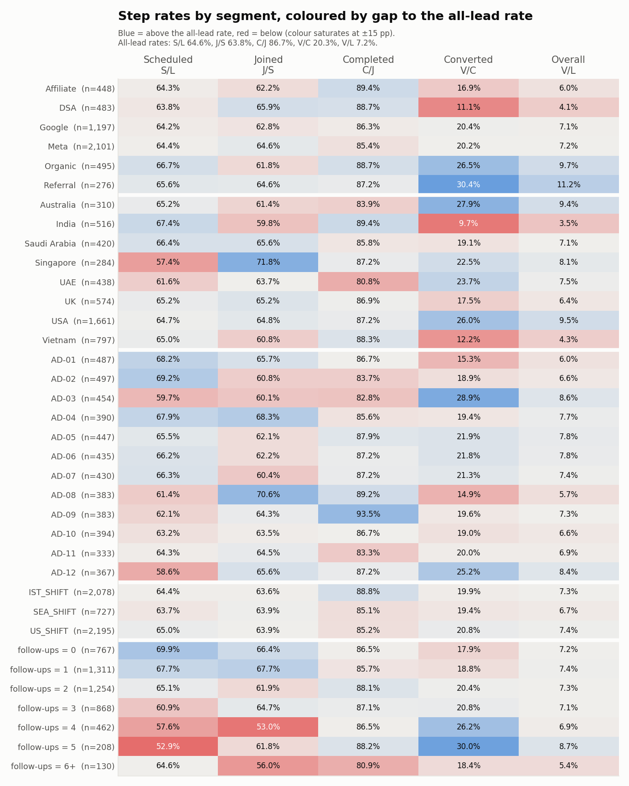
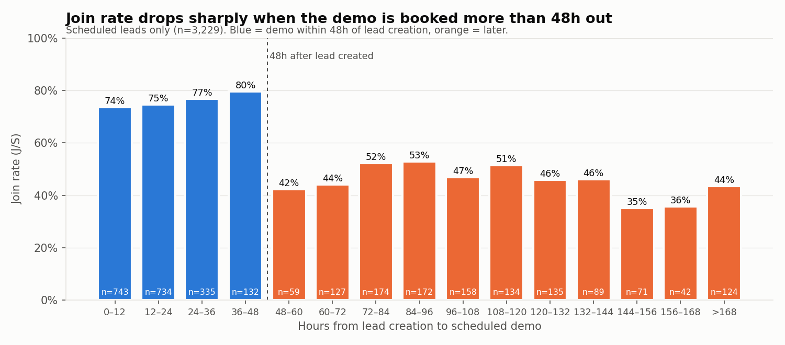
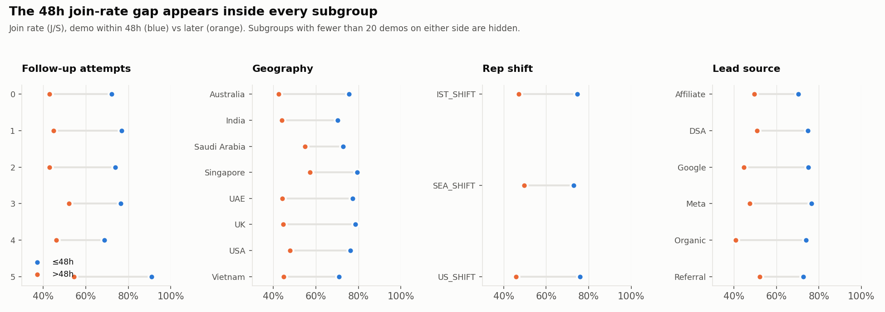
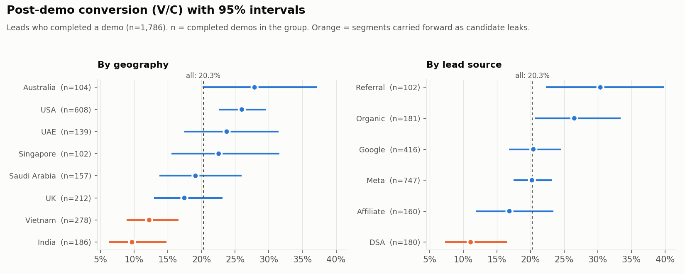

# Phase 3 — Find the Leak

Source file: `BrightChamps_FDA_Case_Dataset.csv`  
Generated by: `analysis/phase_03_leak_analysis.py` (re-run to reproduce).  
Scope: where and for whom leads drop out. Three **candidate** leaks, not a final one. No solution and no ₹ sizing yet.

## 0. Summary

- **204 segment-vs-rest comparisons** were run (6 dimensions × every segment × every funnel step, plus the demo-timing dimension). After Holm correction for multiple testing and a 5 pp minimum difference, **10** survive (section 3): 2 from geography; 1 from follow-up attempts; 7 from time from lead creation to scheduled demo. The follow-up survivor is explained by demo timing (section 6). That leaves two strong candidates and one weaker one:
  - **A. Demo booked more than 48h after the lead arrived → no-show.** 1,285 of 3,229 scheduled demos (39.8%) were booked >48h out. Their join rate is 46.9% vs 74.9% for demos within 48h (-28.0 pp). The drop is a step at 48h, not a slope, and it holds inside every follow-up, geography, shift, source and rep subgroup.
  - **B. India and Vietnam convert half as often after a completed demo.** V/C 11.2% (n=464) vs 23.4% for the other six geographies (n=1,322). Not explained by source, shift or demo timing. India alone survives the strict screen (Holm p 0.028); Vietnam just misses it (Holm p 0.055); geography as a whole clearly matters for V/C (chi-square Holm p <0.001).
  - **C. DSA leads convert poorly after the demo.** V/C 11.1% (n=180) vs 21.3% for all other sources (raw p 0.001). **Tentative:** it does not survive Holm across all 204 comparisons (p 0.236), although lead source as a whole does matter for V/C (chi-square Holm p 0.016) and DSA is its lowest segment. Smaller sample and smaller volume than A and B.
- **No segment explains the largest raw drop-off** (1,771 leads never scheduled). Scheduling rates are flat across source, geography and shift; rep differences do not survive correction.
- Rep shift, and parent-local demo hour under either clock assumption, show **no** meaningful effect on any step.

## 1. Method

- **Step rates** use the Phase 2 letters: S/L scheduled rate, J/S join rate, C/J completion rate, V/C post-demo conversion, V/L overall conversion. Each has its own denominator, so a segment's n shrinks at each step.
- **Comparison group** = every other lead in the same step's denominator (segment vs rest). This avoids picking a flattering comparison after looking at the data.
- **Test** = two-sided two-proportion z-test; 95% CI on the difference (Wald). Across the 204 comparisons, p-values are **Holm-adjusted** (family-wise error 5%). Chi-square tests of "does this dimension matter at all for this step" are also Holm-adjusted (section 2.8).
- **Operationally meaningful** = Holm-adjusted p < 0.05 **and** |difference| ≥ 5 pp. Both are needed: a big gap on 30 leads is noise, and a 1 pp gap on 3,000 leads is not worth acting on.
- **Parent timezone** is 1:1 with geography (Phase 1), so its table is shown but it is not tested a second time.
- **Time to demo** exists only for the 3,229 scheduled leads, so it has no S/L column. It is measured from `created_at` to `demo_scheduled_at`, i.e. to the **demo slot**, not to the moment the booking was made (the file has no booking timestamp).
- The data covers 2 months; per-month figures divide by 2.
- These are **observational** differences. Nothing here shows that changing a segment's treatment would change its outcome.

## 2. Funnel by segment

Columns: leads, then each step rate followed by the count that reached that step.

### 2.1 Lead source

| segment       | leads |   S/L |     S |   J/S |     J |   C/J |     C |   V/C |   V |    V/L |
| ------------- | ----: | ----: | ----: | ----: | ----: | ----: | ----: | ----: | --: | -----: |
| Affiliate     |   448 | 64.3% |   288 | 62.2% |   179 | 89.4% |   160 | 16.9% |  27 |  6.03% |
| DSA           |   483 | 63.8% |   308 | 65.9% |   203 | 88.7% |   180 | 11.1% |  20 |  4.14% |
| Google        | 1,197 | 64.2% |   768 | 62.8% |   482 | 86.3% |   416 | 20.4% |  85 |  7.10% |
| Meta          | 2,101 | 64.4% | 1,354 | 64.6% |   875 | 85.4% |   747 | 20.2% | 151 |  7.19% |
| Organic       |   495 | 66.7% |   330 | 61.8% |   204 | 88.7% |   181 | 26.5% |  48 |  9.70% |
| Referral      |   276 | 65.6% |   181 | 64.6% |   117 | 87.2% |   102 | 30.4% |  31 | 11.23% |
| **All leads** | 5,000 | 64.6% | 3,229 | 63.8% | 2,060 | 86.7% | 1,786 | 20.3% | 362 |  7.24% |

### 2.2 Geography

| segment       | leads |   S/L |     S |   J/S |     J |   C/J |     C |   V/C |   V |   V/L |
| ------------- | ----: | ----: | ----: | ----: | ----: | ----: | ----: | ----: | --: | ----: |
| Australia     |   310 | 65.2% |   202 | 61.4% |   124 | 83.9% |   104 | 27.9% |  29 | 9.35% |
| India         |   516 | 67.4% |   348 | 59.8% |   208 | 89.4% |   186 |  9.7% |  18 | 3.49% |
| Saudi Arabia  |   420 | 66.4% |   279 | 65.6% |   183 | 85.8% |   157 | 19.1% |  30 | 7.14% |
| Singapore     |   284 | 57.4% |   163 | 71.8% |   117 | 87.2% |   102 | 22.5% |  23 | 8.10% |
| UAE           |   438 | 61.6% |   270 | 63.7% |   172 | 80.8% |   139 | 23.7% |  33 | 7.53% |
| UK            |   574 | 65.2% |   374 | 65.2% |   244 | 86.9% |   212 | 17.5% |  37 | 6.45% |
| USA           | 1,661 | 64.7% | 1,075 | 64.8% |   697 | 87.2% |   608 | 26.0% | 158 | 9.51% |
| Vietnam       |   797 | 65.0% |   518 | 60.8% |   315 | 88.3% |   278 | 12.2% |  34 | 4.27% |
| **All leads** | 5,000 | 64.6% | 3,229 | 63.8% | 2,060 | 86.7% | 1,786 | 20.3% | 362 | 7.24% |

### 2.3 Parent timezone

| segment          | leads |   S/L |     S |   J/S |     J |   C/J |     C |   V/C |   V |   V/L |
| ---------------- | ----: | ----: | ----: | ----: | ----: | ----: | ----: | ----: | --: | ----: |
| America/New_York | 1,661 | 64.7% | 1,075 | 64.8% |   697 | 87.2% |   608 | 26.0% | 158 | 9.51% |
| Asia/Dubai       |   438 | 61.6% |   270 | 63.7% |   172 | 80.8% |   139 | 23.7% |  33 | 7.53% |
| Asia/Ho_Chi_Minh |   797 | 65.0% |   518 | 60.8% |   315 | 88.3% |   278 | 12.2% |  34 | 4.27% |
| Asia/Kolkata     |   516 | 67.4% |   348 | 59.8% |   208 | 89.4% |   186 |  9.7% |  18 | 3.49% |
| Asia/Riyadh      |   420 | 66.4% |   279 | 65.6% |   183 | 85.8% |   157 | 19.1% |  30 | 7.14% |
| Asia/Singapore   |   284 | 57.4% |   163 | 71.8% |   117 | 87.2% |   102 | 22.5% |  23 | 8.10% |
| Australia/Sydney |   310 | 65.2% |   202 | 61.4% |   124 | 83.9% |   104 | 27.9% |  29 | 9.35% |
| Europe/London    |   574 | 65.2% |   374 | 65.2% |   244 | 86.9% |   212 | 17.5% |  37 | 6.45% |
| **All leads**    | 5,000 | 64.6% | 3,229 | 63.8% | 2,060 | 86.7% | 1,786 | 20.3% | 362 | 7.24% |

Identical to geography row for row (each geography has exactly one timezone).

### 2.4 Rep assigned

| segment       | leads |   S/L |     S |   J/S |     J |   C/J |     C |   V/C |   V |   V/L |
| ------------- | ----: | ----: | ----: | ----: | ----: | ----: | ----: | ----: | --: | ----: |
| AD-01         |   487 | 68.2% |   332 | 65.7% |   218 | 86.7% |   189 | 15.3% |  29 | 5.95% |
| AD-02         |   497 | 69.2% |   344 | 60.8% |   209 | 83.7% |   175 | 18.9% |  33 | 6.64% |
| AD-03         |   454 | 59.7% |   271 | 60.1% |   163 | 82.8% |   135 | 28.9% |  39 | 8.59% |
| AD-04         |   390 | 67.9% |   265 | 68.3% |   181 | 85.6% |   155 | 19.4% |  30 | 7.69% |
| AD-05         |   447 | 65.5% |   293 | 62.1% |   182 | 87.9% |   160 | 21.9% |  35 | 7.83% |
| AD-06         |   435 | 66.2% |   288 | 62.2% |   179 | 87.2% |   156 | 21.8% |  34 | 7.82% |
| AD-07         |   430 | 66.3% |   285 | 60.4% |   172 | 87.2% |   150 | 21.3% |  32 | 7.44% |
| AD-08         |   383 | 61.4% |   235 | 70.6% |   166 | 89.2% |   148 | 14.9% |  22 | 5.74% |
| AD-09         |   383 | 62.1% |   238 | 64.3% |   153 | 93.5% |   143 | 19.6% |  28 | 7.31% |
| AD-10         |   394 | 63.2% |   249 | 63.5% |   158 | 86.7% |   137 | 19.0% |  26 | 6.60% |
| AD-11         |   333 | 64.3% |   214 | 64.5% |   138 | 83.3% |   115 | 20.0% |  23 | 6.91% |
| AD-12         |   367 | 58.6% |   215 | 65.6% |   141 | 87.2% |   123 | 25.2% |  31 | 8.45% |
| **All leads** | 5,000 | 64.6% | 3,229 | 63.8% | 2,060 | 86.7% | 1,786 | 20.3% | 362 | 7.24% |

### 2.5 Rep shift

| segment       | leads |   S/L |     S |   J/S |     J |   C/J |     C |   V/C |   V |   V/L |
| ------------- | ----: | ----: | ----: | ----: | ----: | ----: | ----: | ----: | --: | ----: |
| IST_SHIFT     | 2,078 | 64.4% | 1,339 | 63.6% |   852 | 88.8% |   757 | 19.9% | 151 | 7.27% |
| SEA_SHIFT     |   727 | 63.7% |   463 | 63.9% |   296 | 85.1% |   252 | 19.4% |  49 | 6.74% |
| US_SHIFT      | 2,195 | 65.0% | 1,427 | 63.9% |   912 | 85.2% |   777 | 20.8% | 162 | 7.38% |
| **All leads** | 5,000 | 64.6% | 3,229 | 63.8% | 2,060 | 86.7% | 1,786 | 20.3% | 362 | 7.24% |

### 2.6 Follow-up attempts

| segment       | leads |   S/L |     S |   J/S |     J |   C/J |     C |   V/C |   V |   V/L |
| ------------- | ----: | ----: | ----: | ----: | ----: | ----: | ----: | ----: | --: | ----: |
| 0             |   767 | 69.9% |   536 | 66.4% |   356 | 86.5% |   308 | 17.9% |  55 | 7.17% |
| 1             | 1,311 | 67.7% |   888 | 67.7% |   601 | 85.7% |   515 | 18.8% |  97 | 7.40% |
| 2             | 1,254 | 65.1% |   816 | 61.9% |   505 | 88.1% |   445 | 20.4% |  91 | 7.26% |
| 3             |   868 | 60.9% |   529 | 64.7% |   342 | 87.1% |   298 | 20.8% |  62 | 7.14% |
| 4             |   462 | 57.6% |   266 | 53.0% |   141 | 86.5% |   122 | 26.2% |  32 | 6.93% |
| 5             |   208 | 52.9% |   110 | 61.8% |    68 | 88.2% |    60 | 30.0% |  18 | 8.65% |
| 6+            |   130 | 64.6% |    84 | 56.0% |    47 | 80.9% |    38 | 18.4% |   7 | 5.38% |
| **All leads** | 5,000 | 64.6% | 3,229 | 63.8% | 2,060 | 86.7% | 1,786 | 20.3% | 362 | 7.24% |

### 2.7 Time from lead creation to scheduled demo

| segment           | scheduled |   J/S |     J |   C/J |     C |   V/C |   V |    V/S |
| ----------------- | --------: | ----: | ----: | ----: | ----: | ----: | --: | -----: |
| ≤6h               |       282 | 73.0% |   206 | 84.0% |   173 | 20.8% |  36 | 12.77% |
| 6–12h             |       461 | 74.0% |   341 | 85.3% |   291 | 15.5% |  45 |  9.76% |
| 12–24h            |       734 | 74.7% |   548 | 87.4% |   479 | 20.9% | 100 | 13.62% |
| 24–48h            |       467 | 77.5% |   362 | 86.5% |   313 | 18.5% |  58 | 12.42% |
| 48–72h            |       186 | 43.5% |    81 | 90.1% |    73 | 13.7% |  10 |  5.38% |
| 72–120h           |       638 | 50.9% |   325 | 87.4% |   284 | 25.4% |  72 | 11.29% |
| 120–168h          |       337 | 42.4% |   143 | 88.8% |   127 | 21.3% |  27 |  8.01% |
| >168h             |       124 | 43.5% |    54 | 85.2% |    46 | 30.4% |  14 | 11.29% |
| **All scheduled** |     3,229 | 63.8% | 2,060 | 86.7% | 1,786 | 20.3% | 362 | 11.21% |

Base = the 3,229 scheduled leads, so the last column is V/S (conversions per scheduled lead), not V/L. Unscheduled leads have no demo time and cannot appear here.

### 2.8 Does each dimension matter at all? (chi-square, Holm-adjusted)

| dimension                                    | step | groups | leads in denominator | p      | p (Holm) | verdict     |
| -------------------------------------------- | ---- | -----: | -------------------: | ------ | -------- | ----------- |
| 1. Lead source                               | S/L  |      6 |                 5000 | 0.932  | 1.000    | no evidence |
| 1. Lead source                               | J/S  |      6 |                 3229 | 0.806  | 1.000    | no evidence |
| 1. Lead source                               | C/J  |      6 |                 2060 | 0.556  | 1.000    | no evidence |
| 1. Lead source                               | V/C  |      6 |                 1786 | <0.001 | 0.016    | **differs** |
| 1. Lead source                               | V/L  |      6 |                 5000 | 0.002  | 0.044    | **differs** |
| 2. Geography                                 | S/L  |      8 |                 5000 | 0.150  | 1.000    | no evidence |
| 2. Geography                                 | J/S  |      8 |                 3229 | 0.153  | 1.000    | no evidence |
| 2. Geography                                 | C/J  |      8 |                 2060 | 0.302  | 1.000    | no evidence |
| 2. Geography                                 | V/C  |      8 |                 1786 | <0.001 | <0.001   | **differs** |
| 2. Geography                                 | V/L  |      8 |                 5000 | <0.001 | <0.001   | **differs** |
| 4. Rep assigned                              | S/L  |     12 |                 5000 | 0.012  | 0.253    | no evidence |
| 4. Rep assigned                              | J/S  |     12 |                 3229 | 0.289  | 1.000    | no evidence |
| 4. Rep assigned                              | C/J  |     12 |                 2060 | 0.325  | 1.000    | no evidence |
| 4. Rep assigned                              | V/C  |     12 |                 1786 | 0.200  | 1.000    | no evidence |
| 4. Rep assigned                              | V/L  |     12 |                 5000 | 0.895  | 1.000    | no evidence |
| 5. Rep shift                                 | S/L  |      3 |                 5000 | 0.798  | 1.000    | no evidence |
| 5. Rep shift                                 | J/S  |      3 |                 3229 | 0.986  | 1.000    | no evidence |
| 5. Rep shift                                 | C/J  |      3 |                 2060 | 0.054  | 1.000    | no evidence |
| 5. Rep shift                                 | V/C  |      3 |                 1786 | 0.854  | 1.000    | no evidence |
| 5. Rep shift                                 | V/L  |      3 |                 5000 | 0.845  | 1.000    | no evidence |
| 6. Follow-up attempts                        | S/L  |      7 |                 5000 | <0.001 | <0.001   | **differs** |
| 6. Follow-up attempts                        | J/S  |      7 |                 3229 | <0.001 | 0.009    | **differs** |
| 6. Follow-up attempts                        | C/J  |      7 |                 2060 | 0.807  | 1.000    | no evidence |
| 6. Follow-up attempts                        | V/C  |      7 |                 1786 | 0.231  | 1.000    | no evidence |
| 6. Follow-up attempts                        | V/L  |      7 |                 5000 | 0.965  | 1.000    | no evidence |
| 7. Time from lead creation to scheduled demo | J/S  |      8 |                 3229 | <0.001 | <0.001   | **differs** |
| 7. Time from lead creation to scheduled demo | C/J  |      8 |                 2060 | 0.809  | 1.000    | no evidence |
| 7. Time from lead creation to scheduled demo | V/C  |      8 |                 1786 | 0.045  | 0.892    | no evidence |

A chi-square test asks whether the step rate varies across the dimension's segments more than chance would. It does not say which segment is different.

## 3. Every segment that stands out (unfiltered screen)

All segment-vs-rest comparisons with Holm p < 0.05 and |diff| ≥ 5 pp, sorted by p. This is the full list — nothing is left out.

| dimension                                    | segment  | step |   n |  rate | rest n | rest rate | abs. diff | rel. diff | p (Holm) |
| -------------------------------------------- | -------- | ---- | --: | ----: | -----: | --------: | --------- | --------- | -------- |
| 7. Time from lead creation to scheduled demo | 120–168h | J/S  | 337 | 42.4% |  2,892 |     66.3% | -23.9 pp  | -36%      | <0.001   |
| 7. Time from lead creation to scheduled demo | 72–120h  | J/S  | 638 | 50.9% |  2,591 |     67.0% | -16.0 pp  | -24%      | <0.001   |
| 7. Time from lead creation to scheduled demo | 12–24h   | J/S  | 734 | 74.7% |  2,495 |     60.6% | +14.1 pp  | +23%      | <0.001   |
| 7. Time from lead creation to scheduled demo | 24–48h   | J/S  | 467 | 77.5% |  2,762 |     61.5% | +16.0 pp  | +26%      | <0.001   |
| 7. Time from lead creation to scheduled demo | 48–72h   | J/S  | 186 | 43.5% |  3,043 |     65.0% | -21.5 pp  | -33%      | <0.001   |
| 7. Time from lead creation to scheduled demo | 6–12h    | J/S  | 461 | 74.0% |  2,768 |     62.1% | +11.9 pp  | +19%      | <0.001   |
| 7. Time from lead creation to scheduled demo | >168h    | J/S  | 124 | 43.5% |  3,105 |     64.6% | -21.1 pp  | -33%      | <0.001   |
| 2. Geography                                 | USA      | V/C  | 608 | 26.0% |  1,178 |     17.3% | +8.7 pp   | +50%      | 0.003    |
| 6. Follow-up attempts                        | 4        | J/S  | 266 | 53.0% |  2,963 |     64.8% | -11.8 pp  | -18%      | 0.026    |
| 2. Geography                                 | India    | V/C  | 186 |  9.7% |  1,600 |     21.5% | -11.8 pp  | -55%      | 0.028    |

**Near misses** — raw p < 0.05 but failing Holm or the 5 pp bar (30 rows). Treat as unconfirmed:

| dimension                                    | segment   | step |     n |  rate | rest rate | abs. diff | p      | p (Holm) |
| -------------------------------------------- | --------- | ---- | ----: | ----: | --------: | --------- | ------ | -------: |
| 2. Geography                                 | USA       | V/L  | 1,661 |  9.5% |      6.1% | +3.4 pp   | <0.001 |    0.002 |
| 2. Geography                                 | Vietnam   | V/C  |   278 | 12.2% |     21.8% | -9.5 pp   | <0.001 |    0.055 |
| 6. Follow-up attempts                        | 5         | S/L  |   208 | 52.9% |     65.1% | -12.2 pp  | <0.001 |    0.061 |
| 2. Geography                                 | Vietnam   | V/L  |   797 |  4.3% |      7.8% | -3.5 pp   | <0.001 |    0.078 |
| 2. Geography                                 | India     | V/L  |   516 |  3.5% |      7.7% | -4.2 pp   | <0.001 |    0.098 |
| 7. Time from lead creation to scheduled demo | ≤6h       | J/S  |   282 | 73.0% |     62.9% | +10.1 pp  | <0.001 |    0.135 |
| 6. Follow-up attempts                        | 0         | S/L  |   767 | 69.9% |     63.6% | +6.3 pp   | <0.001 |    0.159 |
| 6. Follow-up attempts                        | 4         | S/L  |   462 | 57.6% |     65.3% | -7.7 pp   | <0.001 |    0.178 |
| 1. Lead source                               | DSA       | V/C  |   180 | 11.1% |     21.3% | -10.2 pp  | 0.001  |    0.236 |
| 6. Follow-up attempts                        | 1         | J/S  |   888 | 67.7% |     62.3% | +5.4 pp   | 0.005  |    0.867 |
| 6. Follow-up attempts                        | 1         | S/L  | 1,311 | 67.7% |     63.5% | +4.3 pp   | 0.005  |    0.999 |
| 1. Lead source                               | DSA       | V/L  |   483 |  4.1% |      7.6% | -3.4 pp   | 0.006  |    1.000 |
| 1. Lead source                               | Referral  | V/L  |   276 | 11.2% |      7.0% | +4.2 pp   | 0.008  |    1.000 |
| 1. Lead source                               | Referral  | V/C  |   102 | 30.4% |     19.7% | +10.7 pp  | 0.009  |    1.000 |
| 2. Geography                                 | Singapore | S/L  |   284 | 57.4% |     65.0% | -7.6 pp   | 0.009  |    1.000 |
| 4. Rep assigned                              | AD-03     | V/C  |   135 | 28.9% |     19.6% | +9.3 pp   | 0.010  |    1.000 |
| 4. Rep assigned                              | AD-09     | C/J  |   153 | 93.5% |     86.2% | +7.3 pp   | 0.010  |    1.000 |
| 4. Rep assigned                              | AD-12     | S/L  |   367 | 58.6% |     65.1% | -6.5 pp   | 0.013  |    1.000 |
| 6. Follow-up attempts                        | 3         | S/L  |   868 | 60.9% |     65.3% | -4.4 pp   | 0.014  |    1.000 |
| 5. Rep shift                                 | IST_SHIFT | C/J  |   852 | 88.8% |     85.2% | +3.7 pp   | 0.016  |    1.000 |
| 2. Geography                                 | UAE       | C/J  |   172 | 80.8% |     87.2% | -6.4 pp   | 0.018  |    1.000 |
| 7. Time from lead creation to scheduled demo | 72–120h   | V/C  |   284 | 25.4% |     19.3% | +6.0 pp   | 0.020  |    1.000 |
| 4. Rep assigned                              | AD-03     | S/L  |   454 | 59.7% |     65.1% | -5.4 pp   | 0.022  |    1.000 |
| 4. Rep assigned                              | AD-02     | S/L  |   497 | 69.2% |     64.1% | +5.1 pp   | 0.023  |    1.000 |
| 4. Rep assigned                              | AD-08     | J/S  |   235 | 70.6% |     63.3% | +7.4 pp   | 0.023  |    1.000 |
| 7. Time from lead creation to scheduled demo | 6–12h     | V/C  |   291 | 15.5% |     21.2% | -5.7 pp   | 0.026  |    1.000 |
| 1. Lead source                               | Organic   | V/L  |   495 |  9.7% |      7.0% | +2.7 pp   | 0.026  |    1.000 |
| 1. Lead source                               | Organic   | V/C  |   181 | 26.5% |     19.6% | +7.0 pp   | 0.027  |    1.000 |
| 2. Geography                                 | Singapore | J/S  |   163 | 71.8% |     63.4% | +8.4 pp   | 0.030  |    1.000 |
| 2. Geography                                 | Australia | V/C  |   104 | 27.9% |     19.8% | +8.1 pp   | 0.046  |    1.000 |

## 4. Demo timing: the 48h step

### 4.1 Where the threshold comes from

Join rate in 6-hour bins of time-to-demo (first 7 days):

| gap    | demos | join rate | gap      | demos  | join rate  |
| ------ | ----: | --------: | -------- | -----: | ---------: |
| 0–6h   |   282 |     73.0% | 84–90h   |     75 |      58.7% |
| 6–12h  |   461 |     74.0% | 90–96h   |     97 |      48.5% |
| 12–18h |   431 |     74.5% | 96–102h  |     71 |      49.3% |
| 18–24h |   303 |     74.9% | 102–108h |     87 |      44.8% |
| 24–30h |   212 |     75.5% | 108–114h |     75 |      56.0% |
| 30–36h |   123 |     78.9% | 114–120h |     59 |      45.8% |
| 36–42h |    77 |     80.5% | 120–126h |     64 |      46.9% |
| 42–48h |    55 |     78.2% | 126–132h |     71 |      45.1% |
| 48–54h |    29 |     51.7% | 132–138h |     41 |      43.9% |
| 54–60h |    30 |     33.3% | 138–144h |     48 |      47.9% |
| 60–66h |    41 |     48.8% | 144–150h |     35 |      37.1% |
| 66–72h |    86 |     41.9% | 150–156h |     36 |      33.3% |
| 72–78h |    85 |     51.8% | 156–162h |     28 |      35.7% |
| 78–84h |    89 |     52.8% | 162–168h |     14 |      35.7% |

The join rate sits at 73–81% in every 6h bin up to 48h and at 33–59% in every bin after it. The threshold was chosen by looking at this table, so the 48h cut itself is data-driven; the gap between the two sides is too large (and too consistent bin-to-bin) to be a product of where the line was drawn. The gap is also bimodal: demos ≤48h have a median of 15h; demos >48h a median of 104h. Very few fall near the line.

### 4.2 Early (≤48h) vs late (>48h) demos, every step

| comparison                          |     n |  rate | n (comp.) | rate (comp.) | abs. diff | 95% CI (pp)    | rel. diff | p      |
| ----------------------------------- | ----: | ----: | --------: | -----------: | --------- | -------------- | --------- | ------ |
| Join rate (J/S), >48h vs ≤48h       | 1,285 | 46.9% |     1,944 |        74.9% | -28.0 pp  | [-31.4, -24.7] | -37%      | <0.001 |
| Completion rate (C/J)               |   603 | 87.9% |     1,457 |        86.2% | +1.7 pp   | [-1.5, +4.8]   | +2%       | 0.304  |
| Post-demo conversion (V/C)          |   530 | 23.2% |     1,256 |        19.0% | +4.2 pp   | [-0.0, +8.4]   | +22%      | 0.045  |
| Conversion per scheduled lead (V/S) | 1,285 |  9.6% |     1,944 |        12.3% | -2.7 pp   | [-4.9, -0.6]   | -22%      | 0.016  |

Late demos lose on joining but the leads who do join convert at least as well — consistent with the late group being made of the same kind of parents, of whom fewer turn up. Net effect on conversion per scheduled lead: -2.7 pp.

### 4.3 Is it something else in disguise? (interactions and adjustment)

Share of scheduled demos booked >48h out, by segment:

| dimension          | share of demos > 48h                                                                                     |
| ------------------ | -------------------------------------------------------------------------------------------------------- |
| Lead source        | Affiliate: 39%, DSA: 37%, Google: 40%, Meta: 41%, Organic: 37%, Referral: 39%                            |
| Geography          | Australia: 43%, India: 40%, Saudi Arabia: 41%, Singapore: 34%, UAE: 41%, UK: 39%, USA: 40%, Vietnam: 39% |
| Rep shift          | IST_SHIFT: 40%, SEA_SHIFT: 39%, US_SHIFT: 40%                                                            |
| Follow-up attempts | 0: 20%, 1: 29%, 2: 39%, 3: 49%, 4: 70%, 5: 80%, 6+: 86%                                                  |

By rep the share ranges 34%–42%. Late booking is spread evenly across source, geography, shift and rep. **Only follow-up attempts moves with it**: leads that took more attempts are far more often booked late.

Join-rate difference (late − early) after holding other variables fixed (Mantel-Haenszel weighted difference within strata):

| held fixed                     | strata used | demos used | late − early join rate |
| ------------------------------ | ----------: | ---------: | ---------------------- |
| none (raw)                     |           1 |      3,229 | -28.0 pp               |
| follow-up attempts             |           7 |      3,229 | -29.2 pp               |
| follow-ups × geography × shift |         126 |      3,102 | -29.4 pp               |
| follow-ups × rep × source      |         285 |      2,904 | -29.6 pp               |

The difference barely moves when follow-ups, geography, shift, rep and source are held fixed. Within each follow-up level with ≥20 demos on both sides, early demos are joined 23–36 pp more often than late ones (chart 3).

Robustness checks:

| comparison                                             |     n |  rate | n (comp.) | rate (comp.) | abs. diff | 95% CI (pp)    | rel. diff | p      |
| ------------------------------------------------------ | ----: | ----: | --------: | -----------: | --------- | -------------- | --------: | ------ |
| Excl. 124 demos dated after the last lead (Phase 2 §5) | 1,177 | 46.4% |     1,928 |        74.9% | -28.6 pp  | [-32.0, -25.1] |      -38% | <0.001 |
| Leads created Jun 2026 only                            |   666 | 46.1% |       955 |        75.7% | -29.6 pp  | [-34.3, -24.9] |      -39% | <0.001 |
| Leads created Jul 2026 only                            |   619 | 47.8% |       989 |        74.2% | -26.4 pp  | [-31.2, -21.6] |      -36% | <0.001 |

## 5. Post-demo conversion: geography and lead source

### 5.1 India + Vietnam vs the other six geographies

| comparison                                     |     n |  rate | n (comp.) | rate (comp.) | abs. diff | 95% CI (pp)   | rel. diff | p      |
| ---------------------------------------------- | ----: | ----: | --------: | -----------: | --------- | ------------- | --------- | ------ |
| V/C, India + Vietnam vs rest                   |   464 | 11.2% |     1,322 |        23.4% | -12.2 pp  | [-15.9, -8.6] | -52%      | <0.001 |
| V/C, India vs rest                             |   186 |  9.7% |     1,600 |        21.5% | -11.8 pp  | [-16.5, -7.1] | -55%      | <0.001 |
| V/C, Vietnam vs rest                           |   278 | 12.2% |     1,508 |        21.8% | -9.5 pp   | [-13.9, -5.1] | -44%      | <0.001 |
| Scheduled rate (S/L), India + Vietnam vs rest  | 1,313 | 66.0% |     3,687 |        64.1% | +1.9 pp   | [-1.1, +4.9]  | +3%       | 0.225  |
| Join rate (J/S), India + Vietnam vs rest       |   866 | 60.4% |     2,363 |        65.0% | -4.7 pp   | [-8.4, -0.9]  | -7%       | 0.015  |
| Completion rate (C/J), India + Vietnam vs rest |   523 | 88.7% |     1,537 |        86.0% | +2.7 pp   | [-0.5, +5.9]  | +3%       | 0.115  |

India and Vietnam schedule and complete at normal rates. Their join rate is 4.7 pp lower (raw p 0.015; India and Vietnam separately do not survive the section 3 screen on J/S). Most of the gap is after the demo. Note the India + Vietnam grouping was formed after seeing the per-geography table, and its comparison group includes the USA, which is itself above average (V/C 26.0%).

Interaction with lead source and rep shift (V/C, n in brackets):

| subgroup         | India + Vietnam | other geographies |
| ---------------- | --------------- | ----------------- |
| Affiliate        | 4.1% (49)       | 22.5% (111)       |
| DSA              | 5.4% (37)       | 12.6% (143)       |
| Google           | 9.1% (99)       | 24.0% (317)       |
| Meta             | 12.6% (207)     | 23.1% (540)       |
| Organic          | 19.2% (52)      | 29.5% (129)       |
| Referral         | 15.0% (20)      | 34.1% (82)        |
| shift: IST_SHIFT | 12.4% (209)     | 22.8% (548)       |
| shift: SEA_SHIFT | 11.3% (71)      | 22.7% (181)       |
| shift: US_SHIFT  | 9.8% (184)      | 24.3% (593)       |

V/C difference (India + Vietnam − rest) with other variables held fixed:

| held fixed                 | difference |
| -------------------------- | ---------- |
| none (raw)                 | -12.2 pp   |
| lead source                | -12.4 pp   |
| source × shift × demo >48h | -11.9 pp   |
| rep × follow-ups           | -12.2 pp   |

The gap is present in every source and every shift and does not shrink on adjustment. Leads are routed to shifts regardless of geography (Phase 1 §5: every geography is split ~42/15/43 across IST/SEA/US), and the India/Vietnam gap is the same whichever shift handles them.

### 5.2 DSA vs other lead sources

| comparison                                     |   n |  rate | n (comp.) | rate (comp.) | abs. diff | 95% CI (pp)   | rel. diff | p      |
| ---------------------------------------------- | --: | ----: | --------: | -----------: | --------- | ------------- | --------- | ------ |
| V/C, DSA vs all other sources                  | 180 | 11.1% |     1,606 |        21.3% | -10.2 pp  | [-15.2, -5.2] | -48%      | 0.001  |
| V/C, DSA vs rest — excl. India & Vietnam       | 143 | 12.6% |     1,179 |        24.8% | -12.2 pp  | [-18.1, -6.2] | -49%      | 0.001  |
| V/C, Affiliate vs all other sources            | 160 | 16.9% |     1,626 |        20.6% | -3.7 pp   | [-9.9, +2.4]  | -18%      | 0.263  |
| V/C, Affiliate vs rest — excl. India & Vietnam | 111 | 22.5% |     1,211 |        23.5% | -1.0 pp   | [-9.1, +7.1]  | -4%       | 0.810  |
| V/C, Referral + Organic vs rest                | 283 | 27.9% |     1,503 |        18.8% | +9.1 pp   | [+3.5, +14.7] | +48%      | <0.001 |
| Scheduled rate (S/L), DSA vs rest              | 483 | 63.8% |     4,517 |        64.7% | -0.9 pp   | [-5.4, +3.6]  | -1%       | 0.695  |
| Join rate (J/S), DSA vs rest                   | 308 | 65.9% |     2,921 |        63.6% | +2.3 pp   | [-3.2, +7.9]  | +4%       | 0.417  |
| Completion rate (C/J), DSA vs rest             | 203 | 88.7% |     1,857 |        86.5% | +2.2 pp   | [-2.4, +6.8]  | +3%       | 0.384  |

DSA vs rest, V/C difference holding geography × shift fixed: -10.4 pp. DSA's gap is not a geography mix effect (DSA's geography mix matches every other source, Phase 1 §5). Affiliate's lower raw rate is not significant, and outside India and Vietnam it is at the average; its low figure comes from India/Vietnam Affiliate leads (section 5.1 interaction table). Referral and Organic are the best sources but together are only 15% of leads.

## 6. Checked and found no meaningful pattern

- **Rep shift**: across the three shifts S/L differs by at most 1.3 pp, J/S by 0.3 pp and V/C by 1.4 pp; smallest chi-square Holm p 1.000 across its five steps. Completion rate is 88.8% on IST vs 85.2% on US (raw chi-square p = 0.054), not significant after correction.
- **Parent-local demo hour**. The storage clock is unknown (Phase 1 §7). Under either common assumption, demos in parent-local night-time do not have a lower join rate:

| assumption                  | demos 08–22h local | join rate | demos outside | join rate  | difference |     p |
| --------------------------- | -----------------: | --------: | ------------: | ---------: | ---------- | ----: |
| stored clock = UTC          |              1,913 |     64.0% |         1,316 |      63.5% | +0.5 pp    | 0.790 |
| stored clock = Asia/Kolkata |              1,908 |     63.0% |         1,321 |      65.0% | -2.0 pp    | 0.256 |

- **Rep scheduling rate** ranges 58.6% (AD-12) to 69.2% (AD-02). The chi-square raw p = 0.012 fails Holm, and the reps with the lowest scheduling rates (AD-03, AD-12) have the highest post-demo conversion, so their overall V/L is above average. This looks more like a qualification trade-off than a leak.
- **The never-scheduled group (1,771 leads, 35%)** is the largest raw drop-off, but no dimension in the file separates it: S/L is 57–69% in every segment of every dimension (follow-up bands aside, see next point). Whatever drives it is not captured by these columns.
- **Follow-up attempts**: S/L falls from 69.9% at 0 attempts to 52.9% at 5. This is almost certainly reverse causality — reps keep trying the leads that are hard to book — so it is not evidence that follow-ups hurt. The count's definition and timing are unknown (Phase 1 open question 4); it may be recorded after the demo was booked. The one follow-up band in the section 3 screen (4 attempts, J/S -11.8 pp vs rest) shrinks to -2.6 pp once demo timing (≤/>48h) is held fixed: 70% of those demos are late.

## 7. The three strongest candidate leaks

Ranked by strength of evidence × volume. None is called the final leak here. "Implied conversions" is an **upper bound** that assumes the gap is fully causal and fully closable — an assumption not tested in this phase. It is shown only to compare scale between candidates.

|                                                   | A. Demo booked >48h out                       | B. India + Vietnam post-demo                     | C. DSA post-demo                          |
| ------------------------------------------------- | --------------------------------------------- | ------------------------------------------------ | ----------------------------------------- |
| Sample                                            | 1,285 demos booked >48h                       | 464 completed demos (India 186, Vietnam 278)     | 180 completed DSA demos                   |
| Passes strict screen (Holm, ≥5 pp)?               | Yes — 7 of 8 gap bands                        | India yes (p 0.028); Vietnam near miss (p 0.055) | No (p 0.236); source-level chi-square yes |
| Step affected                                     | Join (J/S)                                    | Post-demo conversion (V/C)                       | Post-demo conversion (V/C)                |
| Actual performance                                | 46.9%                                         | 11.2%                                            | 11.1%                                     |
| Comparison group                                  | 1,944 demos ≤48h: 74.9%                       | 1,322 other geos: 23.4%                          | 1,606 other sources: 21.3%                |
| Absolute difference                               | -28.0 pp                                      | -12.2 pp                                         | -10.2 pp                                  |
| 95% CI                                            | [-31.4, -24.7] pp                             | [-15.9, -8.6] pp                                 | [-15.2, -5.2] pp                          |
| Relative difference                               | -37%                                          | -52%                                             | -48%                                      |
| p (raw)                                           | <0.001                                        | <0.001                                           | 0.001                                     |
| Survives adjustment                               | Yes — follow-ups, geo, shift, rep, source     | Yes — source, shift, demo timing, rep            | Yes — geography × shift                   |
| Implied extra conversions (upper bound, 2 months) | 35–73                                         | 57                                               | 18                                        |
| Per month                                         | 17–37                                         | 28                                               | 9                                         |
| Operational lever exists?                         | Plausibly — booking-window / reminder process | Unclear — may be price/market fit                | Plausibly — channel mix / DSA handling    |

Implied-conversion formulas: A low = late demos × (early V/S − late V/S); A high = late demos × (early J/S − late J/S) × late C/J × late V/C. B = India/Vietnam completed × (rest V/C − India/Vietnam V/C). C = DSA completed × (rest V/C − DSA V/C). For scale: the whole file has 362 conversions (181/month).

### A. Demo booked more than 48h after lead creation

- **Pattern.** 39.8% of scheduled demos are set >48h out. They lose 28 pp of join rate — the largest single effect in the file, on the second-largest drop-off (no-shows, 1,169 leads).
- **Why it is strong.** A clean step at 48h rather than a gradual slope; present in every subgroup; barely changes after adjustment; stable across June and July and after removing demos dated past the data window. p is far below any threshold.
- **Why it might not be what it looks like.**
  - *Selection / reverse causality:* a late slot may be a symptom, not a cause. Parents who are less keen may choose a far-away slot or be hard to reach (they needed more follow-ups). Holding follow-ups fixed does not remove the gap, but intent itself is not in the data.
  - *Slot availability:* late slots may reflect demo-teacher capacity, not the parent's choice. The file cannot tell who picked the slot.
  - *Definition:* `demo_scheduled_at` is the demo time, not the booking time. A demo booked within 1h for a slot 4 days away counts as "late". The effect is about the wait before the demo, not about how fast reps respond.
  - *Reschedules:* if a rescheduled demo overwrites the timestamp, late demos may partly be rescheduled ones, which have their own higher no-show risk.
  - *Post-demo offset:* late joiners convert slightly better (V/C), so the net loss per scheduled lead is smaller than the join-rate gap suggests (hence the range above).

### B. India and Vietnam: post-demo conversion

- **Pattern.** V/C 11.2% vs 23.4%. Up to the demo these markets look normal; the whole gap is at the payment decision.
- **Why it is strong.** Large (-12.2 pp, about half the rate), present in every source and every shift, unchanged by adjustment. Geography is the only dimension other than demo timing whose effect survives every test in the file.
- **Caveat on strength.** India passes the strict screen on its own; Vietnam narrowly misses; the two were pooled after looking at the data.
- **Why it might not be what it looks like.**
  - *Price / purchasing power:* ₹60,000 is a much larger share of household income in India and Vietnam. That is a pricing or market question, not a sales-process leak.
  - *Product-market fit / language:* curriculum, language or payment-method fit may differ. The file has no field for any of these.
  - *Revenue per conversion may differ by market:* the ₹60,000 average may not apply, which changes the value of closing this gap.
  - *Operational version:* it could be the demo or the sales pitch that fails for these markets. Shift does not matter, but the individual teacher or closer is not in the data.

### C. DSA lead source: post-demo conversion

- **Pattern.** V/C 11.1% vs 21.3%; DSA leads schedule, join and complete normally.
- **Why it is weaker than A and B.** It fails the strict multiple-testing screen, so it may be a chance finding among 204 comparisons. Only 180 completed demos and 20 conversions; the CI is wide (-15.2 to -5.2 pp); the implied volume is small.
- **Why it might not be what it looks like.**
  - *Lead quality by design:* "DSA" is undefined (Phase 1 open question 5). If it is a direct-sales or aggregator channel, lower intent may be the expected trade-off for cheaper leads.
  - *Cost per lead:* the ₹900 blended CAC hides channel differences. DSA could still be profitable per rupee spent.
  - *Attribution:* DSA leads may have been touched by another channel that the source field does not record.

## 8. Charts

## 9. Verification performed by the script

- Phase 2 stage counts reproduce (5,000 / 3,229 / 2,060 / 1,786 / 362)
- Each dimension's segment counts sum to the step total they are drawn from
- Early + late demos = scheduled leads; no scheduled lead has a missing or negative gap
- The Holm-adjusted p-values are ≥ the raw ones and monotone in rank

## 10. Open questions this phase adds

- Does `demo_scheduled_at` get overwritten on reschedule? Is there a booking timestamp?
- Who picks the demo slot — the parent, the rep, or a calendar with limited capacity?
- Is revenue per conversion (₹60,000) the same in India and Vietnam as elsewhere?
- What is DSA, and what does a DSA lead cost?
