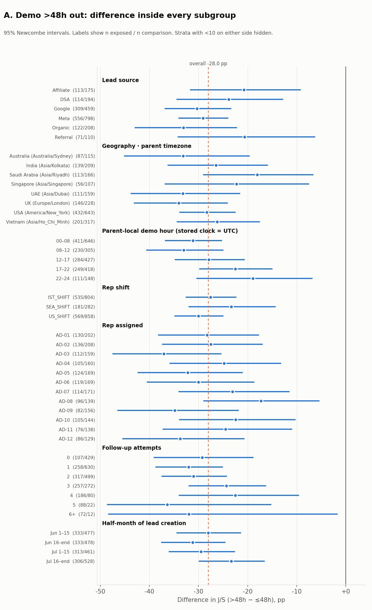
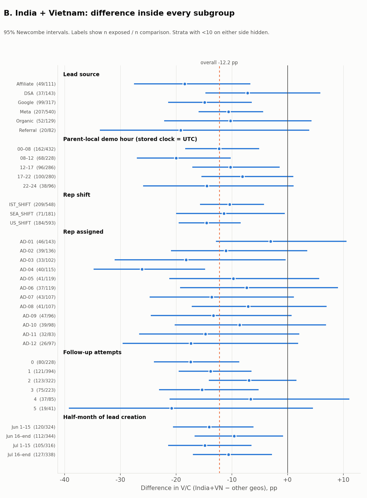
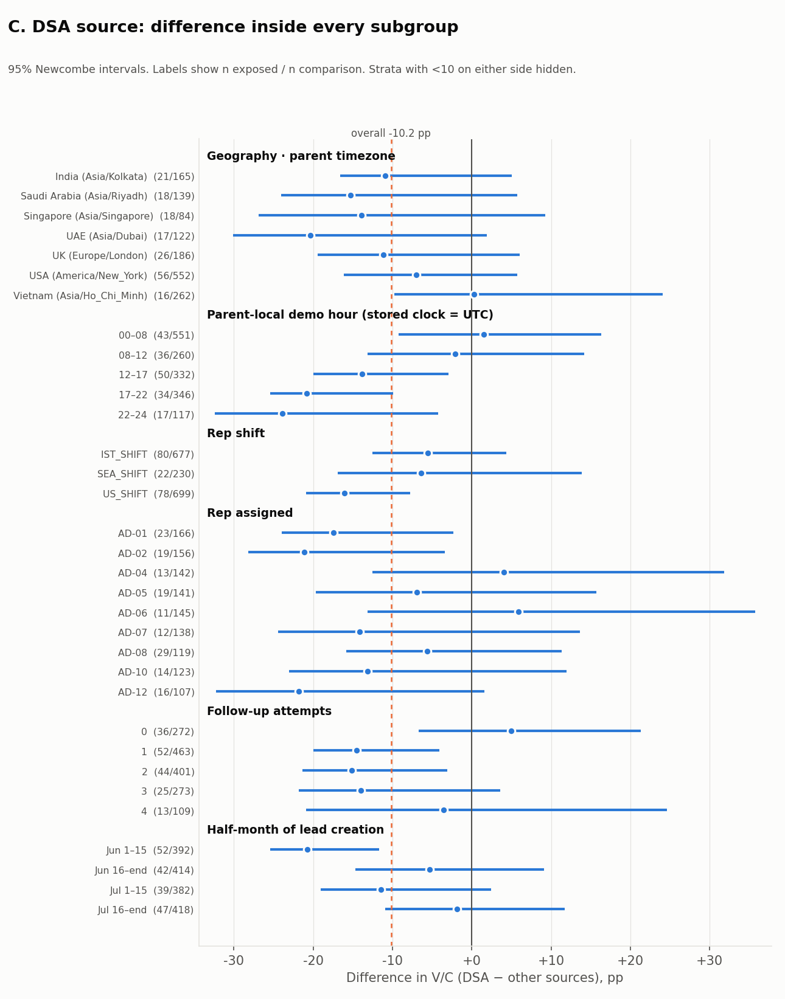
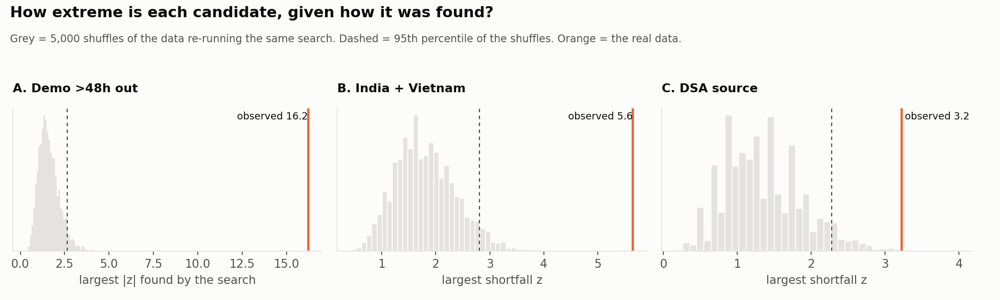

# Phase 4 — Validate the Candidate Leaks

Source file: `BrightChamps_FDA_Case_Dataset.csv`  
Generated by: `analysis/phase_04_leak_validation.py` (re-run to reproduce; permutation seed 20260923).  
Scope: stress-test the three Phase 3 candidates. Still no solution and no ₹ sizing.

## 0. Summary

| candidate                                              | step | observed gap              | 95% CI            | selection-aware p | adjusted OR [95% CI] | evidence   |
| ------------------------------------------------------ | ---- | ------------------------- | ----------------- | ----------------: | -------------------- | ---------- |
| A. Demo booked more than 48h after the lead arrived    | J/S  | 46.9% vs 74.9% (-28.0 pp) | [-31.3, -24.7] pp |            <0.001 | 0.27 [0.23, 0.32]    | **Strong** |
| B. India + Vietnam convert less after a completed demo | V/C  | 11.2% vs 23.4% (-12.2 pp) | [-15.7, -8.4] pp  |            <0.001 | 0.39 [0.29, 0.54]    | **Strong** |
| C. DSA leads convert less after a completed demo       | V/C  | 11.1% vs 21.3% (-10.2 pp) | [-14.5, -4.4] pp  |             0.002 | 0.46 [0.28, 0.75]    | **Weak**   |

**Bottom line.** A and B hold up under every check. C does not.

- **A. Late demo → no-show: Strong.** Demos set more than 48h after the lead arrived are joined 46.9% of the time vs 74.9% (-28.0 pp). The gap points the same way in every source, geography, local-hour band, shift, rep, follow-up band, half-month and week, and dropping any single group moves it by at most 1.6 pp. It survives adjustment for every measured variable (OR 0.27), and a re-run of the threshold search on shuffled data never gets close (p <0.001). These demos make up 39.8% of scheduled demos and 58.3% of all no-shows.
- **B. India + Vietnam post-demo conversion: Strong.** V/C 11.2% vs 23.4% (-12.2 pp). It is lower than *each* of the other six geographies individually, the same in every source, shift and rep, and it survives adjustment (OR 0.39) and the pooling-was-chosen-after-looking permutation test (p <0.001). The association is solid. **Whether it is an operational leak is not**: nothing in the file can tell a sales-process failure apart from price or market fit.
- **C. DSA post-demo conversion: Weak.** The overall gap (-10.2 pp) passes the selection-aware test (p 0.002), but it rests on 20 conversions. It is concentrated in one shift (US: 6.4% vs 15.0% on IST) and one half-month (1–15 June: 1 of 52 converted). Drop either one and the gap is no longer significant. In July alone it is -6.3 pp with a CI that includes 0.
- **Most defensible operational problem:** A — the wait between lead arrival and demo (section 6). It is the only candidate that is strong, large, spread across the whole operation and located at a step the sales team controls. Causation is **not** shown: an unmeasured factor such as parent intent would need a risk ratio of ≥2.6 with both late booking and no-show to explain it away. That is possible, so it needs testing before anyone relies on it.

## 1. Method

**What each check does**

- **Checks 1–6 (source, geography, timezone, shift, rep, follow-ups).** The candidate's gap is recomputed *inside* every level of the dimension (e.g. late vs early demos among Google leads only). A real effect should point the same way in most strata. Per stratum: difference with a 95% Newcombe interval (reliable at small n). Per dimension: a Mantel-Haenszel (MH) adjusted difference, a sign test on how many strata (with ≥10 per side) point the same way, and Cochran's Q for whether the size of the gap varies more than chance.
- **Check 3 (parent timezone).** Timezone is 1:1 with geography (Phase 1), so it shares geography's table. The timezone-specific question is whether the demo lands at a bad *local* hour; the storage clock is unknown (Phase 1 §7), so local hour is computed under both UTC and IST.
- **Check 7 (one small group driving it).** Leave-one-out: drop each source, geography, rep, shift, follow-up band and half-month in turn and recompute. Also: what share of the shortfall comes from each stratum compared with its share of the exposed group.
- **Check 8 (time).** June vs July, four half-months, and weeks for A.
- **Check 9 (sample size).** Events in the exposed group; minimum detectable effect (MDE) at 80% power, both at α 0.05 and at the Holm-level threshold of a 204-test screen. And a **selection-aware permutation test**: every candidate was found by searching (A: a threshold was picked from a scan; B: the two worst geographies were pooled after looking; C: the worst of six sources was picked). The test re-runs that same search on 5,000 shuffled copies of the data and asks how often chance alone finds something as extreme. This is the honest p-value for each candidate; ordinary p-values overstate it.
- **Check 10 (confounding).** Covariate balance (standardised mean difference, SMD; >0.1 = imbalanced), extra strata (weekday, hour, and the other candidates), logistic regression with all measured variables, and an E-value: how strongly an *unmeasured* confounder would need to be tied to both the exposure and the outcome (as a risk ratio) to fully explain the gap away.

**How evidence is graded** (the same rubric for all three; section 5 shows every criterion):

- **Strong** — passes all seven criteria: selection-aware p < 0.01; gap ≥5 pp with CI excluding 0; same direction in ≥85% of strata with no strong heterogeneity (Q p ≥ 0.01); dropping any single group leaves a gap ≥60% of the original with p < 0.05; CI excludes 0 in both months and half-months are homogeneous (Q p ≥ 0.05); ≥50 exposed events and 80% power at a Holm-level threshold; adjusted effect keeps ≥75% of the raw gap with the CI excluding no-effect.
- **Moderate** — passes the selection-aware test and fails at most one other criterion.
- **Weak** — fails the selection-aware test, or fails two or more other criteria. The pattern may be real, but it is too dependent on a few leads, one period or one group to act on as it stands.
- **Inconclusive** — the sample is too small to confirm or rule out a meaningful gap (sample-size criterion failed and the selection-aware test not passed).

The grade is about whether the **association is real and robust**. Whether it is **causal** and **operationally fixable** is a separate question, answered in each candidate's *fact / inference / assumption* block.

## 2. Candidate A — Demo booked more than 48h after the lead arrived

Base: 3,229 scheduled demos. Exposed = >48h (1,285); comparison = ≤48h (1,944). Outcome = J/S. Raw: 46.9% vs 74.9%, -28.0 pp [-31.3, -24.7].

### 2.1 Lead source (check 1)

| stratum   | n exp. | join exp. | n comp. | join comp. |     diff | 95% CI (pp)    | flag |
| --------- | -----: | --------: | ------: | ---------: | -------: | -------------- | ---- |
| Affiliate |    113 |     49.6% |     175 |      70.3% | -20.7 pp | [-31.7, -9.2]  |      |
| DSA       |    114 |     50.9% |     194 |      74.7% | -23.9 pp | [-34.5, -12.7] |      |
| Google    |    309 |     44.7% |     459 |      74.9% | -30.3 pp | [-36.9, -23.3] |      |
| Meta      |    556 |     47.5% |     798 |      76.6% | -29.1 pp | [-34.1, -23.9] |      |
| Organic   |    122 |     41.0% |     208 |      74.0% | -33.1 pp | [-43.0, -22.1] |      |
| Referral  |     71 |     52.1% |     110 |      72.7% | -20.6 pp | [-34.3, -6.2]  |      |

MH-adjusted difference -28.1 pp [-31.4, -24.7]; same direction in **6 of 6** strata with ≥10 per side (sign test p 0.031); heterogeneity Cochran's Q p 0.458.

### 2.2 Geography · parent timezone (check 2)

| stratum                      | n exp. | join exp. | n comp. | join comp. |     diff | 95% CI (pp)    | flag |
| ---------------------------- | -----: | --------: | ------: | ---------: | -------: | -------------- | ---- |
| Australia (Australia/Sydney) |     87 |     42.5% |     115 |      75.7% | -33.1 pp | [-45.2, -19.6] |      |
| India (Asia/Kolkata)         |    139 |     43.9% |     209 |      70.3% | -26.5 pp | [-36.3, -15.9] |      |
| Saudi Arabia (Asia/Riyadh)   |    113 |     54.9% |     166 |      72.9% | -18.0 pp | [-29.1, -6.6]  |      |
| Singapore (Asia/Singapore)   |     56 |     57.1% |     107 |      79.4% | -22.3 pp | [-36.9, -7.5]  |      |
| UAE (Asia/Dubai)             |    111 |     44.1% |     159 |      77.4% | -33.2 pp | [-43.8, -21.5] |      |
| UK (Europe/London)           |    146 |     44.5% |     228 |      78.5% | -34.0 pp | [-43.2, -24.0] |      |
| USA (America/New_York)       |    432 |     47.9% |     643 |      76.2% | -28.3 pp | [-33.9, -22.5] |      |
| Vietnam (Asia/Ho_Chi_Minh)   |    201 |     44.8% |     317 |      71.0% | -26.2 pp | [-34.4, -17.5] |      |

MH-adjusted difference -28.0 pp [-31.3, -24.6]; same direction in **8 of 8** strata with ≥10 per side (sign test p 0.008); heterogeneity Cochran's Q p 0.457.

### 2.3 Parent timezone: parent-local demo hour (check 3)

#### Parent-local demo hour (stored clock = UTC)

| stratum | n exp. | join exp. | n comp. | join comp. |     diff | 95% CI (pp)    | flag |
| ------- | -----: | --------: | ------: | ---------: | -------: | -------------- | ---- |
| 00-08   |    411 |     45.5% |     646 |      76.6% | -31.1 pp | [-36.8, -25.2] |      |
| 08-12   |    230 |     45.7% |     305 |      78.7% | -33.0 pp | [-40.6, -24.9] |      |
| 12-17   |    284 |     45.4% |     427 |      73.3% | -27.9 pp | [-34.8, -20.6] |      |
| 17-22   |    249 |     51.4% |     418 |      73.9% | -22.5 pp | [-29.9, -15.0] |      |
| 22-24   |    111 |     48.6% |     148 |      67.6% | -18.9 pp | [-30.4, -6.8]  |      |

MH-adjusted difference -28.0 pp [-31.3, -24.7]; same direction in **5 of 5** strata with ≥10 per side (sign test p 0.062); heterogeneity Cochran's Q p 0.137.

#### Parent-local demo hour (stored clock = IST)

| stratum | n exp. | join exp. | n comp. | join comp. |     diff | 95% CI (pp)    | flag |
| ------- | -----: | --------: | ------: | ---------: | -------: | -------------- | ---- |
| 00-08   |    435 |     46.2% |     627 |      78.5% | -32.3 pp | [-37.8, -26.5] |      |
| 08-12   |    239 |     46.9% |     334 |      71.3% | -24.4 pp | [-32.1, -16.3] |      |
| 12-17   |    249 |     50.6% |     405 |      74.8% | -24.2 pp | [-31.6, -16.6] |      |
| 17-22   |    274 |     46.4% |     407 |      72.7% | -26.4 pp | [-33.5, -18.9] |      |
| 22-24   |     88 |     42.0% |     171 |      74.9% | -32.8 pp | [-44.2, -20.2] |      |

MH-adjusted difference -28.0 pp [-31.4, -24.7]; same direction in **5 of 5** strata with ≥10 per side (sign test p 0.062); heterogeneity Cochran's Q p 0.316.

### 2.4 Rep shift (check 4)

| stratum   | n exp. | join exp. | n comp. | join comp. |     diff | 95% CI (pp)    | flag |
| --------- | -----: | --------: | ------: | ---------: | -------: | -------------- | ---- |
| IST_SHIFT |    535 |     47.1% |     804 |      74.6% | -27.5 pp | [-32.6, -22.3] |      |
| SEA_SHIFT |    181 |     49.7% |     282 |      73.0% | -23.3 pp | [-32.0, -14.3] |      |
| US_SHIFT  |    569 |     45.9% |     858 |      75.9% | -30.0 pp | [-34.9, -24.9] |      |

MH-adjusted difference -28.0 pp [-31.4, -24.7]; same direction in **3 of 3** strata with ≥10 per side (sign test p 0.250); heterogeneity Cochran's Q p 0.425.

### 2.5 Rep assigned (check 5)

| stratum | n exp. | join exp. | n comp. | join comp. |     diff | 95% CI (pp)    | flag |
| ------- | -----: | --------: | ------: | ---------: | -------: | -------------- | ---- |
| AD-01   |    130 |     48.5% |     202 |      76.7% | -28.3 pp | [-38.2, -17.7] |      |
| AD-02   |    136 |     44.1% |     208 |      71.6% | -27.5 pp | [-37.4, -16.9] |      |
| AD-03   |    112 |     38.4% |     159 |      75.5% | -37.1 pp | [-47.5, -25.3] |      |
| AD-04   |    105 |     53.3% |     160 |      78.1% | -24.8 pp | [-35.9, -13.2] |      |
| AD-05   |    124 |     43.5% |     169 |      75.7% | -32.2 pp | [-42.4, -21.0] |      |
| AD-06   |    119 |     44.5% |     169 |      74.6% | -30.0 pp | [-40.5, -18.6] |      |
| AD-07   |    114 |     46.5% |     171 |      69.6% | -23.1 pp | [-34.1, -11.4] |      |
| AD-08   |     96 |     60.4% |     139 |      77.7% | -17.3 pp | [-29.0, -5.3]  |      |
| AD-09   |     82 |     41.5% |     156 |      76.3% | -34.8 pp | [-46.5, -21.8] |      |
| AD-10   |    105 |     50.5% |     144 |      72.9% | -22.4 pp | [-33.9, -10.3] |      |
| AD-11   |     76 |     48.7% |     138 |      73.2% | -24.5 pp | [-37.3, -10.9] |      |
| AD-12   |     86 |     45.3% |     129 |      79.1% | -33.7 pp | [-45.5, -20.6] |      |

MH-adjusted difference -28.0 pp [-31.4, -24.7]; same direction in **12 of 12** strata with ≥10 per side (sign test p <0.001); heterogeneity Cochran's Q p 0.491.

### 2.6 Follow-up attempts (check 6)

| stratum | n exp. | join exp. | n comp. | join comp. |     diff | 95% CI (pp)    | flag |
| ------- | -----: | --------: | ------: | ---------: | -------: | -------------- | ---- |
| 0       |    107 |     43.0% |     429 |      72.3% | -29.3 pp | [-39.1, -18.8] |      |
| 1       |    258 |     45.0% |     630 |      77.0% | -32.0 pp | [-38.7, -25.0] |      |
| 2       |    317 |     42.9% |     499 |      73.9% | -31.0 pp | [-37.5, -24.2] |      |
| 3       |    257 |     52.1% |     272 |      76.5% | -24.3 pp | [-32.0, -16.2] |      |
| 4       |    186 |     46.2% |      80 |      68.8% | -22.5 pp | [-34.0, -9.5]  |      |
| 5       |     88 |     54.5% |      22 |      90.9% | -36.4 pp | [-48.6, -15.1] |      |
| 6+      |     72 |     51.4% |      12 |      83.3% | -31.9 pp | [-48.4, -1.7]  |      |

MH-adjusted difference -29.2 pp [-32.8, -25.7]; same direction in **7 of 7** strata with ≥10 per side (sign test p 0.016); heterogeneity Cochran's Q p 0.639.

### 2.7 Half-month of lead creation (check 8)

Months:

| month | n exp. | join exp. | n comp. | join comp. |     diff | 95% CI (pp)    |      p |
| ----- | -----: | --------: | ------: | ---------: | -------: | -------------- | -----: |
| Jun   |    666 |     46.1% |     955 |      75.7% | -29.6 pp | [-34.2, -24.9] | <0.001 |
| Jul   |    619 |     47.8% |     989 |      74.2% | -26.4 pp | [-31.1, -21.6] | <0.001 |

Half-months:

| stratum    | n exp. | join exp. | n comp. | join comp. |     diff | 95% CI (pp)    | flag |
| ---------- | -----: | --------: | ------: | ---------: | -------: | -------------- | ---- |
| Jun 1-15   |    333 |     47.4% |     477 |      75.5% | -28.0 pp | [-34.5, -21.3] |      |
| Jun 16-end |    333 |     44.7% |     478 |      75.9% | -31.2 pp | [-37.6, -24.5] |      |
| Jul 1-15   |    313 |     45.4% |     461 |      74.8% | -29.5 pp | [-36.1, -22.5] |      |
| Jul 16-end |    306 |     50.3% |     528 |      73.7% | -23.3 pp | [-30.0, -16.5] |      |

MH-adjusted difference -28.0 pp [-31.3, -24.7]; same direction in **4 of 4** strata with ≥10 per side (sign test p 0.125); heterogeneity Cochran's Q p 0.403.

Weeks of lead creation (A only; B and C are too thin per week):

| stratum      | n exp. | join exp. | n comp. | join comp. |     diff | 95% CI (pp)    | flag |
| ------------ | -----: | --------: | ------: | ---------: | -------: | -------------- | ---- |
| wk of Jun 01 |    149 |     49.0% |     236 |      74.2% | -25.2 pp | [-34.6, -15.2] |      |
| wk of Jun 08 |    164 |     48.2% |     214 |      77.6% | -29.4 pp | [-38.5, -19.7] |      |
| wk of Jun 15 |    158 |     44.3% |     233 |      76.4% | -32.1 pp | [-41.1, -22.3] |      |
| wk of Jun 22 |    149 |     46.3% |     224 |      75.4% | -29.1 pp | [-38.5, -19.1] |      |
| wk of Jun 29 |    159 |     41.5% |     203 |      71.9% | -30.4 pp | [-39.7, -20.3] |      |
| wk of Jul 06 |    135 |     43.7% |     217 |      77.0% | -33.3 pp | [-42.8, -22.9] |      |
| wk of Jul 13 |    143 |     53.8% |     227 |      74.0% | -20.2 pp | [-29.9, -10.1] |      |
| wk of Jul 20 |    119 |     44.5% |     230 |      74.3% | -29.8 pp | [-39.9, -19.0] |      |
| wk of Jul 27 |    109 |     52.3% |     160 |      73.1% | -20.8 pp | [-32.0, -9.1]  |      |

MH-adjusted difference -28.0 pp [-31.3, -24.7]; same direction in **9 of 9** strata with ≥10 per side (sign test p 0.004); heterogeneity Cochran's Q p 0.594.

Excluding 124 demos dated after the last lead was created: -28.6 pp [-32.0, -25.1].

Narrow window around the cut (36–48h vs 48–60h): 79.5% (n=132) vs 42.4% (n=59), -37.2 pp [-50.4, -22.3]. The drop is visible right at the threshold, not only between far-apart groups.

### 2.8 Is one small group driving it? (check 7)

| dimension dropped one level at a time | smallest remaining gap               | largest remaining gap        | worst p | biggest contributor                          |
| ------------------------------------- | ------------------------------------ | ---------------------------- | ------: | -------------------------------------------- |
| lead source                           | -27.3 pp (drop Google, p <0.001)     | -28.7 pp (drop Affiliate)    |  <0.001 | Meta: 45% of shortfall, 43% of exposed       |
| geography                             | -27.2 pp (drop UK, p <0.001)         | -29.0 pp (drop Saudi Arabia) |  <0.001 | USA: 34% of shortfall, 34% of exposed        |
| rep assigned                          | -27.2 pp (drop AD-03, p <0.001)      | -28.9 pp (drop AD-08)        |  <0.001 | AD-03: 12% of shortfall, 9% of exposed       |
| rep shift                             | -26.5 pp (drop US_SHIFT, p <0.001)   | -28.8 pp (drop SEA_SHIFT)    |  <0.001 | US_SHIFT: 47% of shortfall, 44% of exposed   |
| fu band                               | -26.6 pp (drop 1, p <0.001)          | -29.1 pp (drop 3)            |  <0.001 | 2: 26% of shortfall, 25% of exposed          |
| half month                            | -26.9 pp (drop Jun 16-end, p <0.001) | -29.6 pp (drop Jul 16-end)   |  <0.001 | Jun 16-end: 29% of shortfall, 26% of exposed |

Across all 40 leave-one-out runs the gap stays between -26.5 pp and -29.6 pp; the worst p is <0.001.

### 2.9 Sample size and selection-aware significance (check 9)

| item                                           | value                                                              |
| ---------------------------------------------- | ------------------------------------------------------------------ |
| exposed group                                  | 1,285 (603 events)                                                 |
| comparison group                               | 1,944 (1,457 events)                                               |
| 95% CI of gap (Newcombe)                       | [-31.3, -24.7] pp (width 6.7 pp)                                   |
| MDE, 80% power, alpha 0.05                     | 4.4 pp                                                             |
| MDE, 80% power, Holm-level alpha for 204 tests | 7.0 pp                                                             |
| naive p (two-proportion z)                     | <0.001                                                             |
| Phase 3 Holm p (48-72h band vs rest)           | <0.001                                                             |
| search re-run on shuffled data                 | largest absolute z over 19 cuts (12h-120h); real data peaks at 48h |
| statistic: real data                           | 16.22                                                              |
| statistic: 95th percentile under shuffling     | 2.65                                                               |
| **selection-aware p**                          | **<0.001** (none of 5,000 shuffles as extreme)                     |

### 2.10 Confounding (check 10)

Covariate balance, exposed vs comparison (largest SMD across the variable's categories):

| variable           | max SMD | category (exposed vs comp.) | verdict        |
| ------------------ | ------: | --------------------------- | -------------- |
| Lead source        |    0.04 | Meta (43% vs 41%)           | balanced       |
| Geography          |    0.05 | Singapore (4% vs 6%)        | balanced       |
| Rep                |    0.06 | AD-09 (6% vs 8%)            | balanced       |
| Rep shift          |    0.01 | SEA_SHIFT (14% vs 15%)      | balanced       |
| Follow-up attempts |    0.39 | 0 (8% vs 22%)               | **imbalanced** |
| Month              |    0.05 | Jun (52% vs 49%)            | balanced       |
| Day created        |    0.09 | Tue (17% vs 14%)            | balanced       |
| Demo weekday       |    0.09 | Tue (16% vs 13%)            | balanced       |

Gap within strata of other possible confounders:

| held fixed                           |  MH diff | 95% CI (pp)    | strata same direction | heterogeneity p |
| ------------------------------------ | -------: | -------------- | --------------------- | --------------: |
| Day lead was created                 | -28.1 pp | [-31.4, -24.7] | 7/7                   |           0.190 |
| Day of the demo                      | -28.1 pp | [-31.4, -24.7] | 7/7                   |           0.298 |
| Hour lead was created (stored clock) | -28.1 pp | [-31.4, -24.7] | 5/5                   |           0.565 |
| DSA source                           | -28.0 pp | [-31.3, -24.7] | 2/2                   |           0.437 |
| India/Vietnam                        | -28.1 pp | [-31.4, -24.7] | 2/2                   |           0.540 |

Logistic regression (outcome = J/S):

| adjusted for                                | covariate terms | odds ratio | 95% CI       |      p | avg. marginal effect |
| ------------------------------------------- | --------------: | ---------: | ------------ | -----: | -------------------: |
| none                                        |               0 |       0.30 | [0.25, 0.34] | <0.001 |             -28.0 pp |
| source/geography, rep (absorbs shift)       |              23 |       0.29 | [0.25, 0.34] | <0.001 |             -28.0 pp |
| + follow-ups, month, created & demo weekday |              42 |       0.27 | [0.23, 0.32] | <0.001 |             -29.3 pp |

Risk ratio 0.63. **E-value 2.57** (for the CI limit: 2.36): an unmeasured confounder would need a risk ratio of at least 2.57 with both >48h status and the outcome — beyond everything adjusted for above — to fully explain the gap.

**Reading the evidence**

- **Observed fact.** 1,285 of 3,229 scheduled demos (39.8%) were set more than 48h after lead creation; 46.9% were joined vs 74.9% for the rest. These late demos hold 682 of the 1,169 no-shows (58.3%). Right around the threshold (36–48h vs 48–60h) join rate falls from 79.5% to 42.4% (-37.2 pp, CI [-50.4, -22.3]). Late demos that *are* joined complete (87.9% vs 86.2%) and convert (23.2% vs 19.0%, p 0.045) at least as well as early ones.
- **Observed fact.** Late booking is spread evenly across source, geography, shift, rep, month and weekday (all SMD ≤ 0.1). The one imbalance is follow-up attempts (SMD 0.39: 0 (8% vs 22%)), and the gap gets slightly *bigger* once follow-ups are held fixed.
- **Inference.** Because the gap is the same size in every rep, shift, market and source, it looks like a property of the booking process, not of one team or one audience. Late joiners convert just as well, which fits "the same parents, fewer of whom turn up" better than "a less interested group of parents".
- **Inference.** The drop is a *step* at ~48h rather than a steady decline. That shape suggests a rule or process boundary — for example, reminders or confirmations that only run for demos inside a 48h window — or an artefact of how the data was generated. The file cannot tell which.
- **Assumption (untested).** That the delay causes the no-show. The other direction is plausible: parents with low intent may pick far-off slots or be hard to reach. Intent is not in the data. The E-value (2.57; 2.36 for the CI limit) says how strong such a factor would need to be. That is large but not implausible for intent.
- **Assumption (untested).** That `demo_scheduled_at` is the *first* slot offered, not a rescheduled one, and that the slot can be moved earlier. Who picks the slot (parent, rep or a capacity-limited calendar) is unknown.

## 3. Candidate B — India + Vietnam convert less after a completed demo

Base: 1,786 completed demos. Exposed = India+VN (464); comparison = other geos (1,322). Outcome = V/C. Raw: 11.2% vs 23.4%, -12.2 pp [-15.7, -8.4].

### 3.1 Geography and parent timezone — the candidate's own dimension (checks 2–3)

| geography (timezone)         | completed | converted |   V/C | 95% CI (%)   |
| ---------------------------- | --------: | --------: | ----: | ------------ |
| India (Asia/Kolkata)         |       186 |        18 |  9.7% | [6.2, 14.8]  |
| Vietnam (Asia/Ho_Chi_Minh)   |       278 |        34 | 12.2% | [8.9, 16.6]  |
| UK (Europe/London)           |       212 |        37 | 17.5% | [12.9, 23.1] |
| Saudi Arabia (Asia/Riyadh)   |       157 |        30 | 19.1% | [13.7, 26.0] |
| Singapore (Asia/Singapore)   |       102 |        23 | 22.5% | [15.5, 31.6] |
| UAE (Asia/Dubai)             |       139 |        33 | 23.7% | [17.4, 31.5] |
| USA (America/New_York)       |       608 |       158 | 26.0% | [22.7, 29.6] |
| Australia (Australia/Sydney) |       104 |        29 | 27.9% | [20.2, 37.2] |

| comparison                 |     diff | 95% CI (pp)    |
| -------------------------- | -------: | -------------- |
| India+VN vs Australia      | -16.7 pp | [-26.3, -8.3]  |
| India+VN vs Saudi Arabia   |  -7.9 pp | [-15.2, -1.6]  |
| India+VN vs Singapore      | -11.3 pp | [-20.7, -3.6]  |
| India+VN vs UAE            | -12.5 pp | [-20.7, -5.5]  |
| India+VN vs UK             |  -6.2 pp | [-12.5, -0.7]  |
| India+VN vs USA            | -14.8 pp | [-19.2, -10.2] |
| India+VN vs rest excl. USA | -10.1 pp | [-14.1, -5.8]  |
| India alone vs other six   | -13.8 pp | [-18.0, -8.2]  |
| Vietnam alone vs other six | -11.2 pp | [-15.3, -6.3]  |

India vs Vietnam: Fisher p 0.454 (no evidence they differ from each other). Among the other six geographies: chi-square p 0.099.

### 3.2 Lead source (check 1)

| stratum   | n exp. | conv. exp. | n comp. | conv. comp. |     diff | 95% CI (pp)   | flag |
| --------- | -----: | ---------: | ------: | ----------: | -------: | ------------- | ---- |
| Affiliate |     49 |       4.1% |     111 |       22.5% | -18.4 pp | [-27.5, -6.7] |      |
| DSA       |     37 |       5.4% |     143 |       12.6% |  -7.2 pp | [-14.7, +5.9] |      |
| Google    |     99 |       9.1% |     317 |       24.0% | -14.9 pp | [-21.4, -6.4] |      |
| Meta      |    207 |      12.6% |     540 |       23.1% | -10.6 pp | [-15.9, -4.4] |      |
| Organic   |     52 |      19.2% |     129 |       29.5% | -10.2 pp | [-22.1, +4.3] |      |
| Referral  |     20 |      15.0% |      82 |       34.1% | -19.1 pp | [-33.7, +3.9] |      |

MH-adjusted difference -12.4 pp [-16.0, -8.7]; same direction in **6 of 6** strata with ≥10 per side (sign test p 0.031); heterogeneity Cochran's Q p 0.578.

### 3.3 Parent timezone: parent-local demo hour (check 3)

#### Parent-local demo hour (stored clock = UTC)

| stratum | n exp. | conv. exp. | n comp. | conv. comp. |     diff | 95% CI (pp)    | flag |
| ------- | -----: | ---------: | ------: | ----------: | -------: | -------------- | ---- |
| 00-08   |    162 |      13.0% |     432 |       25.2% | -12.3 pp | [-18.4, -5.1]  |      |
| 08-12   |     68 |       5.9% |     228 |       25.9% | -20.0 pp | [-27.0, -10.2] |      |
| 12-17   |     96 |      10.4% |     286 |       20.6% | -10.2 pp | [-17.1, -1.4]  |      |
| 17-22   |    100 |      13.0% |     280 |       21.1% |  -8.1 pp | [-15.4, +1.0]  |      |
| 22-24   |     38 |      10.5% |      96 |       25.0% | -14.5 pp | [-25.9, +1.1]  |      |

MH-adjusted difference -12.3 pp [-15.9, -8.6]; same direction in **5 of 5** strata with ≥10 per side (sign test p 0.062); heterogeneity Cochran's Q p 0.323.

#### Parent-local demo hour (stored clock = IST)

| stratum | n exp. | conv. exp. | n comp. | conv. comp. |     diff | 95% CI (pp)    | flag |
| ------- | -----: | ---------: | ------: | ----------: | -------: | -------------- | ---- |
| 00-08   |    147 |      10.2% |     445 |       25.6% | -15.4 pp | [-21.2, -8.3]  |      |
| 08-12   |     80 |      11.2% |     226 |       22.6% | -11.3 pp | [-19.2, -1.2]  |      |
| 12-17   |    102 |      11.8% |     271 |       21.4% |  -9.6 pp | [-16.8, -0.8]  |      |
| 17-22   |    100 |      12.0% |     269 |       25.3% | -13.3 pp | [-20.7, -4.1]  |      |
| 22-24   |     35 |      11.4% |     111 |       17.1% |  -5.7 pp | [-16.3, +10.0] |      |

MH-adjusted difference -12.3 pp [-15.9, -8.6]; same direction in **5 of 5** strata with ≥10 per side (sign test p 0.062); heterogeneity Cochran's Q p 0.660.

### 3.4 Rep shift (check 4)

| stratum   | n exp. | conv. exp. | n comp. | conv. comp. |     diff | 95% CI (pp)   | flag |
| --------- | -----: | ---------: | ------: | ----------: | -------: | ------------- | ---- |
| IST_SHIFT |    209 |      12.4% |     548 |       22.8% | -10.4 pp | [-15.7, -4.2] |      |
| SEA_SHIFT |     71 |      11.3% |     181 |       22.7% | -11.4 pp | [-20.0, -0.5] |      |
| US_SHIFT  |    184 |       9.8% |     593 |       24.3% | -14.5 pp | [-19.5, -8.4] |      |

MH-adjusted difference -12.2 pp [-15.9, -8.5]; same direction in **3 of 3** strata with ≥10 per side (sign test p 0.250); heterogeneity Cochran's Q p 0.584.

### 3.5 Rep assigned (check 5)

| stratum | n exp. | conv. exp. | n comp. | conv. comp. |     diff | 95% CI (pp)    | flag |
| ------- | -----: | ---------: | ------: | ----------: | -------: | -------------- | ---- |
| AD-01   |     46 |      13.0% |     143 |       16.1% |  -3.0 pp | [-12.8, +10.6] |      |
| AD-02   |     39 |      10.3% |     136 |       21.3% | -11.1 pp | [-20.9, +3.6]  |      |
| AD-03   |     33 |      15.2% |     102 |       33.3% | -18.2 pp | [-31.0, -0.3]  |      |
| AD-04   |     40 |       0.0% |     115 |       26.1% | -26.1 pp | [-34.8, -14.8] |      |
| AD-05   |     41 |      14.6% |     119 |       24.4% |  -9.7 pp | [-21.2, +5.7]  |      |
| AD-06   |     37 |      16.2% |     119 |       23.5% |  -7.3 pp | [-19.3, +9.1]  |      |
| AD-07   |     43 |      11.6% |     107 |       25.2% | -13.6 pp | [-24.7, +1.2]  |      |
| AD-08   |     41 |       9.8% |     107 |       16.8% |  -7.1 pp | [-17.2, +7.0]  |      |
| AD-09   |     47 |      10.6% |      96 |       24.0% | -13.3 pp | [-24.5, +0.8]  |      |
| AD-10   |     39 |      12.8% |      98 |       21.4% |  -8.6 pp | [-20.2, +6.9]  |      |
| AD-11   |     32 |       9.4% |      83 |       24.1% | -14.7 pp | [-26.6, +2.1]  |      |
| AD-12   |     26 |      11.5% |      97 |       28.9% | -17.3 pp | [-29.6, +1.9]  |      |

MH-adjusted difference -12.2 pp [-15.8, -8.5]; same direction in **12 of 12** strata with ≥10 per side (sign test p <0.001); heterogeneity Cochran's Q p 0.256.

### 3.6 Follow-up attempts (check 6)

| stratum | n exp. | conv. exp. | n comp. | conv. comp. |     diff | 95% CI (pp)    | flag |
| ------- | -----: | ---------: | ------: | ----------: | -------: | -------------- | ---- |
| 0       |     80 |       5.0% |     228 |       22.4% | -17.4 pp | [-24.0, -8.7]  |      |
| 1       |    121 |       8.3% |     394 |       22.1% | -13.8 pp | [-19.5, -6.5]  |      |
| 2       |    123 |      15.4% |     322 |       22.4% |  -6.9 pp | [-14.1, +1.6]  |      |
| 3       |     75 |       9.3% |     223 |       24.7% | -15.3 pp | [-23.0, -5.2]  |      |
| 4       |     37 |      21.6% |      85 |       28.2% |  -6.6 pp | [-21.2, +11.1] |      |
| 5       |     19 |      15.8% |      41 |       36.6% | -20.8 pp | [-39.2, +4.6]  |      |
| 6+      |      9 |      11.1% |      29 |       20.7% |  -9.6 pp | [-29.5, +24.6] | n<10 |

MH-adjusted difference -12.5 pp [-16.2, -8.9]; same direction in **6 of 6** strata with ≥10 per side (sign test p 0.031); heterogeneity Cochran's Q p 0.419.

### 3.7 Half-month of lead creation (check 8)

Months:

| month | n exp. | conv. exp. | n comp. | conv. comp. |     diff | 95% CI (pp)   |      p |
| ----- | -----: | ---------: | ------: | ----------: | -------: | ------------- | -----: |
| Jun   |    232 |      12.1% |     668 |       24.0% | -11.9 pp | [-16.8, -6.2] | <0.001 |
| Jul   |    232 |      10.3% |     654 |       22.9% | -12.6 pp | [-17.3, -7.1] | <0.001 |

Half-months:

| stratum    | n exp. | conv. exp. | n comp. | conv. comp. |     diff | 95% CI (pp)   | flag |
| ---------- | -----: | ---------: | ------: | ----------: | -------: | ------------- | ---- |
| Jun 1-15   |    120 |      10.0% |     324 |       24.1% | -14.1 pp | [-20.6, -6.1] |      |
| Jun 16-end |    112 |      14.3% |     344 |       23.8% |  -9.6 pp | [-16.7, -0.8] |      |
| Jul 1-15   |    105 |       9.5% |     316 |       24.4% | -14.8 pp | [-21.4, -6.5] |      |
| Jul 16-end |    127 |      11.0% |     338 |       21.6% | -10.6 pp | [-17.0, -2.8] |      |

MH-adjusted difference -12.2 pp [-15.9, -8.5]; same direction in **4 of 4** strata with ≥10 per side (sign test p 0.125); heterogeneity Cochran's Q p 0.712.

### 3.8 Is one small group driving it? (check 7)

| dimension dropped one level at a time | smallest remaining gap              | largest remaining gap      | worst p | biggest contributor                        |
| ------------------------------------- | ----------------------------------- | -------------------------- | ------: | ------------------------------------------ |
| lead source                           | -11.5 pp (drop Affiliate, p <0.001) | -13.5 pp (drop Meta)       |  <0.001 | Meta: 38% of shortfall, 45% of exposed     |
| rep assigned                          | -10.9 pp (drop AD-04, p <0.001)     | -13.3 pp (drop AD-01)      |  <0.001 | AD-04: 18% of shortfall, 9% of exposed     |
| rep shift                             | -10.6 pp (drop US_SHIFT, p <0.001)  | -13.7 pp (drop IST_SHIFT)  |  <0.001 | US_SHIFT: 47% of shortfall, 40% of exposed |
| fu band                               | -11.2 pp (drop 0, p <0.001)         | -14.1 pp (drop 2)          |  <0.001 | 1: 29% of shortfall, 26% of exposed        |
| half month                            | -11.5 pp (drop Jul 1-15, p <0.001)  | -13.1 pp (drop Jun 16-end) |  <0.001 | Jun 1-15: 30% of shortfall, 26% of exposed |

Across all 32 leave-one-out runs the gap stays between -10.6 pp and -14.1 pp; the worst p is <0.001.

### 3.9 Sample size and selection-aware significance (check 9)

| item                                           | value                                                                          |
| ---------------------------------------------- | ------------------------------------------------------------------------------ |
| exposed group                                  | 464 (52 events)                                                                |
| comparison group                               | 1,322 (310 events)                                                             |
| 95% CI of gap (Newcombe)                       | [-15.7, -8.4] pp (width 7.4 pp)                                                |
| MDE, 80% power, alpha 0.05                     | 6.4 pp                                                                         |
| MDE, 80% power, Holm-level alpha for 204 tests | 10.3 pp                                                                        |
| naive p (two-proportion z)                     | <0.001                                                                         |
| Phase 3 Holm p                                 | India 0.028, Vietnam 0.055                                                     |
| search re-run on shuffled data                 | worst of 36 single geographies and pairs; real data's worst is India + Vietnam |
| statistic: real data                           | 5.64                                                                           |
| statistic: 95th percentile under shuffling     | 2.81                                                                           |
| **selection-aware p**                          | **<0.001** (none of 5,000 shuffles as extreme)                                 |

### 3.10 Confounding (check 10)

Covariate balance, exposed vs comparison (largest SMD across the variable's categories):

| variable           | max SMD | category (exposed vs comp.) | verdict        |
| ------------------ | ------: | --------------------------- | -------------- |
| Lead source        |    0.10 | DSA (8% vs 11%)             | balanced       |
| Rep                |    0.10 | AD-09 (10% vs 7%)           | balanced       |
| Rep shift          |    0.11 | US_SHIFT (40% vs 45%)       | **imbalanced** |
| Follow-up attempts |    0.08 | 1 (26% vs 30%)              | balanced       |
| Month              |    0.01 | Jun (50% vs 51%)            | balanced       |
| Day created        |    0.08 | Fri (13% vs 16%)            | balanced       |
| Demo weekday       |    0.04 | Mon (13% vs 14%)            | balanced       |
| Demo >48h          |    0.02 | False (71% vs 70%)          | balanced       |

Gap within strata of other possible confounders:

| held fixed                           |  MH diff | 95% CI (pp)   | strata same direction | heterogeneity p |
| ------------------------------------ | -------: | ------------- | --------------------- | --------------: |
| Day lead was created                 | -12.2 pp | [-15.8, -8.5] | 7/7                   |           0.042 |
| Day of the demo                      | -12.3 pp | [-16.0, -8.7] | 7/7                   |           0.436 |
| Hour lead was created (stored clock) | -12.3 pp | [-15.9, -8.6] | 5/5                   |           0.739 |
| Demo >48h out                        | -12.2 pp | [-15.9, -8.5] | 2/2                   |           0.758 |
| DSA source                           | -12.6 pp | [-16.2, -8.9] | 2/2                   |           0.284 |

Logistic regression (outcome = V/C):

| adjusted for                                           | covariate terms | odds ratio | 95% CI       |      p | avg. marginal effect |
| ------------------------------------------------------ | --------------: | ---------: | ------------ | -----: | -------------------: |
| none                                                   |               0 |       0.41 | [0.30, 0.56] | <0.001 |             -12.2 pp |
| source/geography, rep (absorbs shift)                  |              16 |       0.41 | [0.30, 0.56] | <0.001 |             -12.2 pp |
| + follow-ups, month, created & demo weekday, demo >48h |              36 |       0.39 | [0.29, 0.54] | <0.001 |             -12.5 pp |

Risk ratio 0.48. **E-value 3.60** (for the CI limit: 2.56): an unmeasured confounder would need a risk ratio of at least 3.60 with both India+VN status and the outcome — beyond everything adjusted for above — to fully explain the gap.

**Reading the evidence**

- **Observed fact.** V/C: India 9.7%, Vietnam 12.2%; the other six range UK 17.5%, Saudi Arabia 19.1%, Singapore 22.5%, UAE 23.7%, USA 26.0%, Australia 27.9%. The pair is lower than each of the six individually (smallest gap: vs UK, -6.2 pp) and lower than the rest with the high-converting USA left out. India and Vietnam do not differ from each other (p 0.454).
- **Observed fact.** Before the demo these markets are close to normal (only the join rate is slightly lower): scheduled +1.9 pp (p 0.225), joined -4.7 pp (p 0.015), completed +2.7 pp (p 0.115). Almost the whole gap sits at the payment decision.
- **Observed fact.** The shift mix is close to the rest (US shift 40% vs 45%), and the gap is the same size on IST, SEA and US shifts and under every rep. So the team handling the lead does not explain it.
- **Inference.** A gap that is the same whoever handles the lead, and that appears only at the payment step, points to something about the market rather than about how the lead was worked: price relative to local income, payment methods, currency, or product/language fit. None of these is in the file.
- **Assumption (untested).** That the ₹60,000 revenue per conversion applies in these markets. If prices are localised, the value of this gap differs.
- **Assumption (untested).** That the demo and the closing conversation are the same product in every market. The demo teacher and closer are not recorded, so a market-specific pitch problem cannot be ruled in or out.

## 4. Candidate C — DSA leads convert less after a completed demo

Base: 1,786 completed demos. Exposed = DSA (180); comparison = other sources (1,606). Outcome = V/C. Raw: 11.1% vs 21.3%, -10.2 pp [-14.5, -4.4].

### 4.1 Lead source — the candidate's own dimension (check 1)

| lead source | completed | converted |   V/C | 95% CI (%)   |
| ----------- | --------: | --------: | ----: | ------------ |
| Affiliate   |       160 |        27 | 16.9% | [11.9, 23.4] |
| DSA         |       180 |        20 | 11.1% | [7.3, 16.5]  |
| Google      |       416 |        85 | 20.4% | [16.8, 24.6] |
| Meta        |       747 |       151 | 20.2% | [17.5, 23.2] |
| Organic     |       181 |        48 | 26.5% | [20.6, 33.4] |
| Referral    |       102 |        31 | 30.4% | [22.3, 39.9] |

| comparison                                         |     diff | 95% CI (pp)   |
| -------------------------------------------------- | -------: | ------------- |
| DSA vs Affiliate                                   |  -5.8 pp | [-13.3, +1.6] |
| DSA vs Google                                      |  -9.3 pp | [-14.9, -2.8] |
| DSA vs Meta                                        |  -9.1 pp | [-14.0, -3.0] |
| DSA vs Organic                                     | -15.4 pp | [-23.3, -7.4] |
| DSA vs Referral                                    | -19.3 pp | [-29.5, -9.5] |
| DSA vs paid sources only (Affiliate, Google, Meta) |  -8.8 pp | [-13.2, -3.0] |

Among the other five sources: chi-square p 0.032.

### 4.2 Geography · parent timezone (check 2)

| stratum                      | n exp. | conv. exp. | n comp. | conv. comp. |     diff | 95% CI (pp)    | flag |
| ---------------------------- | -----: | ---------: | ------: | ----------: | -------: | -------------- | ---- |
| Australia (Australia/Sydney) |      8 |      12.5% |      96 |       29.2% | -16.7 pp | [-30.8, +18.9] | n<10 |
| India (Asia/Kolkata)         |     21 |       0.0% |     165 |       10.9% | -10.9 pp | [-16.6, +5.0]  |      |
| Saudi Arabia (Asia/Riyadh)   |     18 |       5.6% |     139 |       20.9% | -15.3 pp | [-24.1, +5.7]  |      |
| Singapore (Asia/Singapore)   |     18 |      11.1% |      84 |       25.0% | -13.9 pp | [-26.9, +9.2]  |      |
| UAE (Asia/Dubai)             |     17 |       5.9% |     122 |       26.2% | -20.3 pp | [-30.1, +1.9]  |      |
| UK (Europe/London)           |     26 |       7.7% |     186 |       18.8% | -11.1 pp | [-19.5, +6.1]  |      |
| USA (America/New_York)       |     56 |      19.6% |     552 |       26.6% |  -7.0 pp | [-16.1, +5.7]  |      |
| Vietnam (Asia/Ho_Chi_Minh)   |     16 |      12.5% |     262 |       12.2% |  +0.3 pp | [-9.8, +24.1]  |      |

MH-adjusted difference -10.5 pp [-15.5, -5.5]; same direction in **6 of 7** strata with ≥10 per side (sign test p 0.125); heterogeneity Cochran's Q p 0.699.

### 4.3 Parent timezone: parent-local demo hour (check 3)

#### Parent-local demo hour (stored clock = UTC)

| stratum | n exp. | conv. exp. | n comp. | conv. comp. |     diff | 95% CI (pp)    | flag |
| ------- | -----: | ---------: | ------: | ----------: | -------: | -------------- | ---- |
| 00-08   |     43 |      23.3% |     551 |       21.8% |  +1.5 pp | [-9.3, +16.3]  |      |
| 08-12   |     36 |      19.4% |     260 |       21.5% |  -2.1 pp | [-13.2, +14.1] |      |
| 12-17   |     50 |       6.0% |     332 |       19.9% | -13.9 pp | [-20.0, -2.9]  |      |
| 17-22   |     34 |       0.0% |     346 |       20.8% | -20.8 pp | [-25.4, -9.9]  |      |
| 22-24   |     17 |       0.0% |     117 |       23.9% | -23.9 pp | [-32.4, -4.3]  |      |

MH-adjusted difference -10.0 pp [-14.9, -5.1]; same direction in **4 of 5** strata with ≥10 per side (sign test p 0.375); heterogeneity Cochran's Q p 0.007.

#### Parent-local demo hour (stored clock = IST)

| stratum | n exp. | conv. exp. | n comp. | conv. comp. |     diff | 95% CI (pp)    | flag |
| ------- | -----: | ---------: | ------: | ----------: | -------: | -------------- | ---- |
| 00-08   |     63 |      17.5% |     529 |       22.3% |  -4.8 pp | [-13.2, +6.8]  |      |
| 08-12   |     38 |       7.9% |     268 |       21.3% | -13.4 pp | [-20.8, +0.3]  |      |
| 12-17   |     31 |       0.0% |     342 |       20.5% | -20.5 pp | [-25.1, -8.8]  |      |
| 17-22   |     36 |      16.7% |     333 |       22.2% |  -5.6 pp | [-15.6, +10.2] |      |
| 22-24   |     12 |       0.0% |     134 |       17.2% | -17.2 pp | [-24.4, +7.7]  |      |

MH-adjusted difference -10.3 pp [-15.2, -5.4]; same direction in **5 of 5** strata with ≥10 per side (sign test p 0.062); heterogeneity Cochran's Q p 0.091.

### 4.4 Rep shift (check 4)

| stratum   | n exp. | conv. exp. | n comp. | conv. comp. |     diff | 95% CI (pp)    | flag |
| --------- | -----: | ---------: | ------: | ----------: | -------: | -------------- | ---- |
| IST_SHIFT |     80 |      15.0% |     677 |       20.5% |  -5.5 pp | [-12.5, +4.3]  |      |
| SEA_SHIFT |     22 |      13.6% |     230 |       20.0% |  -6.4 pp | [-16.9, +13.9] |      |
| US_SHIFT  |     78 |       6.4% |     699 |       22.5% | -16.1 pp | [-20.9, -7.8]  |      |

MH-adjusted difference -10.2 pp [-15.2, -5.2]; same direction in **3 of 3** strata with ≥10 per side (sign test p 0.250); heterogeneity Cochran's Q p 0.124.

### 4.5 Rep assigned (check 5)

| stratum | n exp. | conv. exp. | n comp. | conv. comp. |     diff | 95% CI (pp)    | flag |
| ------- | -----: | ---------: | ------: | ----------: | -------: | -------------- | ---- |
| AD-01   |     23 |       0.0% |     166 |       17.5% | -17.5 pp | [-24.0, -2.3]  |      |
| AD-02   |     19 |       0.0% |     156 |       21.2% | -21.2 pp | [-28.2, -3.4]  |      |
| AD-03   |      7 |      14.3% |     128 |       29.7% | -15.4 pp | [-29.8, +22.3] | n<10 |
| AD-04   |     13 |      23.1% |     142 |       19.0% |  +4.1 pp | [-12.5, +31.8] |      |
| AD-05   |     19 |      15.8% |     141 |       22.7% |  -6.9 pp | [-19.7, +15.7] |      |
| AD-06   |     11 |      27.3% |     145 |       21.4% |  +5.9 pp | [-13.1, +35.8] |      |
| AD-07   |     12 |       8.3% |     138 |       22.5% | -14.1 pp | [-24.4, +13.6] |      |
| AD-08   |     29 |      10.3% |     119 |       16.0% |  -5.6 pp | [-15.8, +11.3] |      |
| AD-09   |      9 |      22.2% |     134 |       19.4% |  +2.8 pp | [-14.8, +35.9] | n<10 |
| AD-10   |     14 |       7.1% |     123 |       20.3% | -13.2 pp | [-23.1, +11.9] |      |
| AD-11   |      8 |      25.0% |     107 |       19.6% |  +5.4 pp | [-14.4, +40.0] | n<10 |
| AD-12   |     16 |       6.2% |     107 |       28.0% | -21.8 pp | [-32.3, +1.6]  |      |

MH-adjusted difference -9.5 pp [-14.4, -4.6]; same direction in **7 of 9** strata with ≥10 per side (sign test p 0.180); heterogeneity Cochran's Q p 0.299.

### 4.6 Follow-up attempts (check 6)

| stratum | n exp. | conv. exp. | n comp. | conv. comp. |     diff | 95% CI (pp)    | flag |
| ------- | -----: | ---------: | ------: | ----------: | -------: | -------------- | ---- |
| 0       |     36 |      22.2% |     272 |       17.3% |  +4.9 pp | [-6.7, +21.3]  |      |
| 1       |     52 |       5.8% |     463 |       20.3% | -14.5 pp | [-20.0, -4.1]  |      |
| 2       |     44 |       6.8% |     401 |       21.9% | -15.1 pp | [-21.3, -3.1]  |      |
| 3       |     25 |       8.0% |     273 |       22.0% | -14.0 pp | [-21.8, +3.6]  |      |
| 4       |     13 |      23.1% |     109 |       26.6% |  -3.5 pp | [-20.9, +24.6] |      |
| 5       |      5 |       0.0% |      55 |       32.7% | -32.7 pp | [-45.9, +12.1] | n<10 |
| 6+      |      5 |      20.0% |      33 |       18.2% |  +1.8 pp | [-21.2, +45.3] | n<10 |

MH-adjusted difference -10.1 pp [-14.9, -5.2]; same direction in **4 of 5** strata with ≥10 per side (sign test p 0.375); heterogeneity Cochran's Q p 0.144.

### 4.7 Half-month of lead creation (check 8)

Months:

| month | n exp. | conv. exp. | n comp. | conv. comp. |     diff | 95% CI (pp)   |     p |
| ----- | -----: | ---------: | ------: | ----------: | -------: | ------------- | ----: |
| Jun   |     94 |       8.5% |     806 |       22.3% | -13.8 pp | [-18.9, -5.9] | 0.002 |
| Jul   |     86 |      14.0% |     800 |       20.2% |  -6.3 pp | [-12.8, +3.0] | 0.163 |

Half-months:

| stratum    | n exp. | conv. exp. | n comp. | conv. comp. |     diff | 95% CI (pp)    | flag |
| ---------- | -----: | ---------: | ------: | ----------: | -------: | -------------- | ---- |
| Jun 1-15   |     52 |       1.9% |     392 |       22.7% | -20.8 pp | [-25.5, -11.7] |      |
| Jun 16-end |     42 |      16.7% |     414 |       22.0% |  -5.3 pp | [-14.7, +9.1]  |      |
| Jul 1-15   |     39 |      10.3% |     382 |       21.7% | -11.5 pp | [-19.1, +2.4]  |      |
| Jul 16-end |     47 |      17.0% |     418 |       18.9% |  -1.9 pp | [-11.0, +11.7] |      |

MH-adjusted difference -10.2 pp [-15.1, -5.2]; same direction in **4 of 4** strata with ≥10 per side (sign test p 0.125); heterogeneity Cochran's Q p 0.014.

### 4.8 Is one small group driving it? (check 7)

| dimension dropped one level at a time | smallest remaining gap           | largest remaining gap      | worst p | biggest contributor                        |
| ------------------------------------- | -------------------------------- | -------------------------- | ------: | ------------------------------------------ |
| geography                             | -9.2 pp (drop UAE, p 0.005)      | -12.1 pp (drop Vietnam)    |   0.005 | USA: 20% of shortfall, 31% of exposed      |
| rep assigned                          | -8.9 pp (drop AD-02, p 0.008)    | -11.3 pp (drop AD-04)      |   0.008 | AD-02: 23% of shortfall, 11% of exposed    |
| rep shift                             | -5.7 pp (drop US_SHIFT, p 0.172) | -13.9 pp (drop IST_SHIFT)  |   0.172 | US_SHIFT: 68% of shortfall, 43% of exposed |
| fu band                               | -8.4 pp (drop 1, p 0.026)        | -13.8 pp (drop 0)          |   0.026 | 1: 42% of shortfall, 29% of exposed        |
| half month                            | -6.0 pp (drop Jun 1-15, p 0.108) | -13.1 pp (drop Jul 16-end) |   0.108 | Jun 1-15: 59% of shortfall, 29% of exposed |

Across all 34 leave-one-out runs the gap stays between -5.7 pp and -13.9 pp; the worst p is 0.172.

### 4.9 Sample size and selection-aware significance (check 9)

| item                                           | value                                        |
| ---------------------------------------------- | -------------------------------------------- |
| exposed group                                  | 180 (20 events)                              |
| comparison group                               | 1,606 (342 events)                           |
| 95% CI of gap (Newcombe)                       | [-14.5, -4.4] pp (width 10.1 pp)             |
| MDE, 80% power, alpha 0.05                     | 9.0 pp                                       |
| MDE, 80% power, Holm-level alpha for 204 tests | 14.5 pp                                      |
| naive p (two-proportion z)                     | 0.001                                        |
| Phase 3 Holm p                                 | 0.236                                        |
| search re-run on shuffled data                 | worst of 6 sources; real data's worst is DSA |
| statistic: real data                           | 3.22                                         |
| statistic: 95th percentile under shuffling     | 2.28                                         |
| **selection-aware p**                          | **0.002**                                    |

### 4.10 Confounding (check 10)

Covariate balance, exposed vs comparison (largest SMD across the variable's categories):

| variable           | max SMD | category (exposed vs comp.) | verdict        |
| ------------------ | ------: | --------------------------- | -------------- |
| Geography          |    0.23 | Vietnam (9% vs 16%)         | **imbalanced** |
| Rep                |    0.27 | AD-08 (16% vs 7%)           | **imbalanced** |
| Rep shift          |    0.06 | SEA_SHIFT (12% vs 14%)      | balanced       |
| Follow-up attempts |    0.09 | 3 (14% vs 17%)              | balanced       |
| Month              |    0.04 | Jun (52% vs 50%)            | balanced       |
| Day created        |    0.10 | Fri (12% vs 16%)            | balanced       |
| Demo weekday       |    0.11 | Sun (18% vs 14%)            | **imbalanced** |
| Demo >48h          |    0.02 | False (69% vs 70%)          | balanced       |

Gap within strata of other possible confounders:

| held fixed                           |  MH diff | 95% CI (pp)   | strata same direction | heterogeneity p |
| ------------------------------------ | -------: | ------------- | --------------------- | --------------: |
| Day lead was created                 | -10.2 pp | [-15.1, -5.2] | 6/7                   |           0.551 |
| Day of the demo                      | -10.4 pp | [-15.3, -5.4] | 7/7                   |           0.626 |
| Hour lead was created (stored clock) | -10.1 pp | [-15.1, -5.1] | 5/5                   |           0.544 |
| Demo >48h out                        | -10.2 pp | [-15.2, -5.2] | 2/2                   |           0.893 |
| India/Vietnam                        | -10.9 pp | [-15.9, -5.9] | 2/2                   |           0.284 |

Logistic regression (outcome = V/C):

| adjusted for                                           | covariate terms | odds ratio | 95% CI       |     p | avg. marginal effect |
| ------------------------------------------------------ | --------------: | ---------: | ------------ | ----: | -------------------: |
| none                                                   |               0 |       0.46 | [0.29, 0.75] | 0.002 |             -10.2 pp |
| source/geography, rep (absorbs shift)                  |              18 |       0.47 | [0.29, 0.76] | 0.002 |              -9.9 pp |
| + follow-ups, month, created & demo weekday, demo >48h |              38 |       0.46 | [0.28, 0.75] | 0.002 |             -10.0 pp |

Risk ratio 0.52. **E-value 3.24** (for the CI limit: 1.82): an unmeasured confounder would need a risk ratio of at least 3.24 with both DSA status and the outcome — beyond everything adjusted for above — to fully explain the gap.

**Reading the evidence**

- **Observed fact.** DSA V/C 11.1% (20 of 180). It is below every other source, but its gap to Affiliate (16.9%) has a CI that includes 0. Against paid sources only (Affiliate, Google, Meta) the gap is -8.8 pp [-13.2, -3.0].
- **Observed fact.** US_SHIFT holds 43.3% of DSA demos but 68.2% of the shortfall. Without it the gap is -5.7 pp (p 0.172). The first half of June holds 28.9% of DSA demos but 58.7% of the shortfall. Without it the gap is -6.0 pp (p 0.108). The gap varies across half-months more than chance would (Q p 0.014).
- **Observed fact.** July alone: -6.3 pp [-12.8, +3.0].
- **Inference.** DSA may well convert somewhat below average; sources clearly differ (chi-square among the other five: p 0.032). But the headline −10 pp gap leans on a few weeks and one shift. The honest range for the true gap runs from about −4 pp to −15 pp.
- **Assumption (untested).** What "DSA" is and what it costs per lead. A low-converting channel can still be the cheapest per conversion.
- **Assumption (untested).** That the June dip is not an event such as a campaign, a partner batch or a tracking change. The file has no campaign or batch field.

## 5. Evidence scorecard

### A. Demo booked more than 48h after the lead arrived — **Strong**

|   # | criterion                                                                           | result | evidence                                                                        |
| --: | ----------------------------------------------------------------------------------- | ------ | ------------------------------------------------------------------------------- |
|   1 | Significant after accounting for how it was found (permutation)                     | pass   | p <0.001                                                                        |
|   2 | Difference >=5 pp and CI excludes 0                                                 | pass   | -28.0 pp [-31.3, -24.7]                                                         |
|   3 | Same direction across source, geography, timezone, shift, rep, follow-ups           | pass   | 46/46 strata (100%); lowest heterogeneity p 0.137                               |
|   4 | No single group drives it (drop any one source/geo/rep/shift/follow-up band/period) | pass   | weakest: drop US_SHIFT -> -26.5 pp (p <0.001)                                   |
|   5 | Stable across June and July (both months CI excl. 0; half-months homogeneous)       | pass   | Jun -29.6 pp; Jul -26.4 pp; half-months same sign 4/4, heterogeneity p 0.403    |
|   6 | Sample large enough (exposed outcomes >=50; MDE at Holm level <= observed gap)      | pass   | 603 events in 1,285; MDE 4.4 pp (alpha 0.05) / 7.0 pp (Holm-level)              |
|   7 | Survives adjustment for measured confounders                                        | pass   | adjusted effect keeps 104% of raw; OR 0.27 [0.23, 0.32]; E-value 2.57 (CI 2.36) |

**Why Strong.** Every criterion is passed with room to spare. The gap is ~4× the smallest effect detectable even at a Holm-level threshold; it is present in 100% of strata; no subgroup, week or month is needed for it; and adjustment makes it slightly larger. The only thing holding it back from a causal claim is an *unmeasured* confounder (intent), which statistics on this file cannot rule out.

### B. India + Vietnam convert less after a completed demo — **Strong**

|   # | criterion                                                                           | result | evidence                                                                        |
| --: | ----------------------------------------------------------------------------------- | ------ | ------------------------------------------------------------------------------- |
|   1 | Significant after accounting for how it was found (permutation)                     | pass   | p <0.001                                                                        |
|   2 | Difference >=5 pp and CI excludes 0                                                 | pass   | -12.2 pp [-15.7, -8.4]                                                          |
|   3 | Same direction across source, geography, timezone, shift, rep, follow-ups           | pass   | 37/37 strata (100%); lowest heterogeneity p 0.256                               |
|   4 | No single group drives it (drop any one source/geo/rep/shift/follow-up band/period) | pass   | weakest: drop US_SHIFT -> -10.6 pp (p <0.001)                                   |
|   5 | Stable across June and July (both months CI excl. 0; half-months homogeneous)       | pass   | Jun -11.9 pp; Jul -12.6 pp; half-months same sign 4/4, heterogeneity p 0.712    |
|   6 | Sample large enough (exposed outcomes >=50; MDE at Holm level <= observed gap)      | pass   | 52 events in 464; MDE 6.4 pp (alpha 0.05) / 10.3 pp (Holm-level)                |
|   7 | Survives adjustment for measured confounders                                        | pass   | adjusted effect keeps 102% of raw; OR 0.39 [0.29, 0.54]; E-value 3.60 (CI 2.56) |

**Why Strong.** Every criterion is passed. Its weaknesses from Phase 3 are dealt with: the post-hoc pooling of India and Vietnam is covered by the permutation test (which searched all 36 single geographies and pairs), and the comparison is not inflated by the USA. **The grade is for the association, not the lever.** As an *operational* leak it is much weaker, because nothing observed separates a process failure from price or market fit.

### C. DSA leads convert less after a completed demo — **Weak**

|   # | criterion                                                                           | result  | evidence                                                                       |
| --: | ----------------------------------------------------------------------------------- | ------- | ------------------------------------------------------------------------------ |
|   1 | Significant after accounting for how it was found (permutation)                     | pass    | p 0.002                                                                        |
|   2 | Difference >=5 pp and CI excludes 0                                                 | pass    | -10.2 pp [-14.5, -4.4]                                                         |
|   3 | Same direction across source, geography, timezone, shift, rep, follow-ups           | partial | 29/34 strata (85%); lowest heterogeneity p 0.007                               |
|   4 | No single group drives it (drop any one source/geo/rep/shift/follow-up band/period) | fail    | weakest: drop US_SHIFT -> -5.7 pp (p 0.172)                                    |
|   5 | Stable across June and July (both months CI excl. 0; half-months homogeneous)       | partial | Jun -13.8 pp; Jul -6.3 pp; half-months same sign 4/4, heterogeneity p 0.014    |
|   6 | Sample large enough (exposed outcomes >=50; MDE at Holm level <= observed gap)      | fail    | 20 events in 180; MDE 9.0 pp (alpha 0.05) / 14.5 pp (Holm-level)               |
|   7 | Survives adjustment for measured confounders                                        | pass    | adjusted effect keeps 98% of raw; OR 0.46 [0.28, 0.75]; E-value 3.24 (CI 1.82) |

**Why Weak.** It passes the permutation test and survives adjustment, so it is unlikely to be pure noise. But it fails two criteria. (1) **One small group drives it**: removing US_SHIFT or the first half of June makes it non-significant. (2) **Sample size**: 20 conversions, and a Holm-level MDE of 14.5 pp that is larger than the observed gap. It is also unstable over time (clear in June, CI includes 0 in July). Treat it as a hypothesis to re-check on more data, not as a finding.

## 6. The most defensible operational problem

**The problem: a large share of demos are booked too far out, and those demos are mostly no-shows.**

| type          | statement                                                                                                                                                                                       |
| ------------- | ----------------------------------------------------------------------------------------------------------------------------------------------------------------------------------------------- |
| Observed fact | 39.8% of scheduled demos (1,285 in two months) are set more than 48h after the lead arrives.                                                                                                    |
| Observed fact | Those demos are joined 46.9% of the time vs 74.9% for demos within 48h; they account for 58.3% of all no-shows.                                                                                 |
| Observed fact | The gap is the same across every source, market, timezone, local hour, shift, rep, follow-up level, half-month and week. It survives adjustment for all of them (OR 0.27 [0.23, 0.32]).         |
| Observed fact | Leads whose demo was late but who did join convert at least as well as early ones.                                                                                                              |
| Inference     | This behaves like a process-level property of how demos are booked, not a people or market problem, and it sits at a step the sales operation controls (when the demo happens).                 |
| Inference     | The sharp step at ~48h suggests a process boundary (reminders, confirmation or slot-release rules) worth checking in the CRM.                                                                   |
| Assumption    | That moving demos inside 48h would recover a meaningful share of the join-rate gap. This is **not** shown. Low-intent parents choosing far slots would produce the same pattern (E-value 2.57). |
| Assumption    | `demo_scheduled_at` is the demo slot as first booked, and slot timing is at least partly under the company's control.                                                                           |

**Why A and not B.** B is just as solid statistically, but its gap appears only at the payment decision and is the same whoever handles the lead. The data cannot attribute it to anything the sales operation does. It is a market/pricing question to hand to the business, not a defensible operational leak on this evidence.

**Why not C.** It is weak: 20 conversions, driven by one shift and two weeks, and not significant in July.

**What would turn the association into a causal finding** (evidence to seek, not a solution): a booking timestamp and a reschedule flag (to separate "booked late" from "booked quickly for a late slot"); who chose the slot; and ideally a randomised comparison of booking windows. Without these, the defensible statement is: *demos booked more than 48h out are strongly and consistently associated with no-shows, across the whole operation.*

## 7. Charts

## 8. Verification performed by the script

- Phase 2 stage counts reproduce (5,000 / 3,229 / 2,060 / 1,786 / 362)
- Raw gaps reproduce Phase 3 (A −28.0 pp, B −12.2 pp, C −10.2 pp)
- Every stratified table's exposed and comparison counts sum to the candidate's totals
- Geography ↔ parent timezone is 1:1; each rep belongs to exactly one shift
- Logistic regression with no covariates reproduces the raw odds ratio
- Permutation tests use a fixed seed (20260923) and 5,000 shuffles

