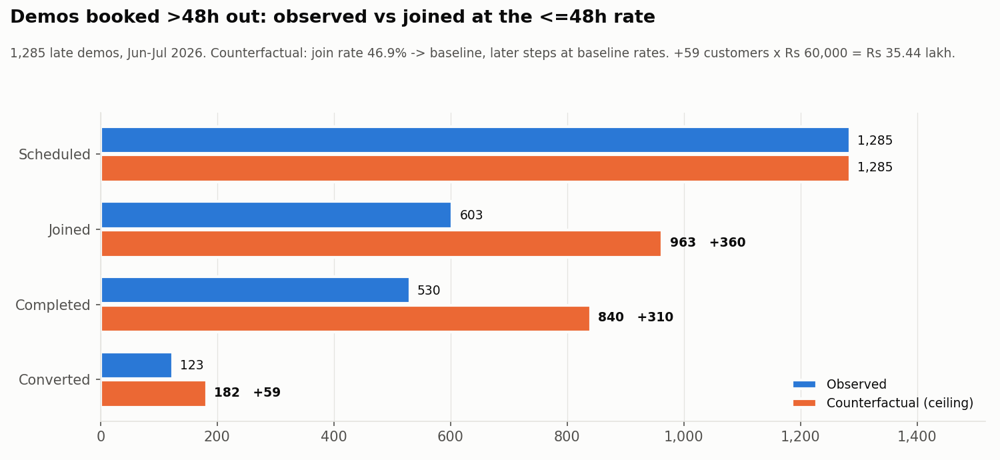
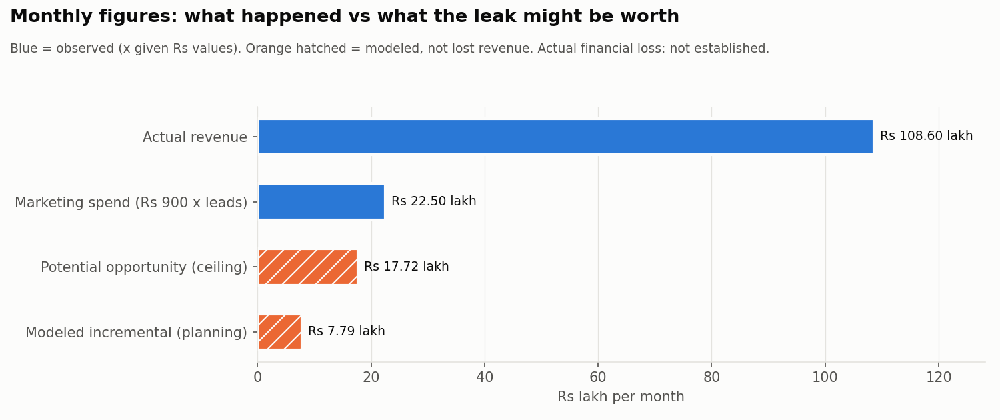
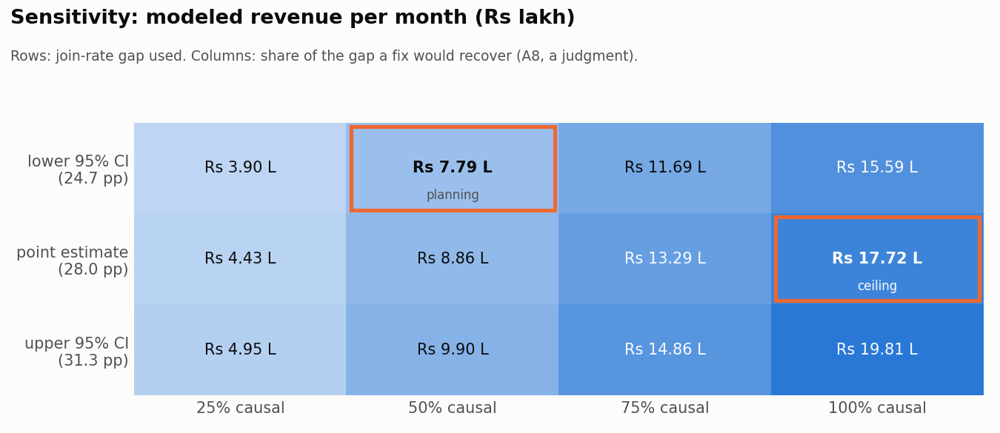

# Phase 5 — Financial Impact of the Validated Leak

Source file: `BrightChamps_FDA_Case_Dataset.csv`
Generated by: `analysis/phase_05_financial_impact.py` (re-run to reproduce; no randomness).
Leak being sized: **Phase 4 candidate A — demos booked more than 48h after the lead arrived are joined far less often.**
Candidates B and C are not sized here (B is not an operational leak on the evidence; C is weak). Adding them would also double-count leads.

## 0. Summary

| what                                                          |       two months |        per month |
| ------------------------------------------------------------- | ---------------: | ---------------: |
| Actual revenue (observed customers x Rs 60,000)               |   Rs 2,17,20,000 |   Rs 1,08,60,000 |
| Marketing spend (all leads x Rs 900)                          |     Rs 45,00,000 |     Rs 22,50,000 |
| **Potential revenue opportunity** (ceiling, whole gap closed) | **Rs 35,44,047** | **Rs 17,72,023** |
| **Modeled incremental revenue** (planning case)               | **Rs 15,58,788** |  **Rs 7,79,394** |
| Actual financial loss                                         |                - |                - |

"-" = not established (section 8).

- **The counterfactual.** If the 1,285 demos booked more than 48h out had been joined at the same rate as demos booked within 48h (74.9% instead of 46.9%), and the extra joiners had then completed and converted like the within-48h joiners, the business would have had **~360 more joined demos, ~310 more completed demos and ~59 more customers** in two months: **₹35.44 lakh (≈₹17.72 lakh a month)**. That is +16.3% on the 362 customers actually won.
- **That is a ceiling, not a loss.** Phase 4 showed the association is strong but could not rule out that low-intent parents choose far-off slots. The planning case keeps only the lower end of the 95% CI of the gap and assumes half of it is caused by the delay: **~26 customers, ₹15.59 lakh over two months (≈₹7.79 lakh a month)**.
- **Where Rs 900 fits.** It is a sunk cost: the leads are already bought, and fixing the leak buys no new ones, so it is **not subtracted** from the opportunity. It matters in three ways: it gives the marketing spend (₹45,00,000) and CAC (₹12,431 → ₹10,687 at the ceiling); it prices the spend sitting on affected leads (₹11,56,500); and it says what the same extra customers would cost to *buy* with more leads (₹7,34,264 at the ceiling, ₹3,22,953 in the planning case).
- **Actual financial loss cannot be established from this file** (section 8).

## 1. Assumptions

Every number below depends on these. Items marked *given* come from the assignment; the rest are choices made here.

| #   | assumption                                                                                                                                     | type            | effect if wrong                                                                                                                                                                                                                                                |
| --- | ---------------------------------------------------------------------------------------------------------------------------------------------- | --------------- | -------------------------------------------------------------------------------------------------------------------------------------------------------------------------------------------------------------------------------------------------------------- |
| A1  | Average revenue per converted customer = Rs 60,000, the same for every customer and segment.                                                   | given           | Revenue scales 1:1 with this figure. If late-booked customers are worth less/more, adjust.                                                                                                                                                                     |
| A2  | Blended marketing cost per lead = Rs 900, the same for every lead.                                                                             | given           | Changes marketing spend and CAC only, not the revenue opportunity.                                                                                                                                                                                             |
| A3  | The dataset covers two months (leads created 1 June - 31 July 2026: 5,000 leads, 666 and 619 late demos by month), so monthly = two-month / 2. | given + checked | Two months have near-identical volume (2,504 and 2,496 leads), so splitting evenly is fair.                                                                                                                                                                    |
| A4  | Revenue is counted in the month the lead was created, and every `converted = Y` is a paying customer worth A1.                                 | choice          | Some July conversions may land in August; timing shifts, total does not.                                                                                                                                                                                       |
| A5  | Baseline = demos booked within 48h of lead creation, same dataset, same two months (J/S 74.9%).                                                | choice          | A narrower comparison (24-48h, J/S 77.5%) would give a *larger* gap; the <=48h group is the more conservative choice.                                                                                                                                          |
| A6  | Extra joiners complete at the baseline C/J (86.2%) and convert at the baseline V/C (19.0%), i.e. 16.4% per joiner.                             | choice          | Late joiners who *did* turn up converted better (20.4% per joiner). Using that would raise the ceiling to Rs 44,07,059. It is not used: parents recovered by a fix are probably less committed than those who showed up despite the wait.                      |
| A7  | Lead volume, source mix, rep capacity and the Rs 60,000 average stay the same; recovered demos do not displace other demos.                    | choice          | If reps are at capacity, extra joins could crowd out other demos and the gain would be smaller. The file has no capacity data.                                                                                                                                 |
| A8  | Only part of the observed gap is caused by the booking delay. The planning case uses **50%**.                                                  | **judgment**    | Not estimable from the data. Phase 4: E-value 2.57 - an unmeasured confounder (parent intent) would need a risk ratio >=2.57 with both late booking and no-show to explain the whole gap. 50% is a round midpoint, not a measurement. Section 5 shows 25-100%. |
| A9  | The planning case uses the lower end of the 95% CI of the gap (24.7 pp) instead of the point estimate (28.0 pp).                               | choice          | Guards against sampling noise on top of A8.                                                                                                                                                                                                                    |
| A10 | Unscheduled leads, no-shows and non-completers never convert (true in the data: 0 conversions without a completed demo).                       | checked         | -                                                                                                                                                                                                                                                              |
| A11 | Revenue, not profit. No margin, delivery cost, refund or fix-cost data is available.                                                           | limitation      | All figures are top-line.                                                                                                                                                                                                                                      |

## 2. Current performance (step 1)

Base: 3,229 scheduled demos, split by whether the demo slot is more than 48h after `created_at`.

| metric                           | >48h (affected) | <=48h (baseline) | formula                              |
| -------------------------------- | --------------: | ---------------: | ------------------------------------ |
| Scheduled demos                  |           1,285 |            1,944 | count of rows with demo_scheduled_at |
| Joined                           |             603 |            1,457 | demo_joined = Y                      |
| Completed                        |             530 |            1,256 | demo_completed = Y                   |
| Converted                        |             123 |              239 | converted = Y                        |
| Join rate J/S                    |           46.9% |            74.9% | joined / scheduled                   |
| Completion rate C/J              |           87.9% |            86.2% | completed / joined                   |
| Conversion after demo V/C        |           23.2% |            19.0% | converted / completed                |
| Customers per joiner V/J         |           20.4% |            16.4% | converted / joined = C/J x V/C       |
| Customers per scheduled demo V/S |            9.6% |            12.3% | converted / scheduled                |
| Revenue (Rs 60,000 each)         |    Rs 73,80,000 |   Rs 1,43,40,000 | converted x 60,000                   |

Late demos lose at the **join** step. Once a parent joins, late demos do at least as well as early ones (C/J 87.9% vs 86.2%; V/C 23.2% vs 19.0%). So the counterfactual only changes the join rate, and carries the extra joiners through the *baseline's* later steps (the lower of the two; see A6).

## 3. Counterfactual — potential revenue opportunity (ceiling)

**Question:** what if the 1,285 late demos had been joined at the baseline rate?

Formulas:

```
gap                 = J/S(baseline) - J/S(late)
extra joined        = N_late x gap
extra completed     = extra joined x C/J(baseline)
extra customers     = extra completed x V/C(baseline)      (= extra joined x V/J(baseline))
extra revenue (2mo) = extra customers x 60,000
monthly             = extra revenue (2mo) / 2
```

| step | item                         | formula                                          |       result |
| ---- | ---------------------------- | ------------------------------------------------ | -----------: |
| 1    | Current join rate (affected) | 603 / 1,285                                      |       46.93% |
| 2    | Baseline join rate           | 1,457 / 1,944                                    |       74.95% |
| 3    | Difference (gap)             | 74.95% - 46.93%                                  |     28.02 pp |
| 4    | Affected leads               | scheduled leads with demo > 48h after created_at |        1,285 |
| 5a   | Additional joined demos      | 1,285 x 0.2802                                   |        360.1 |
| 5b   | Additional completed demos   | 360.1 x 0.8620 (baseline C/J)                    |        310.4 |
| 5c   | Additional customers         | 310.4 x 0.1903 (baseline V/C)                    |        59.07 |
| 6    | Additional revenue           | 59.07 x 60,000                                   | Rs 35,44,047 |
| 7    | Two-month impact             | = step 6 (the data covers two months)            | Rs 35,44,047 |
| 8    | Monthly impact               | Rs 35,44,047 / 2                                 | Rs 17,72,023 |

Hand check: 1,285 × (1,457/1,944) = 963.09 joins expected at the baseline rate; minus 603 actual joins = 360.09 extra joins. 360.09 × (239/1,457) = 59.07 customers. 59.07 × 60,000 = ₹35,44,047.

Items 1–8 requested:

|   # | item                                        |           value |
| --: | ------------------------------------------- | --------------: |
|   1 | Current performance (late J/S)              |           46.9% |
|   2 | Baseline performance (<=48h J/S)            |           74.9% |
|   3 | Difference                                  |         28.0 pp |
|     | ... 95% CI of the difference                | 24.7 to 31.3 pp |
|   4 | Affected leads                              |           1,285 |
|     | ... share of scheduled demos / of all leads |   39.8% / 25.7% |
|   5 | Extra joined demos                          |             360 |
|     | Extra completed demos                       |             310 |
|     | Extra customers                             |            59.1 |
|   6 | Extra revenue                               |    Rs 35,44,047 |
|   7 | Two-month impact                            |    Rs 35,44,047 |
|   8 | Monthly impact                              |    Rs 17,72,023 |

**Month by month** (each month's own rates, 100% causal — a stability check on item 8):

| month (lead created) | late demos | late J/S | baseline J/S |      gap | extra joins | extra customers | extra revenue |
| -------------------- | ---------: | -------: | -----------: | -------: | ----------: | --------------: | ------------: |
| June                 |        666 |    46.1% |        75.7% | +29.6 pp |       197.2 |            35.2 |  Rs 21,11,182 |
| July                 |        619 |    47.8% |        74.2% | +26.4 pp |       163.4 |            24.5 |  Rs 14,69,259 |

June + July = ₹35,80,441 vs ₹35,44,047 pooled; the small difference is because each month uses its own rates.

## 4. Modeled incremental revenue (planning case)

The ceiling assumes the entire 28.0 pp gap is caused by the delay and would disappear. Neither is shown. The planning case applies two haircuts (A8, A9):

```
extra customers = N_late x gap_lower_CI x causal_share x C/J(baseline) x V/C(baseline)
                = 1,285 x 0.2465 x 0.5 x 0.8620 x 0.1903
```

| item                       | formula                            |       result |
| -------------------------- | ---------------------------------- | -----------: |
| Join-rate gap used         | lower end of the 95% CI of the gap |     24.65 pp |
| Causal share recovered     | assumption (see A8)                |          50% |
| Additional joined demos    | 1,285 x 0.2465 x 0.5               |        158.4 |
| Additional completed demos | 158.4 x 0.8620                     |        136.5 |
| Additional customers       | 136.5 x 0.1903                     |        25.98 |
| Two-month revenue          | 25.98 x 60,000                     | Rs 15,58,788 |
| Monthly revenue            | Rs 15,58,788 / 2                   |  Rs 7,79,394 |

## 5. Sensitivity

Extra customers and **monthly** revenue for each combination of join-rate gap and causal share (baseline C/J and V/C throughout):

| join-rate gap used       |                25% causal |                50% causal |                 75% causal |                100% causal |
| ------------------------ | ------------------------: | ------------------------: | -------------------------: | -------------------------: |
| lower 95% CI (24.7 pp)   | 13.0 cust. / Rs 3.90 lakh | 26.0 cust. / Rs 7.79 lakh | 39.0 cust. / Rs 11.69 lakh | 52.0 cust. / Rs 15.59 lakh |
| point estimate (28.0 pp) | 14.8 cust. / Rs 4.43 lakh | 29.5 cust. / Rs 8.86 lakh | 44.3 cust. / Rs 13.29 lakh | 59.1 cust. / Rs 17.72 lakh |
| upper 95% CI (31.3 pp)   | 16.5 cust. / Rs 4.95 lakh | 33.0 cust. / Rs 9.90 lakh | 49.5 cust. / Rs 14.86 lakh | 66.0 cust. / Rs 19.81 lakh |

- The ceiling in section 3 is *point estimate × 100%*. The planning case in section 4 is *lower 95% CI × 50%*.
- Every cell is linear: monthly revenue = 1,285 × gap × share × 0.1640 × 60,000 / 2.
- Using the late joiners' own conversion per joiner (20.4%) instead of the baseline's (A6) raises every cell by 24%; the ceiling would be ₹44,07,059 over two months.

## 6. Where the Rs 900 marketing cost is relevant

| item                                                    | formula                      |       result |
| ------------------------------------------------------- | ---------------------------- | -----------: |
| Total marketing spend (2 months)                        | 5,000 leads x 900            | Rs 45,00,000 |
| Marketing spend per month                               | Rs 45,00,000 / 2             | Rs 22,50,000 |
| Spend on the affected (>48h) leads                      | 1,285 x 900                  | Rs 11,56,500 |
| Spend on affected leads that did not join               | 682 x 900                    |  Rs 6,13,800 |
| Current CAC (marketing only)                            | Rs 45,00,000 / 362           |    Rs 12,431 |
| CAC if the ceiling were captured                        | Rs 45,00,000 / (362 + 59.07) |    Rs 10,687 |
| CAC under the planning case                             | Rs 45,00,000 / (362 + 25.98) |    Rs 11,599 |
| Lead-to-customer rate V/L                               | 362 / 5,000                  |        7.24% |
| Leads needed to buy the ceiling's extra customers       | 59.07 / 0.0724               |          816 |
| ... their marketing cost (2 months)                     | 815.8 x 900                  |  Rs 7,34,264 |
| Leads needed to buy the planning case's extra customers | 25.98 / 0.0724               |          359 |
| ... their marketing cost (2 months)                     | 358.8 x 900                  |  Rs 3,22,953 |

How to read it:

- **Not a cost of the counterfactual.** All 5,000 leads, including the 1,285 affected ones, were already paid for. Recovering their demos needs no new leads, so the modeled revenue is **not** reduced by Rs 900 × anything. (The real cost of a fix — rep time, reminders, calendar capacity — is not in the data and is not included.)
- **Not a loss either.** The ₹11,56,500 spent on late-booked leads, or the ₹6,13,800 on the ones who did not join, would have been spent anyway. Calling it "wasted" double-counts it with the revenue opportunity.
- **Efficiency.** Marketing-only CAC is ₹12,431 today. The same spend spread over more customers would lower it to ₹10,687 (ceiling) or ₹11,599 (planning case).
- **Price benchmark.** At today's lead-to-customer rate (7.24%), buying the ceiling's 59 extra customers through more leads would take ~816 leads and ₹7,34,264 of marketing (₹3,67,132/month); the planning case's 26 would take ~359 leads and ₹3,22,953 (₹1,61,477/month). That is the marketing budget a fix is equivalent to — it assumes extra leads convert at the average rate, which is optimistic for marginal spend.
- **Return on spend.** Revenue per rupee of marketing is 4.83 today; 5.61 at the ceiling; 5.17 in the planning case.

## 7. The five figures, kept apart

| category                                    | status                | basis                        |     two months | note                                                                                    |
| ------------------------------------------- | --------------------- | ---------------------------- | -------------: | --------------------------------------------------------------------------------------- |
| Actual revenue                              | Observed              | 362 customers x 60,000       | Rs 2,17,20,000 | Rs 1,08,60,000 / month. Real, but Rs 60,000 is an assumed average, not a booked figure. |
| Marketing acquisition cost                  | Observed x given      | 5,000 leads x 900            |   Rs 45,00,000 | Rs 22,50,000 / month. Already spent; the leak does not change it.                       |
| Potential revenue opportunity (ceiling)     | Modeled, upper bound  | full gap closed; 100% causal |   Rs 35,44,047 | Rs 17,72,023 / month. Only true if the whole gap is caused by booking delay.            |
| Modeled incremental revenue (planning case) | Modeled, conservative | lower-CI gap x 50% causal    |   Rs 15,58,788 | Rs 7,79,394 / month. The figure to plan with; the 50% is a judgment.                    |
| Actual financial loss                       | Not established       | -                            |              - | Not computable. See section 8. Needs causal proof, margin data and the cost of the fix. |

- *Actual revenue* and *marketing cost* describe what happened.
- *Potential revenue opportunity* and *modeled incremental revenue* describe what might have happened. They are **not** revenue that was lost, and they must not be added to each other or to Phase 4 candidate B.
- The naive figure — 1,162 non-converted late demos × 60,000 = ₹6,97,20,000 — is **not** used anywhere. Most of those parents would not have bought even with an early demo; in the baseline group only 12.3% of scheduled demos become customers.

## 8. Why actual financial loss cannot be established

1. **No proof of cause.** Phase 4 established a strong association, not causation (A8). Without a causal effect there is no "revenue we would otherwise have had".
2. **No observed counterfactual.** Nobody in the data had their late demo moved earlier; the baseline is a different group of parents.
3. **Revenue, not profit.** Rs 60,000 is revenue. A loss to the business is lost margin, and margin is not given (A11).
4. **Unknown fix cost and capacity.** If recovering those demos needs more rep hours or earlier slots that are already full (A7), the net gain is smaller than the revenue figure.
5. **Rs 60,000 is an average.** Whether late-booked customers are worth the same is not known (A1).

What *can* be said: over these two months the business made ₹2,17,20,000 of revenue on ₹45,00,000 of marketing, and the booking-delay pattern is associated with a revenue opportunity of up to ₹35,44,047 (₹17,72,023 a month), with ₹15,58,788 (₹7,79,394 a month) as a conservative planning figure. Turning either into a *loss* needs a test (e.g. randomising some leads to a within-48h slot) plus margin and cost data.

## 9. Charts







## 10. Verification performed by the script

- V/J of the <=48h group equals C/J x V/C (the two-step and one-step routes agree)
- Extra joins = 1,285 x (baseline - late rate) = (1,285 x baseline) - 603 actual joins
- June + July computed separately (₹35,80,441) is within 5% of the pooled two-month ceiling (₹35,44,047)
- Late + early customers (123 + 239) = 362 = all customers (unscheduled leads never convert)
- Phase 2 stage counts reproduce (5,000 / 3,229 / 2,060 / 1,786 / 362)
