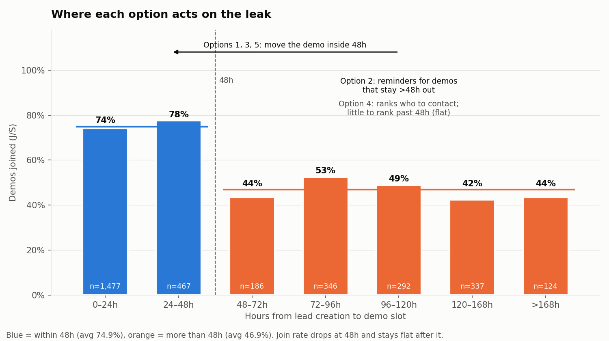
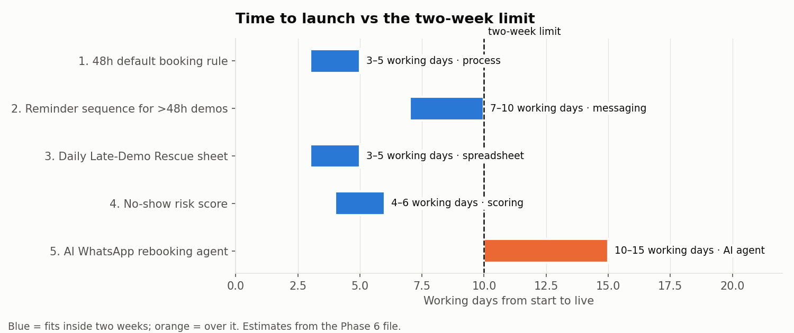
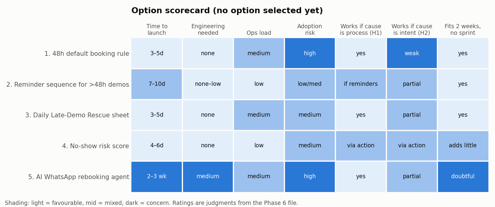
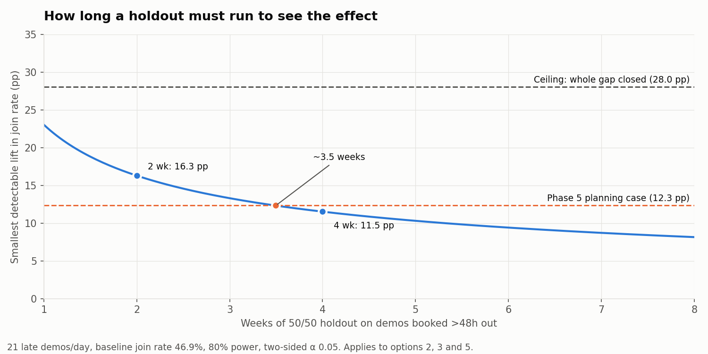

# Phase 6 — Intervention Options

Inputs: `results/phase_04_leak_validation.md` (validated leak) and `results/phase_05_financial_impact.md` (sizing). Nothing else.
Scope: five candidate interventions. **No final choice is made here.** That is Phase 7.

## 0. What any intervention has to work with

**The leak (Phase 4, candidate A — Strong).** 1,285 of 3,229 scheduled demos (39.8%) are set more than 48h after the lead arrives. They are joined 46.9% of the time, against 74.9% for demos within 48h (-28.0 pp, 95% CI -31.3 to -24.7). They account for 58.3% of all no-shows. Parents who do join a late demo complete it and convert at least as well as early joiners (C/J 87.9% vs 86.2%, V/C 23.2% vs 19.0%). **The loss is at the join step only.**

**The money (Phase 5).** Ceiling ≈ **₹17.72 lakh/month** (59 customers in two months, whole gap closed). Planning case ≈ **₹7.79 lakh/month** (26 customers: lower CI × 50% causal). Neither figure is an established loss.

**The constraints (assignment).** Live within **two weeks**, **no engineering sprint**.

**Facts from the data that shape the options**

| fact | value | why it matters |
| --- | --- | --- |
| Late demos per day | ~21 (1,285 over 61 days) | Manageable by hand: about 1.75 per rep per day across 12 reps (IST 5, US 5, SEA 2). |
| Hours to demo, late group | median 104h; 25th–75th pct 81–133h; 124 demos >7 days | Most late demos are 3–6 days out, so there is time to act before the slot. |
| Hours to demo, early group | median 15h; 743 within 12h | The team *can* book fast. Late booking is not a capacity limit everywhere. |
| Join rate by band | 0–24h 74.1% · 24–48h 77.5% · 48–72h 43.5% · 72–96h 52.6% · 96–120h 49.0% · 120–168h 42.4% · >168h 43.5% | This is a **step** at 48h, not a slope. Past 48h, being later adds no further risk. |
| Join rate within late demos, by follow-ups | 0–1: 44.4% · 2–3: 47.0% · 4+: 49.4% | Follow-up count does not predict no-shows among late demos. |
| Spread | Same gap in every source, geography, shift, rep, local-hour band, week | Must be a process-wide fix. Targeting one team or market would miss most of the leak. |

**Two possible explanations the options must handle** (Phase 4 §2.10, §6):

- **H1 — the process.** Something changes at 48h, for example reminders or confirmations that only run inside a 48h window, or slot-release rules. If so, pulling demos earlier *or* giving far-out demos the same touchpoints should close much of the gap.
- **H2 — parent intent.** Less committed parents pick far-off slots. If so, forcing earlier slots recovers little, and the realistic gain is nearer the 25–50% causal rows of the Phase 5 sensitivity table.

Some options work mainly under H1, some under both. Every option below says which.

**Common baseline for measurement** (register before any launch, from the same CRM export as the dataset):

| metric | baseline (Jun–Jul 2026) |
| --- | --- |
| Share of scheduled demos >48h after lead creation | 39.8% |
| J/S, demos >48h | 46.9% |
| J/S, demos ≤48h | 74.9% |
| J/S, all scheduled demos | 63.8% |
| Customers per scheduled demo (V/S), >48h | 9.6% |
| Completion (C/J) and V/C of late joiners (guardrail: must not fall) | 87.9% / 23.2% |

**Power note (applies to every option).** About 21 late demos a day means a 50/50 holdout gets about 150 demos per arm in two weeks. That detects a J/S lift of about 16 pp at 80% power, and four weeks (about 300 per arm) detects about 11 pp. A lift the size of the planning case (≈12 pp on late demos) needs **about four weeks** to confirm. Join rate is known on the day of the demo, so it gives a read long before conversion does.

---

## Option 1 — "48-hour default" booking rule with exception codes (process intervention)

**1. Problem addressed.** Demos being *set* more than 48h out. This goes at the exposure itself: fewer late demos means fewer late no-shows.

**2. How it works.** Reps offer only slots within 48h of the lead's arrival by default (for example "today at X or tomorrow at Y"). A slot further out is allowed only when the parent asks for it, and the rep logs one of a few reason codes (parent busy / travelling / wants a specific day / no slot available). No reason code means the booking gets flagged in the daily review.

**3. Expected mechanism.** It shifts demos across the 48h line, where the data shows a step change in join rate. It works fully under **H1**. Under **H2** it recovers less: low-intent parents may refuse early slots (and get logged as "parent asked"), or accept an early slot and still not show. The reason codes are useful either way. They show *who* picks the late slot (Phase 4's open question), which also tests H1 vs H2.

**4. Implementation steps.**
1. Day 1–2: Sales lead and ops confirm the rule, the reason codes, and whether same- or next-day slots exist in every shift's calendar.
2. Day 2–3: Add a mandatory "late-slot reason" dropdown to the CRM booking form (admin config, not code). If that isn't possible, use a shared Google Form or a sheet column.
3. Day 3: Script change for reps: offer two slots inside 48h before offering anything later.
4. Day 4: A 30-minute briefing per shift (IST, US, SEA).
5. Day 5 onward: The shift lead reviews the daily list of late bookings and their reason codes.
6. Week 2: Adjust the codes and slot supply based on what reps log.

**5. Time to launch.** 3–5 working days.

**6. Engineering requirements.** None. It needs a CRM admin to add a picklist field, or a Google Form as fallback.

**7. Operational requirements.** Enough same- and next-day demo capacity in every shift. The file has no capacity data (Phase 5, A7). Shift leads spend about 15 minutes a day reviewing the list. Reps need to be held to the rule.

**8. AI/automation opportunity.** Low at launch. Later, an automated daily digest of late bookings with no reason code, and automatic tallies of reason codes.

**9. Adoption risk.** **High.** Reps can follow the letter of the rule and ignore its intent by marking every late slot "parent asked". If demo capacity inside 48h is tight, the rule turns into a queue problem. Reps may also feel it as micro-management.

**10. Measurement.** Main metric: share of scheduled demos >48h (baseline 39.8%). Outcome: overall J/S (baseline 63.8%). Stagger the rollout by shift (for example IST first, US and SEA a week later) so the shifts still on the old process act as a concurrent control. Check the guardrails: S/L (the rule must not lose bookings from parents who wanted a later slot), and C/J and V/C.

**11. Main downside.** It depends on slot capacity and rep compliance, and neither is visible in the data. Under H2 it moves the metric (fewer late demos) without moving the outcome (joins).

---

## Option 2 — Confirmation + reminder sequence for far-out demos (messaging/reminder workflow)

**1. Problem addressed.** No-shows among demos that stay more than 48h out. It aims straight at the join step, which is the only place late demos lose (C/J and V/C are fine).

**2. How it works.** Any demo booked >48h out goes into a message sequence on WhatsApp, with email/SMS as backup:
- **T+0 (at booking):** confirmation with date and time in the parent's timezone, the child's name, what to expect, and a one-tap reschedule link.
- **Every 48h until the demo** (so no parent goes more than two days without hearing from us): a short value message (what the child will build), and a "reply 1 to confirm / 2 to move earlier".
- **T-24h:** reconfirmation request. No reply triggers a rep call task.
- **T-2h and T-15min:** join link reminders.

Demos ≤48h keep whatever they get today.

**3. Expected mechanism.** Phase 4 found a *step* at 48h rather than a steady decline. That hints at a process boundary such as reminders that only fire inside a 48h window. If so (**H1**), this option copies the ≤48h experience onto far-out demos. Under **H2** it still helps at the margin: reminders are a standard lever against no-shows, and the "move earlier" reply lets parents with some intent pull the demo forward. **First step: check in the CRM what reminders already go out, and when.** If far-out demos already get the same reminders, the expected gain drops sharply.

**4. Implementation steps.**
1. Day 1–2: Audit today's reminder rules in the CRM and WhatsApp tool: which fire, and relative to what time. This alone may explain the 48h step.
2. Day 2–4: Write the templates (confirmation, nurture, reconfirm, join link) in the languages of the eight markets. Submit WhatsApp templates for approval (usually 1–2 days).
3. Day 4–6: Build the sequence in the existing CRM workflow builder or WhatsApp Business provider (trigger: demo booked with slot − created > 48h). If there is no native trigger, use a no-code tool (Zapier/Make) reading CRM demo records.
4. Day 7: Set up the holdout: send the sequence only to leads whose ID ends in an even digit.
5. Day 8–10: QA with test bookings in each timezone, then go live.

**5. Time to launch.** 7–10 working days. The risk to the timeline is WhatsApp template approval.

**6. Engineering requirements.** None if the CRM or WhatsApp provider has a workflow builder. Otherwise a no-code integration (Zapier/Make) set up by an ops or marketing-automation owner. Not a sprint.

**7. Operational requirements.** A content owner for the templates. Reps handle "reply 2 = move earlier" and no-reply call tasks (at most ~21 new late demos a day in total, so under two per rep per day). Someone monitors delivery and opt-out rates.

**8. AI/automation opportunity.** High on automation, low on AI. The sequence runs by itself. AI could help write and localise templates, and sort free-text replies ("can we do Saturday instead?") into confirm, reschedule or cancel.

**9. Adoption risk.** **Low for reps** (it runs without them). The risks are on the parent side: message fatigue and opt-outs, WhatsApp policy on marketing templates, and the timezone rendering having to be right (Phase 1 left the stored clock ambiguous, UTC vs IST). A wrong time in a reminder would make no-shows *worse*.

**10. Measurement.** Randomised holdout at the lead level (even/odd lead ID) among demos booked >48h out. Main metric: J/S in treated vs holdout (baseline 46.9%). Secondary: reply and confirm rate, share moved earlier, opt-out rate. Guardrails: C/J and V/C of late joiners. About four weeks gives enough data for a ~11 pp effect (see power note).

**11. Main downside.** It could be treating a symptom that already has this treatment. If far-out demos already get reminders, the 48h step has some other cause and this adds noise without moving joins. The Day 1 audit settles this. Under strong H2, reminders cannot create intent that isn't there.

---

## Option 3 — Daily "Late-Demo Rescue" sheet: call to pull demos earlier (spreadsheet-based workflow)

**1. Problem addressed.** The ~21 demos a day that are already booked >48h out. It tries to move them inside 48h, or at least get a live confirmation.

**2. How it works.** A Google Sheet is filled each morning per shift from the CRM export (lead ID, geography, timezone, rep, created_at, demo_scheduled_at). A formula or Apps Script flags every demo where slot − created > 48h and the demo hasn't happened yet. It assigns each one to the owning rep, adds a call/WhatsApp script with two earlier slots, and gives outcome columns: *moved earlier / confirmed as is / no answer / cancelled*. The shift lead sees a summary tab: rescues attempted, moved, confirmed, and the J/S of each outcome after the demo.

**3. Expected mechanism.** A human touch plus an earlier slot. Under **H1** moving a demo inside 48h puts it on the high-join side of the step. Under **H2** the call also *reveals* intent: parents who won't move or confirm are low-intent, and freeing their slot is a gain too. The outcome columns give the first direct evidence on H1 vs H2, so this doubles as the experiment Phase 5 said was needed.

**4. Implementation steps.**
1. Day 1: Agree the columns and the daily export (manual CSV export from the CRM is fine).
2. Day 2–3: Build the sheet: import tab, flag formula (`slot − created > 48h` and slot in the future), a rep-assignment view filtered per rep, a script column, outcome dropdowns and a summary tab.
3. Day 3: Optional Apps Script to pull the export from a shared Drive folder every morning and send each rep their rows.
4. Day 4: 20-minute walkthrough per shift.
5. Day 5 onward: Reps work their rows. The shift lead checks completion at mid-shift.
6. Weekly: Join the outcome columns with demo_joined from the next export.

**5. Time to launch.** 3–5 working days.

**6. Engineering requirements.** None. A spreadsheet, a CRM export and optionally about 50 lines of Apps Script that an ops analyst can own.

**7. Operational requirements.** About 1.75 rescue calls per rep per day, 3–5 minutes each (roughly 10 minutes per rep a day). Earlier slots must be available. Someone runs the daily export (5 minutes, or automated). The shift lead holds reps to it.

**8. AI/automation opportunity.** Medium. Apps Script can automate the export and flagging. AI could write a personal opener per parent (child's age, market, local time) or summarise call notes into the outcome column.

**9. Adoption risk.** **Medium.** It adds a daily task to reps who are measured on other things. Rescue calls tend to get skipped on busy days. Manual outcome entry will be patchy unless the shift lead checks it. The sheet can drift from the CRM if the export is missed.

**10. Measurement.** Randomise which late demos go on the sheet (for example 50% of flagged rows, by lead ID). Main metric: J/S of the rescue arm vs the untouched arm (baseline 46.9%). Diagnostic: J/S by outcome (moved earlier vs confirmed as is vs no answer). Process metrics: % of rows worked, % moved inside 48h.

**11. Main downside.** It cleans up after the problem instead of preventing it, and it runs on rep discipline. If the team is busy, it's the first thing dropped. It also needs spare early slots, same as Option 1.

---

## Option 4 — No-show risk score and prioritised confirmation list (lead scoring/prioritisation)

**1. Problem addressed.** Limited rep time. Rather than touching every upcoming demo, rank them by no-show risk and spend confirmation effort where the risk is highest.

**2. How it works.** A simple score in a sheet (or a CRM formula field) for every upcoming demo, built from the Phase 3–4 findings. The main input is hours from lead creation to slot (>48h: expected J/S ~47%; ≤48h: ~75%). Secondary inputs could be source, geography and local demo hour. Each day's upcoming demos are sorted by predicted join probability. Reps confirm from the top down as far as their time allows, and demos in the bottom tier get the Option 2 or Option 3 treatment.

**3. Expected mechanism.** It concentrates effort where the no-shows are. The score itself changes nothing. It only improves the *targeting* of whatever confirmation action comes with it.

**4. Implementation steps.**
1. Day 1–2: Fit a logistic model (or use the band table) on the Jun–Jul data. Keep only inputs that are known at booking time.
2. Day 2–3: Hold out July to check the score's calibration and AUC.
3. Day 3–4: Put the score into the Option 3-style daily sheet as a formula, with a lookup table and no live model.
4. Day 5: Define the action for each tier and brief reps.
5. Ongoing: Re-fit monthly.

**5. Time to launch.** 4–6 working days, plus whatever the action it drives needs.

**6. Engineering requirements.** None: a formula column or lookup table in a sheet or CRM field. An analyst builds and owns it.

**7. Operational requirements.** An analyst re-fits and monitors it monthly. Reps must follow the ranking. It needs one of the other options as its action.

**8. AI/automation opportunity.** Medium. A proper ML model is possible, but on this dataset it would add little (see downside).

**9. Adoption risk.** **Medium.** Reps don't trust scores they can't explain. If it's used to decide who *doesn't* get a call, a missed no-show gets blamed on the model.

**10. Measurement.** Model quality: calibration and AUC on a July holdout, then on live data. Business effect: compare J/S where confirmation effort follows the score vs random order at equal effort.

**11. Main downside.** **On this data there is very little to score beyond one rule.** Past 48h the join rate is flat (43–53% in every band out to 7+ days), follow-ups don't predict it among late demos (44–49%), and source, geography, shift and rep are balanced between late and early (Phase 4 §2.10). A "model" would mostly repeat the rule "slot > 48h after the lead arrived". A scoring layer adds maintenance and explanation cost for targeting that a single flag already gives. It would earn its place only once new fields exist (for example reply-to-confirmation, reschedule flag).

---

## Option 5 — AI rebooking & confirmation agent on WhatsApp (AI agent)

**1. Problem addressed.** Demos >48h out that no rep has the time to handle. It aims to confirm intent and pull the slot earlier conversationally, at scale and in every timezone.

**2. How it works.** When a demo is booked >48h out, an LLM agent writes to the parent on WhatsApp. It confirms the booking, answers basic questions (price range, what the class is, device needed), offers the two earliest free slots, and books or reschedules on the parent's reply. Anything outside its scope (complaints, pricing negotiation, unclear replies) is handed to the owning rep with a summary. It follows up at T-24h and T-2h like Option 2.

**3. Expected mechanism.** The Options 2 and 3 mechanisms combined (reminders plus a move to an earlier slot), without using rep time. It adds two-way conversation, which a one-way reminder can't. It works under **H1** by moving slots, and reads intent under **H2** from how the parent replies.

**4. Implementation steps.**
1. Day 1–3: Choose the channel (WhatsApp Business API provider already in use, or a new one) and an agent platform with WhatsApp and calendar connectors (a no-code or low-code agent builder).
2. Day 3–6: Write the agent's prompt, scope, allowed actions, escalation rules and tone. Get approval for opening templates.
3. Day 6–9: Connect it to the demo calendar (read free slots, write rebookings) and the CRM (update demo_scheduled_at, log the conversation).
4. Day 9–12: Red-team it: wrong timezone, a price question, a parent who is upset, non-English replies. Check privacy for messages about children.
5. Day 12–15: Soft launch on one market or shift with a human reviewing every conversation.

**5. Time to launch.** 2–3 weeks for a supervised pilot. **Probably over the two-week limit**, and only doable without engineering if the calendar and CRM have ready-made connectors.

**6. Engineering requirements.** **Medium.** Two-way calendar and CRM writes almost always need API work or an integration partner. A fallback is "draft-only": the AI writes the message and a rep sends it and books the slot by hand. That takes away most of the scale benefit.

**7. Operational requirements.** An owner for the prompt and escalation rules. Human review of conversations in the pilot (about 21 new conversations a day). A process for escalations. Legal/compliance sign-off on AI messaging to parents about minors, across eight countries.

**8. AI/automation opportunity.** Highest of all options. This *is* the AI option.

**9. Adoption risk.** **High, mostly brand and trust.** A wrong slot, a wrong timezone or a made-up price is worse than no message. Parents may find an AI agent impersonal for a children's education product. Reps may resent the agent moving their bookings.

**10. Measurement.** Randomised holdout by lead ID among >48h demos. Main metric: J/S vs holdout (baseline 46.9%). Agent-specific: reply rate, share rebooked inside 48h, escalation rate, error rate (wrong slot or time), and parent complaints. Guardrails: C/J and V/C.

**11. Main downside.** It is the most expensive and slowest option, with the highest risk, aimed at a mechanism (H1 vs H2) that hasn't been tested yet. It probably needs integration work, which breaks the "no engineering sprint" rule. It makes more sense as a *phase 2* after a cheaper option shows that confirmation or earlier slots actually move J/S.

---

## Side-by-side

| # | option | type | time to launch | engineering | ops load | adoption risk | works under H1 (process) | works under H2 (intent) | fits 2-week, no-sprint rule |
| --- | --- | --- | --- | --- | --- | --- | --- | --- | --- |
| 1 | 48h default booking rule + reason codes | process | 3–5 days | none (CRM picklist) | medium | high | yes (prevents exposure) | weak | yes |
| 2 | Confirmation + reminder sequence for >48h demos | messaging / automation | 7–10 days | none–low (no-code) | low | low (reps) / medium (parents) | yes, if reminders are the cause | partial | yes |
| 3 | Daily Late-Demo Rescue sheet | spreadsheet workflow | 3–5 days | none (sheet + Apps Script) | medium | medium | yes (moves slots) | partial, and reveals intent | yes |
| 4 | No-show risk score + prioritised list | scoring | 4–6 days (+ its action) | none | low | medium | only through its action | only through its action | yes, but adds little on this data |
| 5 | AI WhatsApp rebooking agent | AI agent | 2–3 weeks | medium (calendar/CRM writes) | medium in pilot | high | yes | partial, and reveals intent | **doubtful** |

**What each option needs to be true** (no choice made here):

- Options 1 and 3 need **spare demo slots inside 48h**. The file has no capacity data.
- Option 2 needs **far-out demos to get fewer touchpoints today**. A one-day CRM audit confirms or rules this out.
- Option 4 needs **predictive signal beyond the 48h flag**. This data has almost none.
- Option 5 needs **integrations and compliance sign-off** that probably don't fit the two-week, no-sprint limit.
- All options: the gain is capped by the causal share (Phase 5: ₹3.9–17.7 lakh/month across the 25–100% causal rows). That is why each option comes with a holdout rather than a before/after comparison.

These options can be combined (for example 3 + 4, or 2 as the automated part of 3). Phase 7 decides which one, if any, goes first, and why the others are rejected.

## Charts

Generated by `analysis/phase_06_intervention_charts.py` (re-run to reproduce). Charts 1 and 4 are computed from the CSV. Charts 2 and 3 plot the judgments written above.

