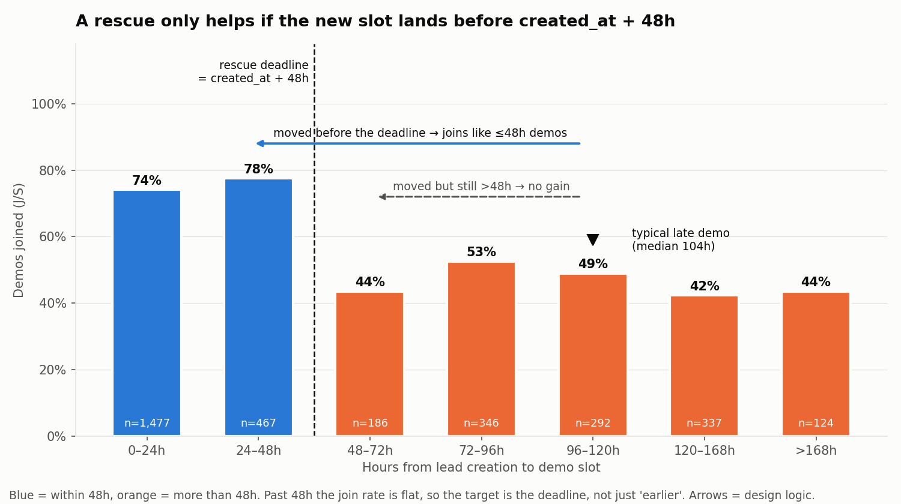
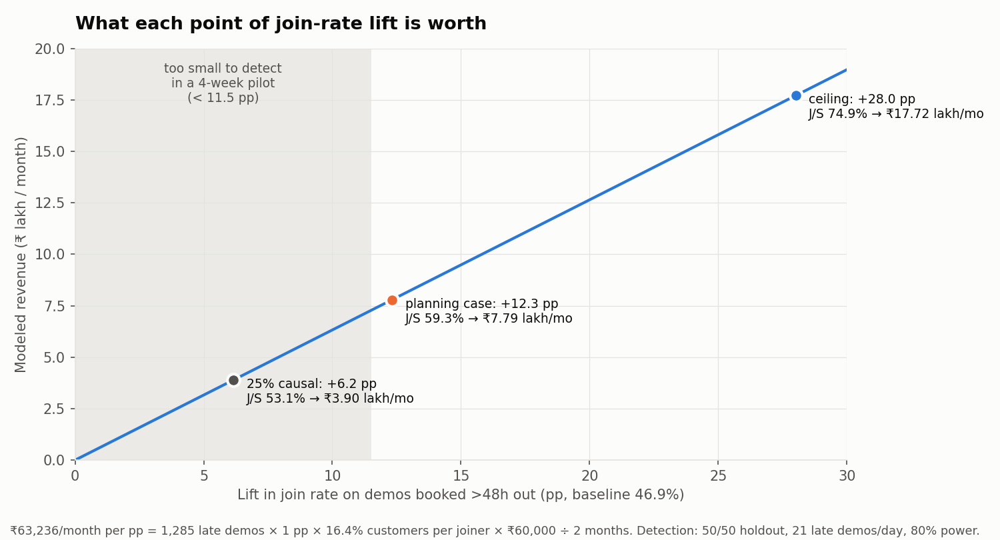
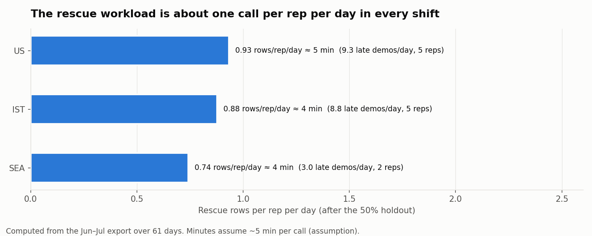
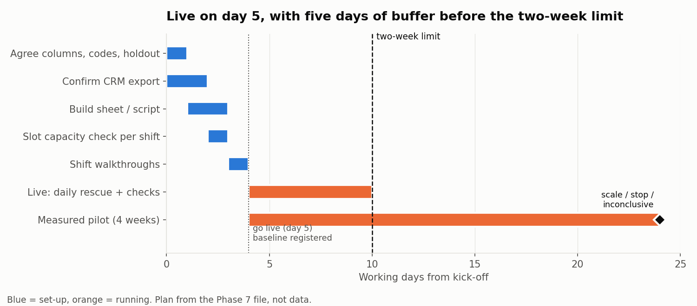

# Phase 7 — Select the Lever

Inputs: `results/phase_00_assignment_understanding.md` (constraints), `results/phase_04_leak_validation.md` (validated leak), `results/phase_05_financial_impact.md` (sizing), `results/phase_06_intervention_options.md` (five options). One extra count was run on `BrightChamps_FDA_Case_Dataset.csv` (late demos by hours band, §1). No new analysis beyond that.

Labels used throughout:
- **[D] Dataset evidence**: counted or tested in the CSV (Phases 1–5).
- **[I] Inference**: reasoning from [D], not directly observed.
- **[A] Assumption**: not in the data. It has to hold for the argument to work, and each one is listed in §5.

---

## 0. Decision

**Selected lever: Option 3, the daily "Late-Demo Rescue" sheet.** Each shift gets a list of demos booked more than 48h after the lead arrived. The owning rep calls or WhatsApps the parent to move the demo to a slot before `created_at + 48h`. If the parent won't move, the rep gets a live confirmation of the existing slot. A random half of flagged demos is held out so we can measure the effect.

It is the only option that meets all of the following:
- goes live inside two weeks with no engineering;
- acts on the leak under both explanations (process or parent intent);
- can be measured with a randomised holdout from the first day;
- can be prototyped and run on the export we already have.

Its weak point is rep discipline, and the design below is built around that (§4.8, §6).

---

## 1. What the choice has to satisfy

| requirement | source | value |
| --- | --- | --- |
| Live within two weeks | assignment [given] | ≤ 10 working days |
| No engineering sprint | assignment [given] | config, sheets, no-code only |
| One intervention, with rejected options explained | assignment [given] | §2, §4.6 |
| Prototype must run and be ownable by someone else | assignment [given] | §4.5 |
| Aim at the validated leak | Phase 4 [D] | 1,285 of 3,229 scheduled demos (39.8%) are >48h from lead creation. J/S 46.9% vs 74.9% (−28.0 pp, 95% CI −31.3 to −24.7) |
| Loss happens at the join step only | Phase 5 [D] | Late joiners: C/J 87.9% (vs 86.2%) and V/C 23.2% (vs 19.0%) |
| Money at stake | Phase 5 [D × A] | Ceiling ₹17.72 lakh/month. Planning case ₹7.79 lakh/month (lower CI × 50% causal) |
| Shape of the effect | Phase 6 [D] | A **step** at 48h. Past 48h the join rate is flat: 43.5% / 52.6% / 49.0% / 42.4% / 43.5% across bands out to 7+ days |
| Volume | Phase 6 [D] | ~21 late demos/day. 12 reps (IST 5, US 5, SEA 2), so ~1.75 per rep per day |
| Spread | Phase 4 [D] | Same gap in every source, geography, shift, rep and week. Late share by shift: IST 40.0%, US 39.9%, SEA 39.1% |
| Cause | Phase 4 [D + A] | Association only. E-value 2.57. H1 (process) vs H2 (parent intent) cannot be separated with this file |

Late demos by hours from lead creation to slot [D, counted for this phase]:

| band | 48–72h | 72–96h | 96–120h | 120–168h | >168h |
| --- | ---: | ---: | ---: | ---: | ---: |
| late demos | 186 | 346 | 292 | 337 | 124 |
| share of 1,285 | 14.5% | 26.9% | 22.7% | 26.2% | 9.6% |

**[I] The consequence for any lever.** The step is measured from **lead creation**, not from booking, so moving a slot from 104h to 60h would put it in a band that joins no better (43.5%). A fix that relies on moving slots only helps if the new slot is **before `created_at + 48h`**. That makes timing the central design constraint: late demos have to be caught within the lead's first day or so.

---

## 2. Trade-offs by option

The same eight criteria are used for every option. There are no scores: each cell states what is known and labels it.

### Option 1: 48-hour default booking rule with reason codes

| criterion | trade-off |
| --- | --- |
| Evidence from dataset | [D] Targets the exposure directly: 39.8% of demos land on the low side of the step. [D] Early booking is achievable (median 15h for the ≤48h group, 743 demos within 12h). |
| Financial opportunity | [I] The widest reach: it acts on every booking at the only moment when a slot before created+48h is certainly still possible. Under H1 it can approach the ceiling. Under H2 it moves the metric (share >48h) more than the outcome (joins). |
| Time to launch | 3–5 working days. |
| Engineering dependency | None: a CRM picklist field, or a Google Form as fallback. |
| Operational complexity | Medium. [A] Needs spare slots inside 48h in every shift, and the file has no capacity data (Phase 5 A7). Shift leads review late bookings daily. |
| Adoption risk | **High.** [I] It changes how reps book, which is their core task. Reason codes are easy to game: "parent asked" on every late slot satisfies the rule without changing anything. Reps may see it as micro-management. |
| Ease of measurement | Weak. Randomising within a rep's own booking behaviour is impractical, so the design is a staggered rollout by shift. [D] Shifts are balanced on the late share, but the comparison is still concurrent-cohort rather than randomised, and there is only one control unit per step. |
| Ability to prototype quickly | Low. The deliverable is a rule, a picklist and a script change. There is little that "runs". |

### Option 2: Confirmation and reminder sequence for demos >48h out

| criterion | trade-off |
| --- | --- |
| Evidence from dataset | [I] The step shape fits a process boundary, for example reminders that only fire inside 48h. [D] The file has nothing on which reminders are sent today. The whole case rests on an audit that has not been done. |
| Financial opportunity | [I] High if far-out demos get fewer touchpoints today, and close to zero if they already get the same reminders. Under H2 the gain is marginal. |
| Time to launch | 7–10 working days. WhatsApp template approval (usually 1–2 days, sometimes more) puts the date at risk. |
| Engineering dependency | None to low if the CRM or WhatsApp provider has a workflow builder. Otherwise a Zapier/Make integration. |
| Operational complexity | Low once live. It needs a template owner, localisation for 8 markets, and monitoring of opt-outs. |
| Adoption risk | Low for reps (it runs without them), medium for parents. [D] The timestamp clock is unknown (Phase 1 §7: no UTC offset). [I] An automated reminder showing the wrong local time would *create* no-shows. |
| Ease of measurement | Good. A randomised holdout by lead ID is simple. |
| Ability to prototype quickly | Medium. Templates and trigger logic can be written, but the sequence only runs inside the real messaging tool. |

### Option 3: Daily Late-Demo Rescue sheet (selected)

| criterion | trade-off |
| --- | --- |
| Evidence from dataset | [D] The flag (slot − created > 48h) is exactly the exposure validated in Phase 4. [D] Every field it needs (`lead_id`, `rep_assigned`, `rep_shift`, `parent_timezone`, `created_at`, `demo_scheduled_at`) is in the existing CRM export. [D] Volume (~21/day, <2 per rep) is manageable by hand. |
| Financial opportunity | [I] It reaches every late demo the rep contacts before the deadline. It works under H1 when a demo is moved before created+48h, and partly under H2: a live call flushes out and frees the slots of parents who won't confirm. [I] Reach is capped by contact rate and slot supply, so it will not capture the full ceiling. |
| Time to launch | 3–5 working days. |
| Engineering dependency | None: a sheet, a CSV export and optionally ~50 lines of Apps Script or Python owned by an ops analyst. |
| Operational complexity | Medium. ~1.75 calls per rep per day at 3–5 minutes (~10 min per rep per day), a daily export per shift, and a shift-lead check mid-shift. [A] Needs slots before created+48h. |
| Adoption risk | Medium. It adds a task that reps are not measured on, and it gets dropped on busy days. |
| Ease of measurement | **Best of the five.** Randomise at the row level (even/odd lead ID) and compare J/S intent-to-treat. The outcome columns (*moved / confirmed as is / no answer / cancelled*) produce the first direct evidence on H1 vs H2. |
| Ability to prototype quickly | **High.** The core component (ingest export → flag → deadline → per-rep list → holdout split → summary) can be built and run end-to-end on the case dataset itself. |

### Option 4: No-show risk score and prioritised list

| criterion | trade-off |
| --- | --- |
| Evidence from dataset | [D] Almost no signal beyond the 48h flag. Past 48h the join rate is flat by band (42–53%), by follow-ups (44.4% / 47.0% / 49.4%), and source, geography, shift and rep are balanced between late and early (Phase 4 §2.10). |
| Financial opportunity | [I] None on its own. It only re-orders effort for another action, and at ~21 late demos a day every one can be worked, so ranking frees little capacity. |
| Time to launch | 4–6 days, plus whatever action it drives. |
| Engineering dependency | None: a lookup or formula column. |
| Operational complexity | Low, plus a monthly re-fit by an analyst. |
| Adoption risk | Medium. Reps distrust unexplained scores, and a missed no-show gets blamed on the model. |
| Ease of measurement | Model quality (AUC, calibration) is easy to measure. Business effect needs a paired action and a holdout. |
| Ability to prototype quickly | High, but the prototype would mostly reproduce the rule "slot > 48h". |

### Option 5: AI WhatsApp rebooking and confirmation agent

| criterion | trade-off |
| --- | --- |
| Evidence from dataset | [I] Combines the Option 2 and Option 3 mechanisms. [D] Neither mechanism has been shown to move J/S yet. |
| Financial opportunity | [I] Potentially the largest reach (all late demos, every timezone, no rep time), but the bet is on an untested mechanism. |
| Time to launch | 2–3 weeks for a *supervised* pilot. **Likely exceeds the two-week limit.** |
| Engineering dependency | **Medium.** Two-way calendar and CRM writes usually need API work, which breaks the "no sprint" rule. The draft-only fallback removes most of the benefit. |
| Operational complexity | High in the pilot: prompt owner, human review of ~21 conversations a day, escalation path, and compliance sign-off for AI messaging to parents of minors in 8 countries. |
| Adoption risk | **High**, mostly for brand and trust. A wrong slot, wrong timezone (see the Phase 1 clock issue) or made-up price is worse than no message. |
| Ease of measurement | Good (lead-ID holdout), plus agent-error metrics. |
| Ability to prototype quickly | Medium. A conversation demo is easy to build, but a working agent with real calendar writes is not. |

### The trade-offs that decided it

1. **Two-week, no-sprint rule.** [I] Option 5 probably fails it. Option 2 meets it only if template approval and the reminder audit go smoothly. Options 1, 3 and 4 meet it comfortably.
2. **Robustness to H1 vs H2.** [I] This is the biggest unknown in the case. Options 1 and 2 pay off mainly under H1. Option 3 pays off under H1 and still yields something under H2 (slots freed, intent revealed). It also *measures* which explanation is true, so it tells us what to fund next.
3. **Ease of measurement.** [I] Option 3 randomises cleanly at the demo level. Option 1 can only use a staggered shift rollout. For Option 2, a null result is ambiguous until the audit is done.
4. **Adoption risk.** Option 2 is lower than Option 3 for reps. [I] Option 3 was still preferred because its failure mode (rows not worked) is visible the same day on the summary tab and can be fixed by a shift lead. Option 2's failure mode (reminders don't matter, or show the wrong time) only shows up weeks later in J/S.
5. **Prototype.** [I] Only Options 3 and 4 give a component that fully runs on the case data. Option 4 adds nothing beyond the flag that Option 3 already uses.

---

## 3. What we give up by choosing Option 3

- **Reach at the point of booking.** [I] Option 1 acts when an early slot is guaranteed to be open. Option 3 acts after booking, so a late demo booked on a lead that is already ~40h old leaves only hours to rescue. [A] We assume most bookings happen soon after the lead arrives. The file has no booking timestamp (Phase 4 §2.10), so we can't check this.
- **Zero rep effort.** Option 2 runs by itself. Option 3 depends on reps.
- **Scale.** Option 3 is sized for ~21 demos a day. [I] If volume doubles, it needs automation (Option 2) or an agent (Option 5) behind it.

---

## 4. The selected intervention

### 4.1 What exactly we will change

One daily list and one call. No change to the booking process, CRM configuration or messaging stack.

1. **Flag.** At the start of each shift (IST, US, SEA), the ops analyst loads the latest CRM export (same columns as the case CSV). The sheet flags every scheduled, not-yet-held demo where `demo_scheduled_at − created_at > 48h`.
2. **Deadline.** Each flagged row gets a **rescue deadline = `created_at + 48h`**, shown in the parent's local time (`parent_timezone`). Rows are sorted by deadline, soonest first. [I] Moving a slot to any time before this deadline puts the demo on the high-join side of the step. Moving it to a time after the deadline does not (§1).
3. **Holdout.** Rows with an **odd** last digit of `lead_id` go to the rep. Rows with an **even** digit are logged and left alone (control). The split is by ID, so nobody chooses who gets rescued.
4. **Assignment.** Each rep sees only their own rescue rows (filtered view on `rep_assigned`). The scripted ask: *"We have an earlier slot for [child] — [slot 1] or [slot 2] (your time). Would either work?"* If the parent says no: *"No problem — can I confirm you're all set for [current slot]?"*
5. **Outcome.** The rep picks one: *moved before deadline / moved but after deadline / confirmed as is / no answer / cancelled*.
6. **Summary tab.** For the shift lead: rows due today, rows worked, % worked before deadline, and outcome counts. Weekly: J/S by arm and by outcome, filled in from the next export's `demo_joined`.

### 4.2 Who will use it

| role | what they do | time |
| --- | --- | --- |
| Reps (12: IST 5, US 5, SEA 2) | Work their own rescue rows and log an outcome | ~1 rescue row per rep per day (half of ~1.75 go to control), ~5 min each |
| Shift leads (3) | Check the summary tab mid-shift and chase unworked rows before their deadline | ~10 min per shift |
| Ops / sales analyst (1) | Owns the sheet and script, runs or automates the export, compiles the weekly read-out | ~15 min/day, 1 h/week |
| Head of sales | Reads the weekly J/S by arm and makes the scale/stop call at week 4 | 15 min/week |

### 4.3 When it will be used

- **Daily, at the start of each shift**, on the export of new bookings.
- **Within the rescue window**: between booking and `created_at + 48h`. [A] If booking happens at or soon after lead creation, the rep usually has ≥24h. Rows whose deadline has already passed get the confirmation ask only, and are logged as such.
- **For four weeks as a measured pilot** (the power note in Phase 6: ~300 demos per arm detects ~11 pp). After that it continues as business-as-usual, or is stopped (§6).

### 4.4 How it addresses the leak

| mechanism | label | how the sheet acts on it |
| --- | --- | --- |
| The join gap sits at the 48h mark, measured from lead creation | [D] | The sheet targets exactly that population and that boundary (deadline = created+48h). |
| Once a parent joins, late demos complete and convert as well as early ones | [D] | Every extra join is worth the baseline 16.4% customers per joiner. Nothing downstream needs fixing. |
| H1: something about the wait or process causes no-shows | [I] | Moving the slot before the deadline removes the wait, and the live call adds a touchpoint the parent would otherwise not get. |
| H2: low-intent parents choose far slots | [I] | The call reveals intent. "No answer" and "cancelled" rows free slots and rep time. "Confirmed as is" rows show whether a live confirmation alone lifts J/S. |
| We don't know which explanation is right | [D] | The outcome columns plus the holdout give J/S for *moved* vs *confirmed* vs *control*. That is the evidence Phase 4 said was missing. |

**What success has to look like in numbers.** [I, from Phase 5] The planning case (₹7.79 lakh/month, ~13 customers/month) needs ~79 extra joins a month on ~642 late demos, i.e. **+12.3 pp J/S** on late demos (46.9% → ~59%). Each extra customer is ₹60,000 [given]. At 16.4% customers per joiner, that is ~6.1 extra joins per customer. These are targets to test against, not forecasts.

### 4.5 Why it can launch within two weeks

| day | step | why no engineering is needed |
| --- | --- | --- |
| 1 | Sales head and ops agree the columns, outcome codes and holdout rule | Decision only |
| 1–2 | Confirm the CRM can export scheduled demos with the 12 case fields | [D] The case CSV *is* such an export, so the fields already exist |
| 2–3 | Build the sheet or script: import → flag → deadline in local time → odd/even split → per-rep views → summary tab | Spreadsheet formulas or ~50 lines of script, owned by an analyst. This is the Phase 8 build |
| 3 | Check with the shift leads that slots inside 48h exist in each shift's calendar | Ops conversation |
| 4 | 20-minute walkthrough per shift, with the call script | Training |
| 5 | Go live on all three shifts. The baseline is registered before this day (§6) | — |
| 6–10 | Daily completion checks. Adjust the script and outcome codes from rep feedback | — |

Buffer: 5 working days before the two-week line. Nothing waits on a vendor, template approval, API access or legal review. The call is an ordinary rep-to-parent contact about a demo the parent already booked.

**Timezone risk is contained.** [D] Phase 1 §7 could not tell which clock the timestamps use. [I] The flag and the deadline are *differences* between two timestamps from the same export, so they don't depend on the clock (this assumes both columns use the same clock [A]). The only clock-dependent value is the local time the rep reads out, and the rep confirms it with the parent in conversation. An automated message (Options 2 and 5) has no such check.

### 4.6 Why the other alternatives were not selected

| option | not selected because | could come back when |
| --- | --- | --- |
| 1: 48h booking rule | [I] High adoption risk: easy to game with "parent asked", and it changes the reps' core task. Measurement is limited to a staggered shift rollout. It helps mainly under H1, which is unproven. [A] Slot capacity is equally unknown for Options 1 and 3, so that doesn't favour Option 1. | The rescue pilot shows that *moved-before-deadline* demos join well **and** that early slots are available. Then moving the fix upstream to booking is justified by evidence. |
| 2: Reminder sequence | [D] The whole case depends on today's reminder rules, which the data doesn't show. [I] Template approval puts the timeline at risk, and a wrong-clock reminder could raise no-shows. [I] A null result is ambiguous. | The rescue pilot shows *confirmed as is* demos join better than control (contact matters). That is the automated way to scale Option 3. The one-day CRM reminder audit should run in parallel anyway, at no cost. |
| 4: Risk score | [D] No predictive signal beyond the 48h flag in this data. [I] At ~21 demos a day every row can be worked, so ranking adds maintenance without adding reach. | New fields exist (reply to confirmation, reschedule flag, booking timestamp) and volume outgrows rep capacity. |
| 5: AI agent | [I] Probably over two weeks and needs calendar/CRM integration, which breaks both constraints. It is the highest brand risk, and it bets on a mechanism nobody has tested. | Option 3 proves the mechanism, and Option 2 or rep capacity becomes the bottleneck. The rescue sheet's outcome log is then training and evaluation data for the agent. |

### 4.7 Biggest assumption

**[A] Some of the join gap is caused by the wait (H1). A late-booked parent who is moved before created+48h, or who gets a live confirmation, will join at a rate meaningfully closer to 74.9% than to 46.9%.**

- Why it is an assumption: [D] Phase 4 shows association only. The E-value of 2.57 means parent intent could explain much of the gap. [D] Nobody in the data had a demo moved, so there is no observed counterfactual.
- What else rests on it: the whole ₹ case. At 25% causal, the planning figure drops to ₹3.90 lakh/month (Phase 5 sensitivity).
- How the pilot tests it: J/S of the rescue arm vs control (intent-to-treat), and J/S of *moved before deadline* vs control. If the rescue arm doesn't beat control, the assumption fails and the case shifts toward H2.
- Two supporting assumptions, checked in week 1:
  - [A] slots before created+48h exist in each shift (checked with shift leads, Day 3);
  - [A] most bookings are made soon after the lead arrives, leaving a usable rescue window (measured by the "% of rows still before deadline when the sheet is produced" metric).

### 4.8 Biggest adoption risk

**Reps don't work the rows, or work them after the deadline.**

- Why: [I] It is an extra task that isn't in their targets. The window is short (hours to about a day). Busy shifts drop "admin" first. Manually logged outcomes also tend to be patchy.
- Why it matters more here than elsewhere: [I] A row worked after the deadline can at best get a confirmation, not a move. Low completion would make a real mechanism look like it doesn't work, and the pilot would then be testing adoption rather than the lever.
- How the design reduces it:
  - The load is small: about one rescue row per rep per day, because half go to control.
  - Rows are sorted by deadline, so the urgent ones come first.
  - The script is supplied.
  - Completion is visible on the summary tab mid-shift, and the shift lead chases it.
  - Outcome entry is a single dropdown.
- How we'll know: a process guardrail of **≥80% of rescue rows worked before the deadline**, tracked daily. If it falls below that for three consecutive days in a shift, the shift lead escalates before any conclusion about J/S is drawn.

---

## 5. Evidence, inference and assumption register

| # | statement | label | source |
| --- | --- | --- | --- |
| 1 | 1,285 of 3,229 scheduled demos (39.8%) are >48h after lead creation | D | Phase 4/5 |
| 2 | J/S 46.9% (>48h) vs 74.9% (≤48h), −28.0 pp, 95% CI −31.3 to −24.7 | D | Phase 4 |
| 3 | Late joiners complete (87.9%) and convert (23.2%) at least as well as early ones | D | Phase 5 |
| 4 | The drop is a step at 48h. Beyond it, the join rate is flat across bands | D | Phase 6 |
| 5 | The gap appears in every source, geography, shift, rep and week | D | Phase 4 |
| 6 | ~21 late demos a day, ~1.75 per rep | D | Phase 6 |
| 7 | All fields the sheet needs are in the existing export | D | Phase 1 |
| 8 | The timestamp clock is unknown | D | Phase 1 §7 |
| 9 | Follow-up count does not predict joins among late demos | D | Phase 6 |
| 10 | Ceiling ₹17.72 lakh/month. Planning case ₹7.79 lakh/month | D × A | Phase 5 |
| 11 | A slot moved to after created+48h gives no benefit | I | from #4 |
| 12 | The rescue works under H1 and partly under H2 | I | from #2, #5 |
| 13 | The outcome columns plus the holdout separate H1 from H2 | I | design |
| 14 | Row-level randomisation is cleaner than a staggered shift rollout | I | design |
| 15 | Launch in ≤10 working days with no engineering | I | from #7 and the §4.5 plan |
| 16 | Some of the gap is causal (H1) | **A** | untested (E-value 2.57) |
| 17 | Slots before created+48h are available in each shift | **A** | no capacity data |
| 18 | Bookings happen soon after lead creation | **A** | no booking timestamp |
| 19 | Both timestamp columns use the same clock | **A** | Phase 1 §7 |
| 20 | Reps will work ≥80% of rows before the deadline | **A** | tracked from day 1 |
| 21 | ₹60,000 per customer, ₹900 per lead | given | assignment |

---

## 6. Measurement and baseline (register before Day 5)

**Baseline** (Jun–Jul 2026, from the case export [D]):

| metric | baseline |
| --- | --- |
| Share of scheduled demos >48h | 39.8% |
| J/S, >48h | 46.9% |
| J/S, ≤48h | 74.9% |
| J/S, all scheduled | 63.8% |
| V/S, >48h | 9.6% |
| C/J and V/C of late joiners (guardrails) | 87.9% / 23.2% |

**Design.** Flagged late demos are split by lead ID parity (odd = rescue, even = control). The comparison is **intent-to-treat**: rescue arm vs control, whatever the call outcome. Comparing *moved* vs *not moved* alone would be biased by self-selection.

| type | metric |
| --- | --- |
| Primary | J/S rescue arm − J/S control arm, with 95% CI, after 4 weeks (~300 per arm) |
| Diagnostic | J/S by outcome (moved before deadline / confirmed / no answer / cancelled) against control |
| Process | % of rows worked before deadline (target ≥80%); % of rows still before deadline when the sheet is produced |
| Guardrails | C/J and V/C of joiners in the rescue arm must not fall below control. Cancellations are tracked; they count as not joined in the intent-to-treat comparison |

**Decision rule at week 4** (registered in advance):
- **Scale:** the CI of the difference excludes zero and process completion is ≥80%. Keep the sheet, and consider Option 2 to automate the confirmation part and Option 1 to move the fix upstream.
- **Stop or pivot:** the CI includes zero *with* completion ≥80%. The mechanism is weak, which is evidence for H2. Run the CRM reminder audit and consider Option 2 only if far-out demos are shown to be under-served.
- **Inconclusive:** completion <80%. Fix adoption first and don't judge the lever yet.

---

## 7. What would change this decision

- The Day 3 capacity check finds **no free slots inside 48h** in one or more shifts. The "move" half of the rescue fails there, and the sheet becomes a confirmation-only tool. In that case Option 2 is equally good and needs less rep effort, so Option 2 should be reconsidered.
- The CRM reminder audit shows far-out demos get **no reminders at all**. That is a strong H1 signal with an obvious fix, and Option 2 should run alongside the sheet (with its own holdout).
- Lead volume rises well above ~21 late demos a day. Manual rescue stops scaling.

---

## 8. Charts

Generated by `analysis/phase_07_lever_charts.py` (re-run to reproduce). Charts 1–3 are computed from the CSV. Chart 4 plots the plan in §4.5 and §6.

